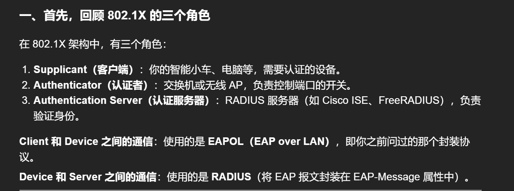
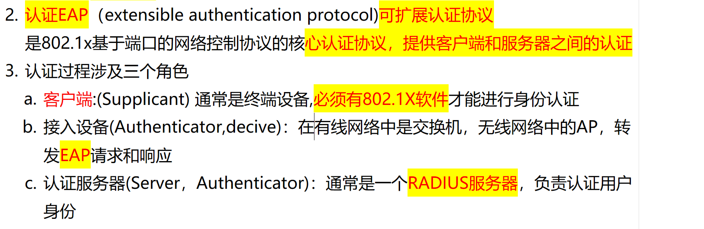
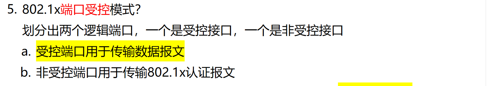

# 1. 802.1X 原理？802.1x中的三个角色？

<!-- en-interview -->
### English Interview Answer

802.1X is a port-based network access control protocol designed to enhance LAN security by authenticating devices before granting network access. It operates on the principle of "authentication before access," ensuring only authorized users or devices can connect to the network.

The architecture involves three key roles: first, the **Supplicant**, which is the client device—like a laptop or IoT device—requesting network access and providing credentials. Second, the **Authenticator**, typically a switch or wireless AP, which controls the physical or logical port and acts as a gatekeeper, forwarding authentication requests to the server. Third, the **Authentication Server**, usually a RADIUS server such as Cisco ISE or FreeRADIUS, which validates the credentials and authorizes or denies access.

Communication between the Supplicant and Authenticator uses **EAPOL** (EAP over LAN), while the Authenticator and Server communicate via **RADIUS**, encapsulating EAP messages within RADIUS packets. This layered approach ensures secure, scalable authentication across enterprise networks. For example, in a corporate environment, an employee’s laptop (Supplicant) connects to a switch (Authenticator), which sends credentials to the RADIUS server (Authentication Server) for verification before allowing network access.

# 2. 802.1X 的怎么提供的认证？

<!-- en-interview -->
### English Interview Answer

802.1X is a port-based network access control protocol that provides secure authentication for network devices. At its core, it uses the Extensible Authentication Protocol, or EAP, which enables flexible and secure identity verification between clients and servers.

The authentication process involves three key roles: the Supplicant, the Authenticator, and the Authentication Server. The Supplicant is typically the end-user device, like a laptop or smartphone, which must have 802.1X client software to initiate the authentication. The Authenticator, such as a switch in wired networks or an AP in wireless environments, acts as a middleman—it forwards EAP messages between the client and the server. Finally, the Authentication Server, usually a RADIUS server, validates the user’s credentials and grants or denies access.

This architecture ensures that only authorized users can access the network. For example, in a corporate Wi-Fi setup, when an employee connects, their device (Supplicant) sends credentials through the AP (Authenticator) to the RADIUS server (Authentication Server), which then authenticates them before allowing network access. This layered approach enhances security and scalability.

# 4. 802.1X 端口受控模式？

<!-- en-interview -->
### English Interview Answer

In 802.1X port-controlled mode, the physical port is logically split into two separate virtual ports: an authenticated (controlled) port and an unauthenticated (uncontrolled) port. The key idea is to separate data traffic from authentication traffic to ensure secure access control.

The uncontrolled port is always active and allows EAP (Extensible Authentication Protocol) messages to pass through, which are used for the 802.1X authentication process between the client, authenticator, and authentication server. Once the client successfully authenticates, the controlled port is enabled. This port is then used to forward regular data traffic — such as HTTP, DNS, or other application packets — to the network.

Before authentication, only authentication-related traffic flows through the uncontrolled port. After successful authentication, the controlled port opens up, allowing full network access. This mechanism prevents unauthorized devices from accessing network resources while still allowing them to complete the authentication process.

For example, when a user connects a laptop to a switch port, the device can send EAP packets to authenticate, but cannot access the internet until authentication is complete. This is a fundamental security feature in enterprise networks.
