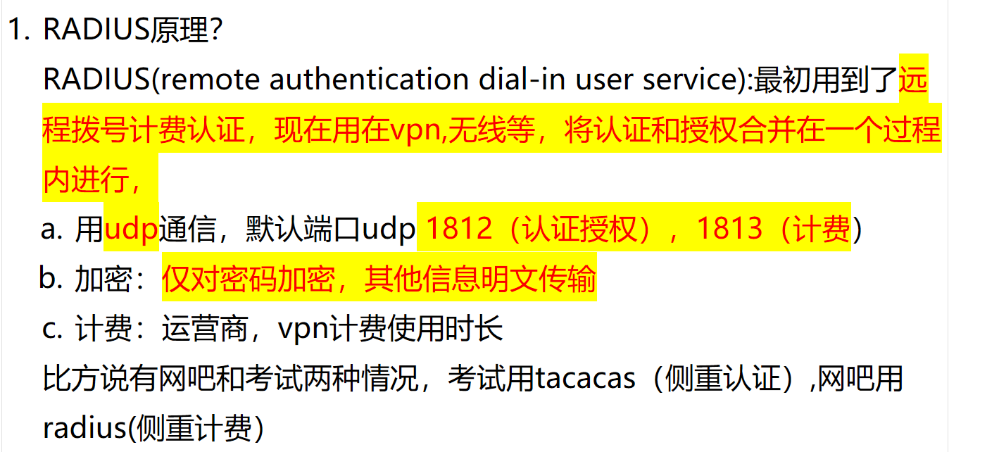
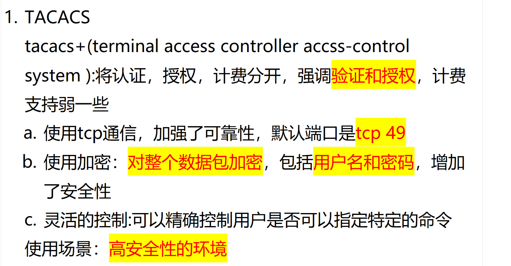
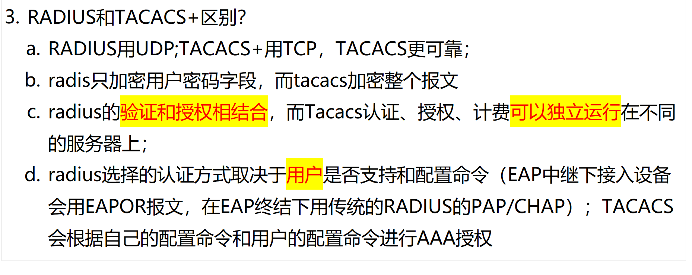

# 1. RADIUS 和 TACACS+的区别？

<!-- en-interview -->
### English Interview

**Question:** What are the key differences between RADIUS and TACACS+?

**Answer:**

The main difference lies in their architecture and security approach. RADIUS combines authentication and authorization into one process, while TACACS+ separates them, offering more granular control. RADIUS uses UDP on ports 1812 and 1813, which is less reliable but simpler; TACACS+ uses TCP on port 49, providing better reliability and retransmission. In terms of security, RADIUS only encrypts the password, leaving other data in plaintext, whereas TACACS+ encrypts the entire packet, including username and password, making it more secure. TACACS+ also allows fine-grained command-level authorization, especially useful in high-security environments like network device management. For example, in a corporate network, TACACS+ can restrict a user from executing certain configuration commands, while RADIUS typically focuses on access control for VPNs or wireless networks. Additionally, TACACS+ supports independent AAA services, meaning authentication, authorization, and accounting can run on different servers, while RADIUS integrates auth and authz tightly.
