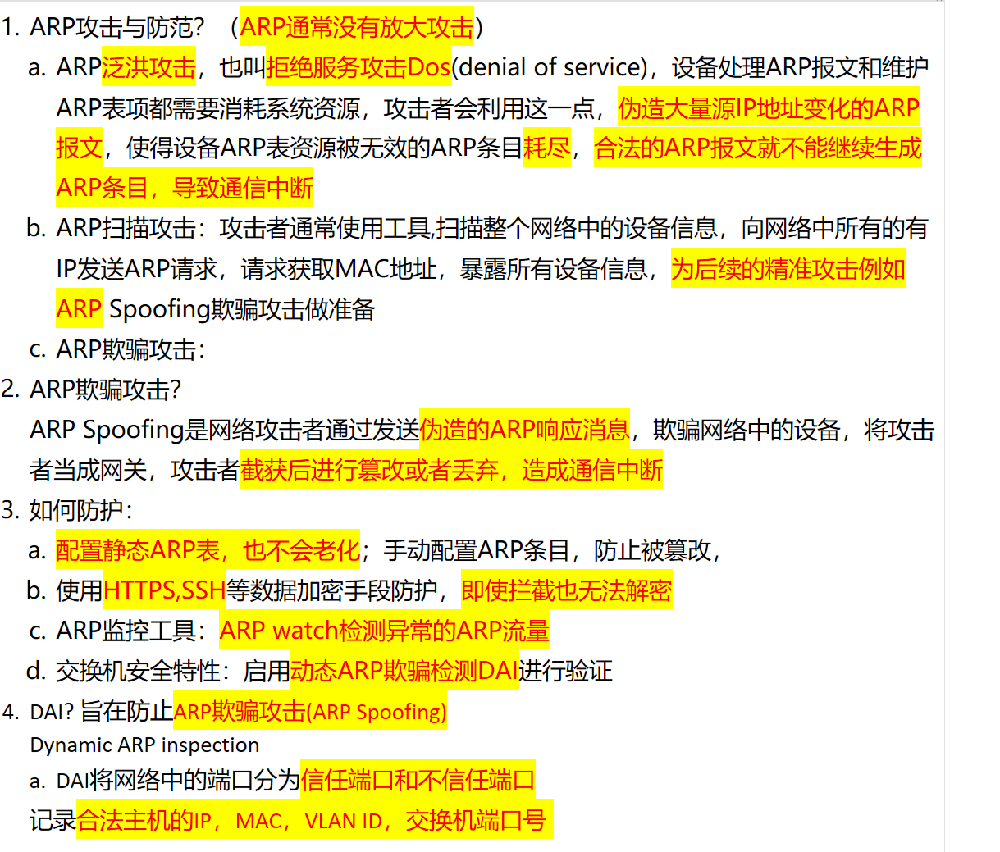
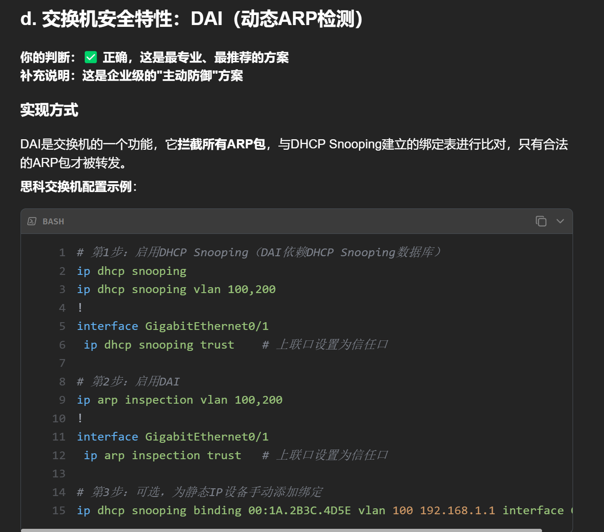
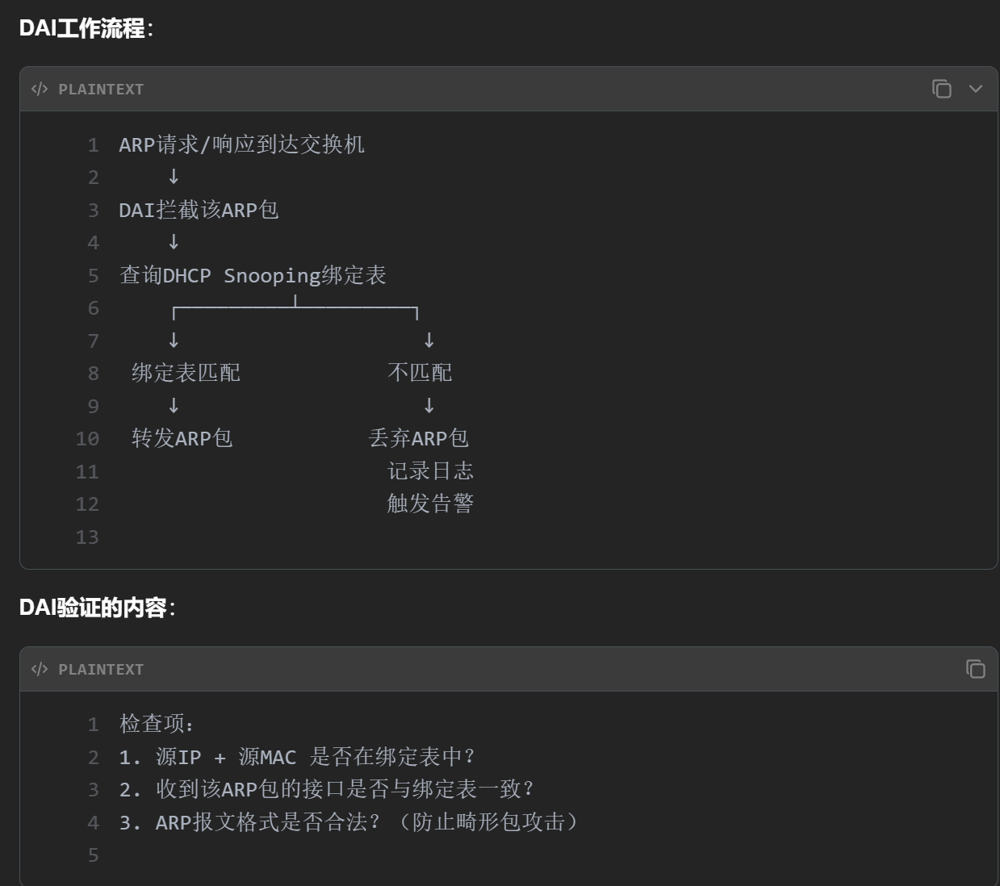
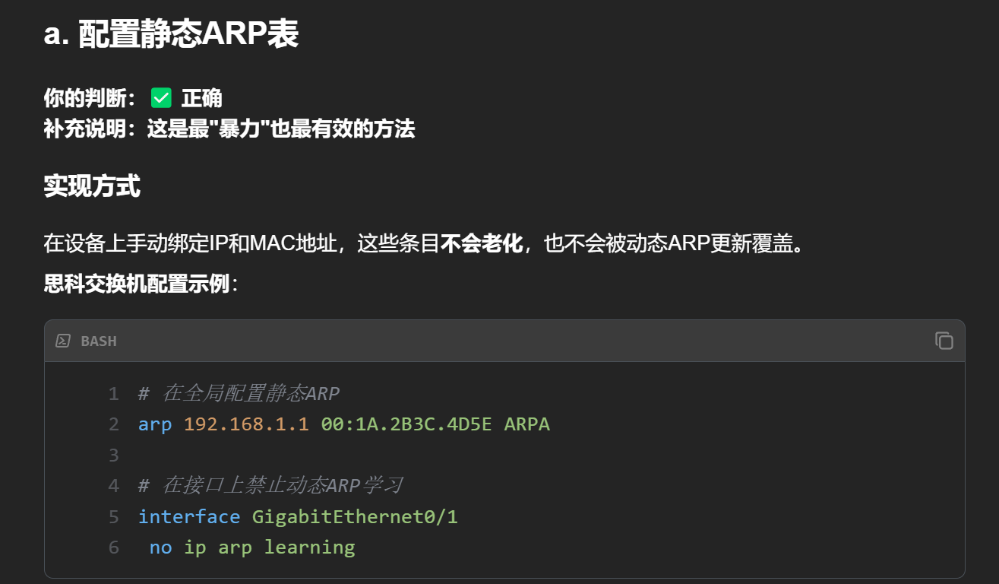
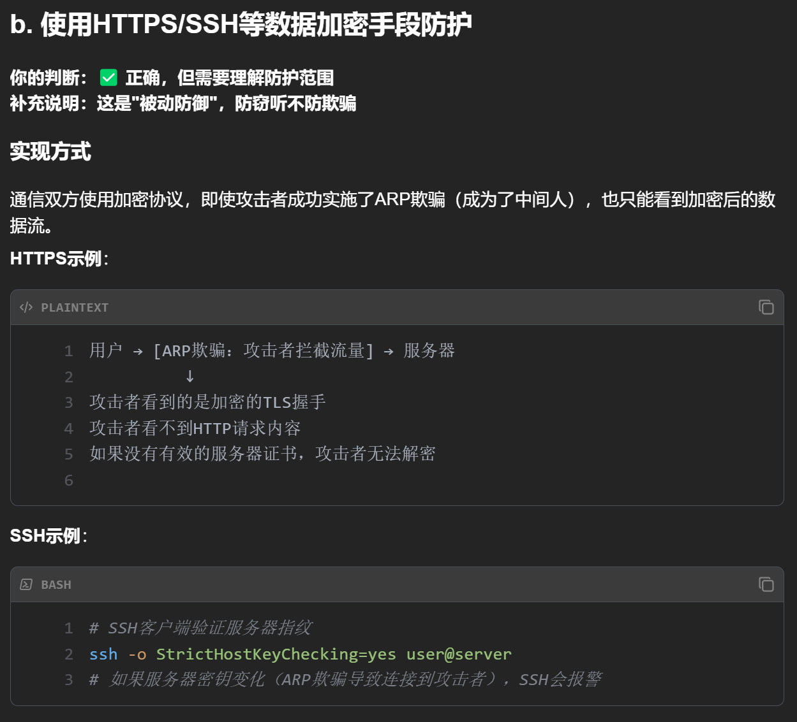
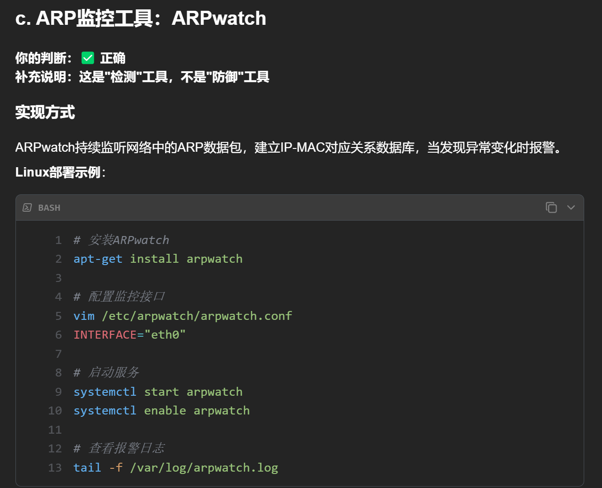
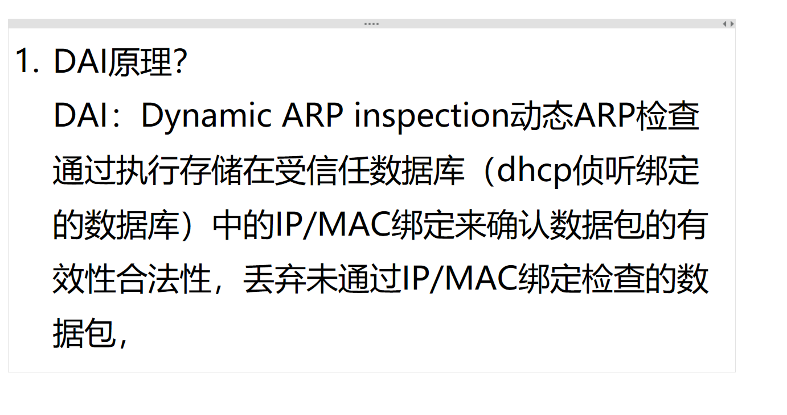

# 1. ARP 攻击和防护？

<!-- en-interview -->
### English Interview

**Question:** What are ARP attacks and how can they be mitigated?

**Answer:**

ARP attacks primarily include flooding, scanning, and spoofing. ARP flooding is a DoS attack where attackers send massive forged ARP packets with changing source IPs, exhausting ARP table resources and disrupting communication. ARP scanning reveals device MACs for later targeted attacks like spoofing. ARP spoofing involves sending fake ARP replies to trick devices into routing traffic through the attacker, who can then intercept, modify, or drop data. To defend against these, we can configure static ARP entries to prevent tampering, use encryption like HTTPS or SSH so intercepted data can't be decrypted, deploy ARP monitoring tools such as ARP watch to detect anomalies, and enable DAI (Dynamic ARP Inspection) on switches. DAI classifies ports as trusted or untrusted, and validates ARP packets against a database of legitimate IP, MAC, VLAN ID, and port bindings, effectively preventing spoofed ARP responses from being accepted.

# ARP攻击的防护手段？

<!-- en-interview -->
### English Interview

**Question:** What are the effective countermeasures against ARP spoofing attacks?

**Answer:**

The most professional defense is Dynamic ARP Inspection (DAI) on switches. DAI intercepts all ARP packets and checks them against the binding table built by DHCP Snooping. Only legitimate ARP packets are forwarded. It’s an active defense, especially for enterprise networks. For example, you first enable DHCP Snooping on VLANs, mark uplink ports as trusted, then enable DAI on the same VLANs. Another approach is static ARP binding—manually configuring IP-MAC pairs on devices. These entries don’t age out and resist dynamic ARP updates. This is a brute-force, passive method. Also, using encrypted protocols like HTTPS or SSH helps. Even if an attacker becomes a man-in-the-middle, they can only see encrypted traffic, not the actual data. Tools like ARPwatch can detect anomalies by monitoring ARP changes, but they’re for detection, not prevention. So, DAI is the top choice, while static ARP and encryption are good supplements.

# 2. DAI 动态 ARP 检测原理？

<!-- en-interview -->
### English Interview

**Question:** What is the principle behind Dynamic ARP Inspection (DAI)?

**Answer:**

Dynamic ARP Inspection, or DAI, is a security feature that helps prevent ARP spoofing attacks by validating ARP packets on a network. The core idea is to check the legitimacy of ARP messages before they’re forwarded. DAI works by maintaining a trusted binding table, typically populated through DHCP snooping, which stores valid IP-to-MAC address mappings. When an ARP packet arrives, the switch checks whether the sender’s IP and MAC address pair matches the entries in this trusted database. If the packet passes the validation, it’s allowed; otherwise, it’s dropped. This mechanism is especially effective in Layer 2 networks where ARP spoofing is common. For example, if a malicious host tries to send an ARP reply claiming to be the gateway, DAI will reject it because the IP-MAC pair doesn’t match the trusted records. DAI is usually enabled on trusted ports and requires DHCP snooping to be active for dynamic binding. It’s a key component in securing networks against man-in-the-middle attacks.
