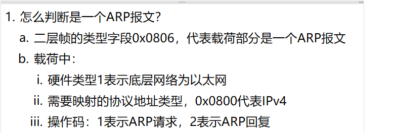
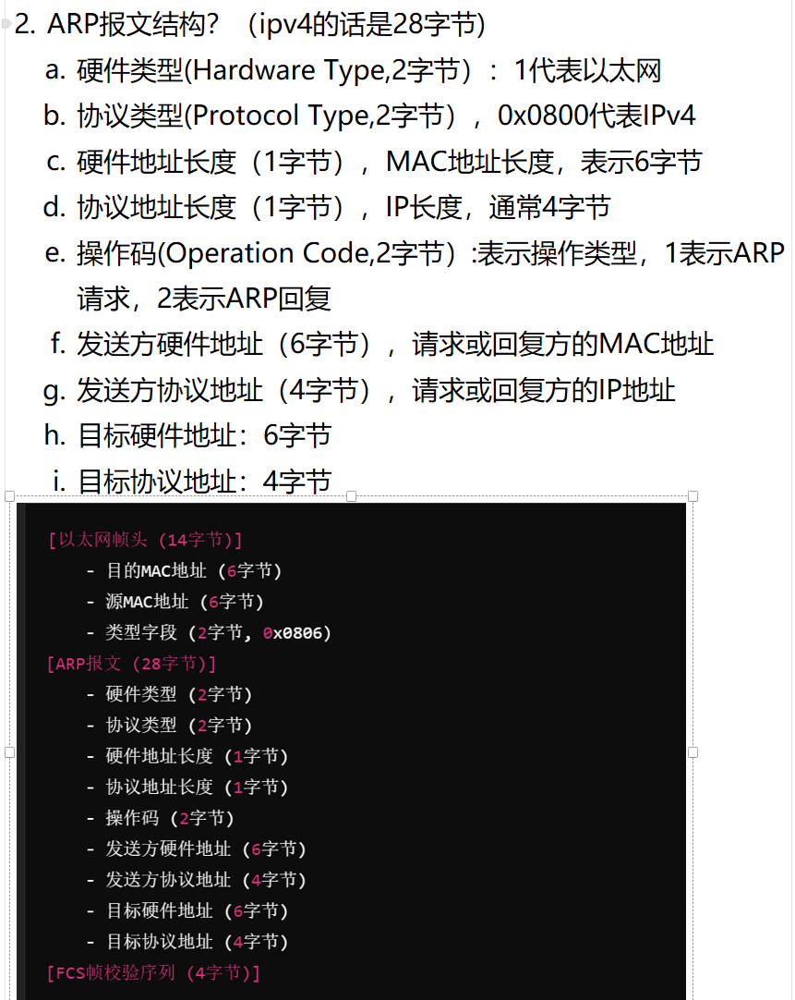

# 1. 怎么判断是一个 ARP 报文？

<!-- en-interview -->
### English Interview

**Question:** How can you identify an ARP packet?

**Answer:**

To identify an ARP packet, you first look at the Ethernet frame’s type field. If it’s 0x0806, that means the payload is an ARP packet. Once you confirm it’s ARP, you can further verify by checking the ARP header fields. The hardware type field should be 1, indicating Ethernet as the underlying network. The protocol type field should be 0x0800, which corresponds to IPv4—this tells us ARP is mapping IPv4 addresses to MAC addresses. Finally, the operation code distinguishes between request and reply: 1 means ARP request, and 2 means ARP reply. For example, when a device wants to send data to another device on the same LAN but doesn’t know its MAC address, it sends an ARP request with op code 1. The target device responds with an ARP reply, op code 2, including its MAC address. So, by checking these three fields—Ethernet type, hardware type, protocol type, and operation code—you can confidently identify and validate an ARP packet.

# 2. ARP 报文的结构？

<!-- en-interview -->
### English Interview

**Question:** What is the structure of an ARP packet?

**Answer:**

An ARP packet is 28 bytes in size for IPv4 and is used to map IP addresses to MAC addresses. It consists of several key fields: Hardware Type (2 bytes), which is 1 for Ethernet; Protocol Type (2 bytes), typically 0x0800 for IPv4; Hardware Address Length (1 byte), usually 6 for MAC addresses; Protocol Address Length (1 byte), typically 4 for IPv4; Operation Code (2 bytes), where 1 means ARP request and 2 means ARP reply; Sender Hardware Address (6 bytes), the MAC address of the sender; Sender Protocol Address (4 bytes), the IP address of the sender; Target Hardware Address (6 bytes), the MAC address of the target; and Target Protocol Address (4 bytes), the IP address of the target. This packet is encapsulated within an Ethernet frame, which includes the destination and source MAC addresses, and a type field (0x0806 for ARP), followed by the FCS (Frame Check Sequence) for error detection. For example, when a device wants to send data to another device on the same LAN but only knows its IP, it broadcasts an ARP request to find the corresponding MAC address.
