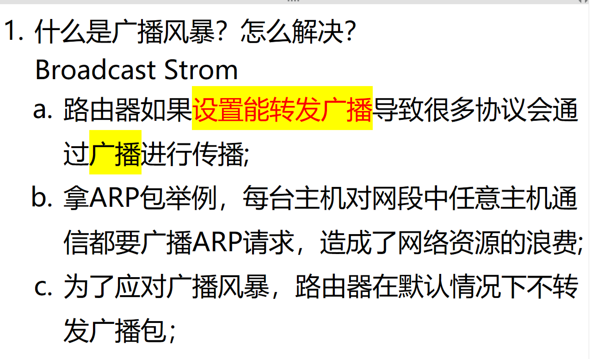
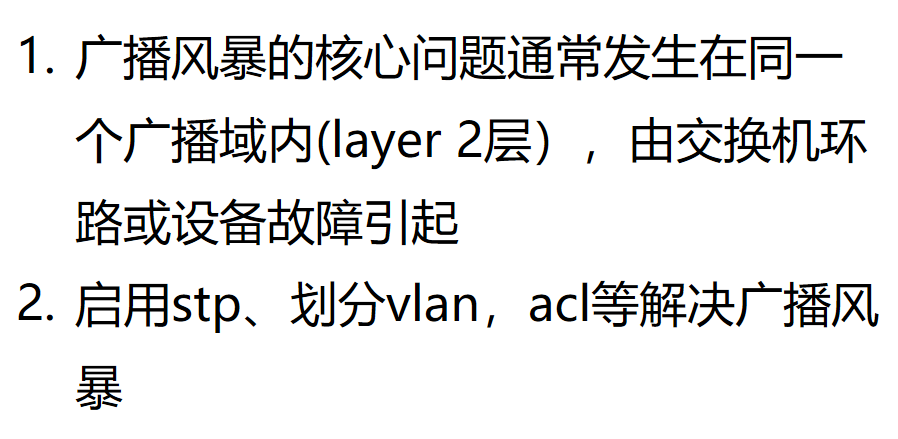

# 1.什么是广播风暴？

**Question:** What is a broadcast storm, and how can it be mitigated?

**Answer:**

A broadcast storm occurs when broadcast traffic floods the network, overwhelming bandwidth（带宽过载） and causing performance degradation（性能下降）.  This commonly happens in Layer 2 networks, especially when switches or routers are misconfigured to forward broadcasts. For example, ARP requests are broadcast by every host to resolve IP-to-MAC mappings, and if routers are configured to forward these broadcasts, they can propagate across multiple subnets, creating a loop and consuming excessive network resources. In practice, this can bring down entire networks. To prevent this, routers are designed by default to block broadcast forwarding between interfaces — they act as barriers to broadcast domains. Additionally, network engineers use tools like VLANs, STP (Spanning Tree Protocol), and broadcast suppression features to contain and control broadcast traffic. Proper network segmentation and device configuration are key to avoiding broadcast storms.

# 2. 为什么会产生广播风暴？

**Question:** What causes a broadcast storm in a network?

**Answer:**

A broadcast storm typically occurs within the same broadcast domain at Layer 2, mainly due to switch loops or device failures. When a loop exists in the network, broadcast frames get continuously forwarded and retransmitted between switches, creating an exponential increase（指数增长） in traffic. This overwhelms the network, consumes bandwidth, and can cause devices to crash or become unresponsive. The root cause is usually a misconfigured or accidental physical loop, or a failure in the Spanning Tree Protocol (STP) that should prevent such loops. To mitigate this, we enable STP to block redundant paths and avoid loops. Additionally, we can segment the network using VLANs to isolate broadcast domains, and apply ACLs to control or filter unnecessary broadcast traffic. These measures help contain the broadcast scope and prevent the storm from spreading across the entire network.
