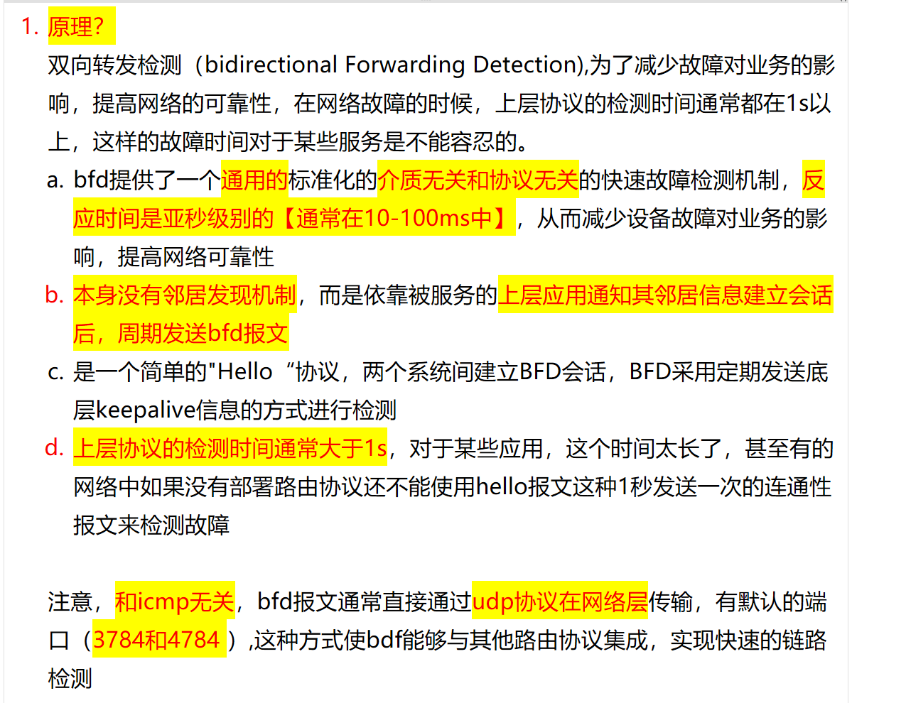
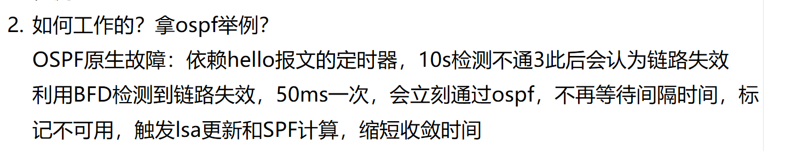
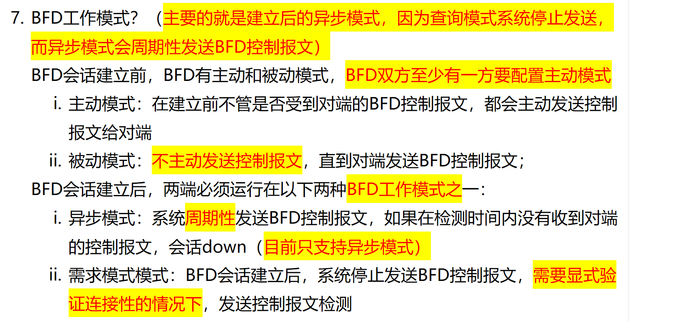

# 1. BFD 原理？

## BFD (Bidirectional Forwarding Detection)

**Purpose:**
 In traditional networks, upper-layer protocol **detection** times are typically over 1 second, which is unacceptable for certain services.

**Key Characteristics:**

**b.** BFD does not discover neighbors on its own; instead, it relies on upper-layer applications (such as OSPF, BGP, etc.) to notify it of neighbor information to establish sessions.

**c.** BFD is a simple "Hello" protocol. It establishes BFD sessions between two systems and performs detection by periodically sending low-level keepalive messages.

**BFD Packet Transmission:**
BFD packets are typically（通常） encapsulated in UDP, using ** port 3784**. 

---

## Summary Table:

| Feature | Description |
|---------|-------------|
| Detection Method | Periodic keepalive messages |
| Neighbor Discovery | Relies on upper-layer protocols |
| Transport | UDP (port 3784) |
| Detection Speed | Sub-second (configurable, typically 50ms-1s) |
| Main Benefit | Fast failure detection for critical services |

# 2. BFD 如何联动 OSPF?

# 3. BFD 的工作模式？(重要)

