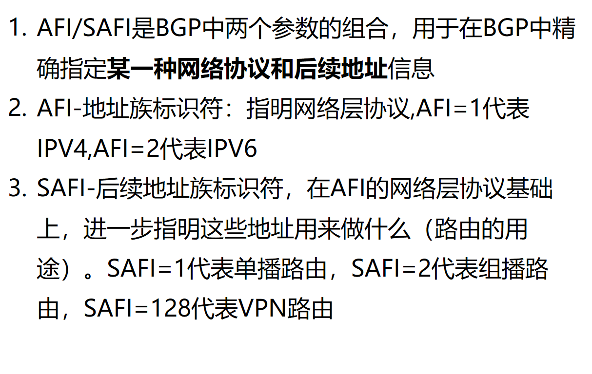
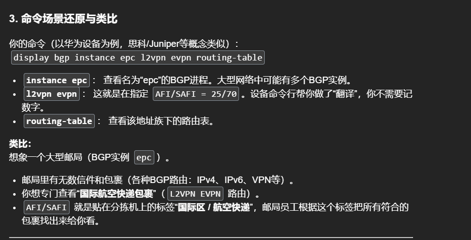
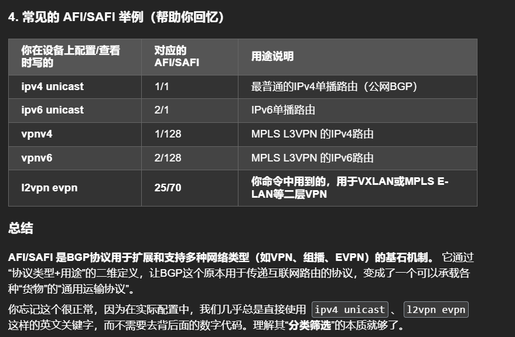
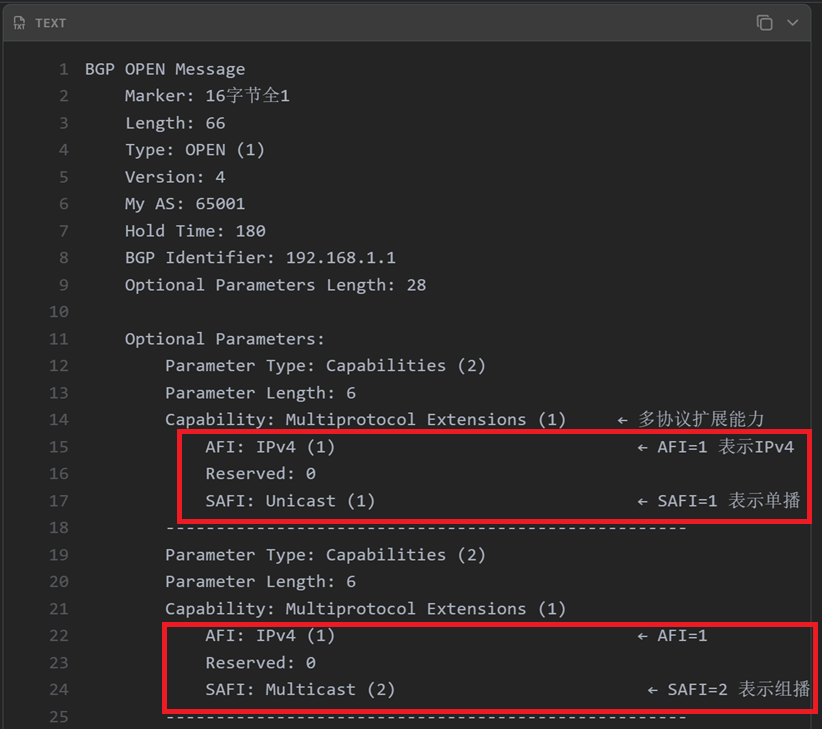

# BPG中,AFI和SAFI是什么？

Here's a professional, interview-ready explanation of **AFI and SAFI in BGP**:

---

## AFI and SAFI in BGP — Interview-Ready Explanation

### What are AFI and SAFI?

**AFI (Address Family Identifier)** and **SAFI (Subsequent Address Family Identifier)** are two parameters used together in BGP to **precisely identify a specific network protocol and the routing information** being carried.

### Detailed Breakdown:

#### 1. AFI — Address Family Identifier
- **Purpose:** Specifies the **network layer protocol**
- **Scope（范围）:** Identifies which address family the routes belong to

| AFI Value | Protocol |
|-----------|----------|
| 1 | IPv4 |
| 2 | IPv6 |
| 25 | L2VPN |
| 16384 | Private Use |

#### 2. SAFI — Subsequent Address Family Identifier
- **Purpose:** Within a given AFI, further specifies **how the addresses are used** (the purpose/type of routing information)

| SAFI Value | Usage |
|------------|-------|
| 1 | Unicast routing |
| 2 | Multicast routing |
| 4 | MPLS-labeled VPN (RFC 3107) |
| 128 | VPN routing (MPLS VPN, L3VPN) |
| 129 | Multicast VPN |

### Common AFI/SAFI Combinations:

| Combination | Description | Typical Use |
|-------------|-------------|-------------|
| AFI=1, SAFI=1 | IPv4 Unicast | Standard BGP IPv4 routing |
| AFI=1, SAFI=2 | IPv4 Multicast | MBGP for multicast |
| AFI=1, SAFI=128 | IPv4 VPN | MPLS L3VPN (VPNv4) |
| AFI=2, SAFI=1 | IPv6 Unicast | BGP for IPv6 |
| AFI=2, SAFI=128 | IPv6 VPN | 6VPE / MPLS IPv6 VPN |
| AFI=25, SAFI=70 | L2VPN EVPN | EVPN for VXLAN/MPLS |

### Why are AFI/SAFI important?

1. **Protocol Multiplexing（协议复用）** — BGP can carry multiple address families in a single session
2. **Route Distinction（Route Distinction）** — Routes for different purposes (unicast vs. multicast vs. VPN) are kept separate
3. **MP-BGP Foundation** — Enables BGP to support MPLS VPN, EVPN, IPv6, multicast, and more
4. **Flexibility** — New AFI/SAFI combinations can be defined for future protocols

### How it works in BGP updates:

In MP-BGP, the `MP_REACH_NLRI` and `MP_UNREACH_NLRI` path attributes carry:
- **AFI** — Which network layer protocol
- **SAFI** — How the addresses should be interpreted
- **NLRI** — The actual route prefixes

### Sample Interview Answer:

> "AFI and SAFI are two parameters in Multiprotocol BGP that together specify exactly which type of routing information is being carried. AFI identifies the network layer protocol — for example, AFI=1 means IPv4, AFI=2 means IPv6. SAFI then specifies the purpose of those addresses — SAFI=1 means unicast, SAFI=2 means multicast, SAFI=128 means VPN. This allows BGP to carry multiple different types of routes in a single session, which is essential for technologies like MPLS L3VPN, EVPN, and IPv6 transition mechanisms."

---

# `如何查看指定实例的BGP路由表？（这是在看 EVPN 控制平面（Control Plane）里，BGP 学到的 EVPN 路由）`

# AFI/SAFI举例

# AFI/SAFI报文结构
