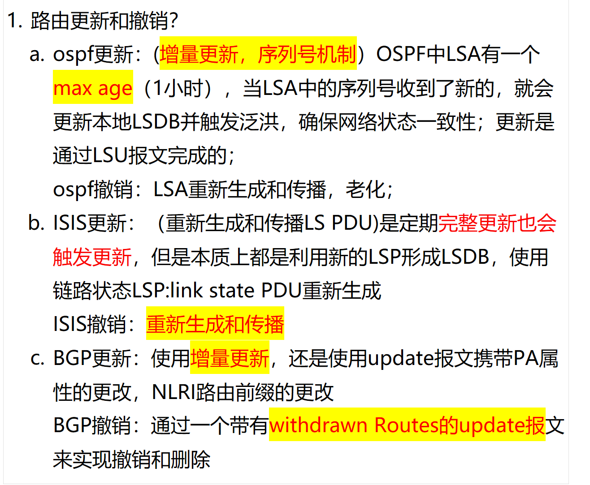

# 1. BGP,OSPF,ISIS 路由更新和撤销机制是怎样的？
- 

## Route Update and Withdrawal — Interview-Ready Explanation

### Overview

Different routing protocols handle route updates and withdrawals differently based on their underlying design principles (link-state vs. path-vector(路径向量)).

---

### A. OSPF (Link-State Protocol)

#### Update Mechanism:
- **Triggered Updates + Periodic Refresh（定期刷新）**
- Each LSA has a **sequence number** and an **aging timer** (max age = 3600 seconds / 1 hour)
- When a new LSA with a **higher sequence number** is received, the router:
  1. Updates its local LSDB
  2. Triggers flooding to all neighbors
- Updates are carried in **LSU (Link State Update)** packets
- The sequence number mechanism ensures **reliable flooding** and prevents stale information

#### Withdrawal Mechanism:
- **LSA Re-generation and Aging**
- When a link goes down, the router:
  1. Generates a **new LSA** with updated information
  2. Flushes the old LSA by setting its **age to MaxAge (3600s)**
  3. Floods the new LSA to all neighbors
- Alternatively, an LSA naturally **ages out** after 3600 seconds if not refreshed

**Key Point:** OSPF withdrawals are essentially **re-generation and propagation** of updated LSAs.

---

### B. IS-IS (Link-State Protocol)

#### Update Mechanism:
- **Periodic Full Updates + Triggered Updates**
- IS-IS uses **LSPDU (Link State PDU)** to carry link-state information
- **Periodic refresh:** Complete LSP is re-generated and flooded every **900-1200 seconds** (default)
- **Triggered update:** When a topology change occurs, a new LSP is immediately generated
- Both mechanisms ultimately **form a new LSDB** using updated LSPs
- IS-IS uses a **remaining lifetime** field (similar to OSPF aging)

#### Withdrawal Mechanism:
- **LSP Re-generation with Zero Lifetime**
- When a link fails:
  1. Router generates a new LSP with the **removed adjacency**
  2. Sets the **remaining lifetime to 0** (or a very short value)
  3. Floods this LSP — receiving routers interpret zero lifetime as **withdrawal**
- The old LSP is purged from the LSDB

**Key Point:** IS-IS uses **lifetime-based withdrawal** — setting lifetime to zero signals removal.

---

### C. BGP (Path-Vector Protocol)

#### Update Mechanism:
- **Incremental (Triggered) Updates Only（仅增量（触发式）更新）**
- BGP does **not** perform periodic full updates
- Updates are sent only when **changes occur**
- Uses **UPDATE** messages containing:
  - **Path Attributes (PA)** — AS_PATH, NEXT_HOP, MED, Local Pref, etc.
  - **NLRI (Network Layer Reachability Information)** — the actual prefixes
- Only **changed** prefixes are advertised — this is why BGP is efficient for large-scale networks

#### Withdrawal Mechanism:
- **Explicit Withdrawal via UPDATE Message**
- BGP withdrawals are **explicit and immediate**
- An UPDATE message carries a **WITHDRAWN ROUTES** field
- When a route becomes unreachable, the router sends an UPDATE with:
  - Empty NLRI (no new routes)
  - The withdrawn prefixes listed in the **Withdrawn Routes** field
- The receiving router **immediately removes** those prefixes from its RIB

**Key Point:** BGP withdrawals are **clean and explicit** — no aging or timeout required.

---

### Comparison Table:

| Aspect | OSPF | IS-IS | BGP |
|--------|------|-------|-----|
| **Update Type** | Triggered + Periodic | Triggered + Periodic | Incremental only |
| **Update Unit** | LSU (LSA) | LSPDU | UPDATE message |
| **Sequence Control** | Sequence number + Age | Remaining lifetime | No sequence (reliable TCP) |
| **Withdrawal Method** | LSA re-generation + aging | Zero lifetime LSP | Explicit Withdrawn Routes |
| **Withdrawal Speed** | Fast (immediate flood) | Fast (immediate flood) | Immediate (TCP delivery) |
| **Full Refresh** | Every 3600s | Every 900-1200s | Never (unless reset) |
| **Transport** | IP (89) | Data-link (CLNP) | TCP (179) |

---

### Sample Interview Answer:

> "OSPF and IS-IS are both link-state protocols but handle updates differently. OSPF uses LSU packets with sequence numbers and a 1-hour aging timer — withdrawals are done by re-generating LSAs with updated information. IS-IS uses LSPDUs with a remaining lifetime field — setting lifetime to zero effectively withdraws a route. Both protocols do periodic full refreshes. BGP, on the other hand, is a path-vector protocol that uses incremental updates only. It sends UPDATE messages with path attributes and NLRI for new routes, and explicitly lists withdrawn prefixes in the same message — no aging or periodic refresh is needed."

---
