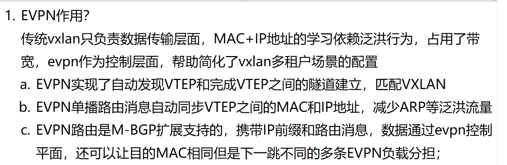
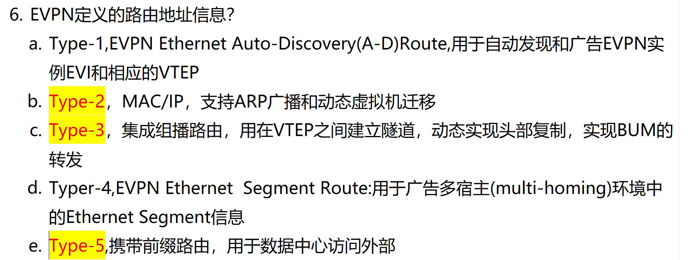
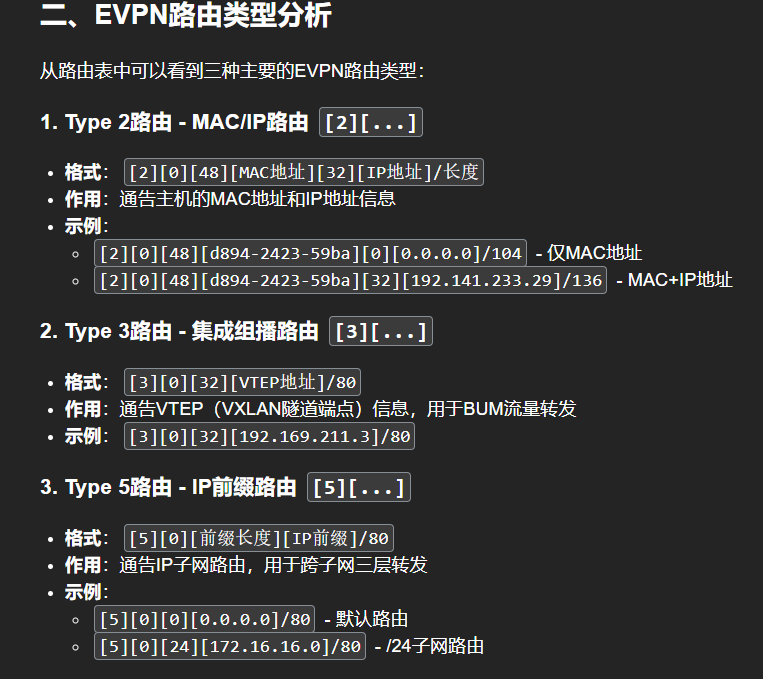
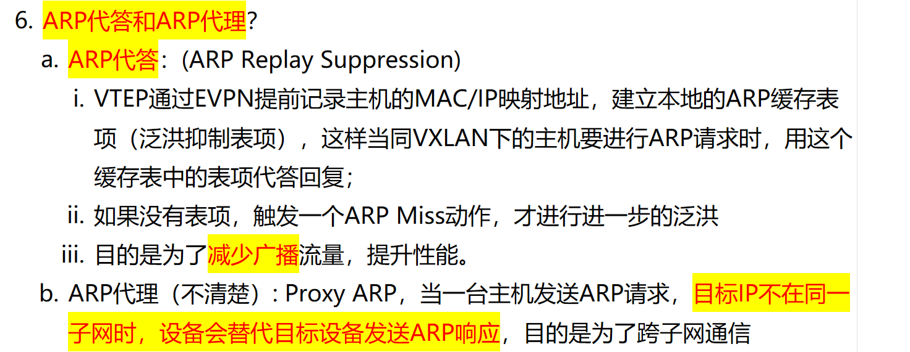
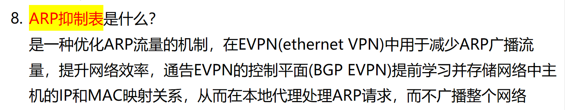
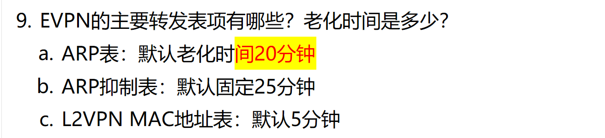

# 1. EVPN 作用？

# 2. EVPN 路由种类？

# 3. ARP 代理和 ARP 代答是什么？

# 4. ARP 抑制表是什么?

# 5. EVPN 表项有哪些？

9db53cbf-07b6-422a-8f79-4d4cd0c582b6
bdb9a9ca-a150-4e57-9ffa-a91536793c9a
bcbfeea5-644f-43ea-831d-07e4574a9454
d495a790-0754-4015-ba64-725cad8a32c0
321e3aa9-904d-4dcb-a03d-309ef3940e39

./vif.py -a update -i d773084e-9c16-40cf-9142-c0479438fccd -n 2048 -e 2048