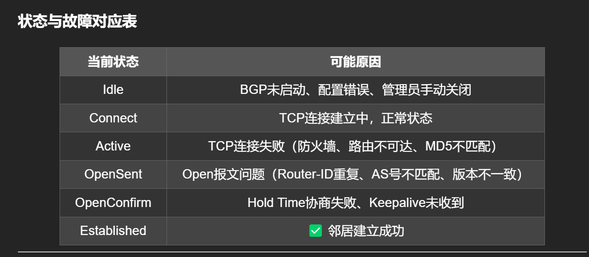
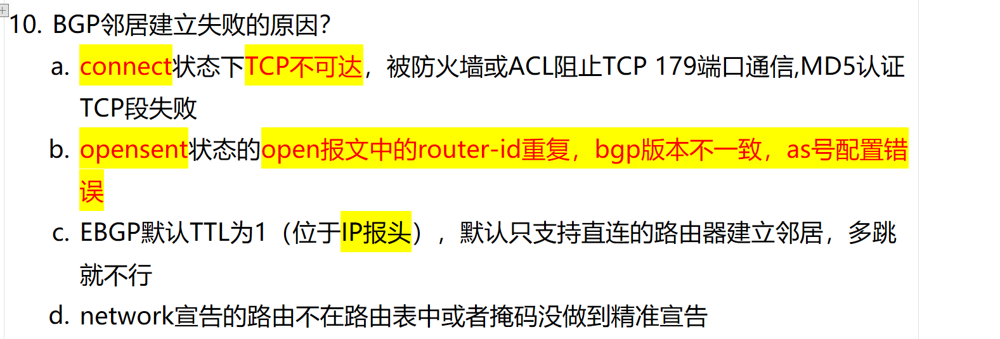
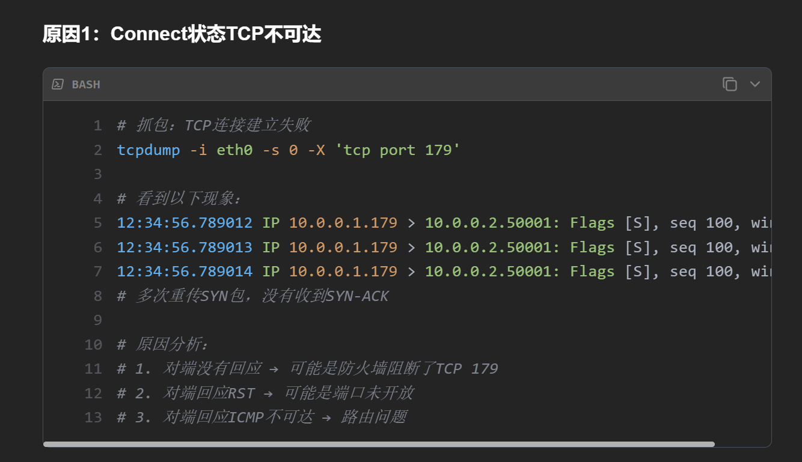
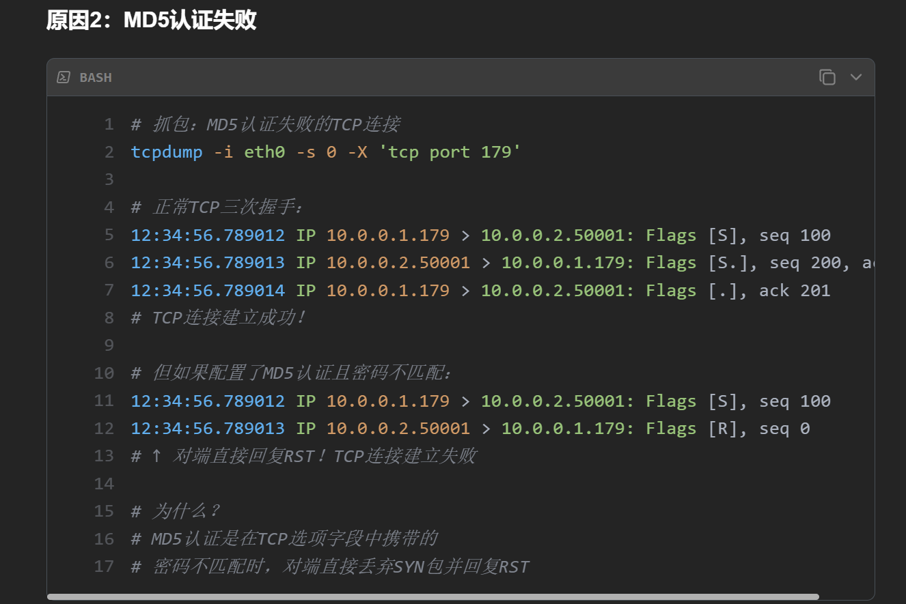
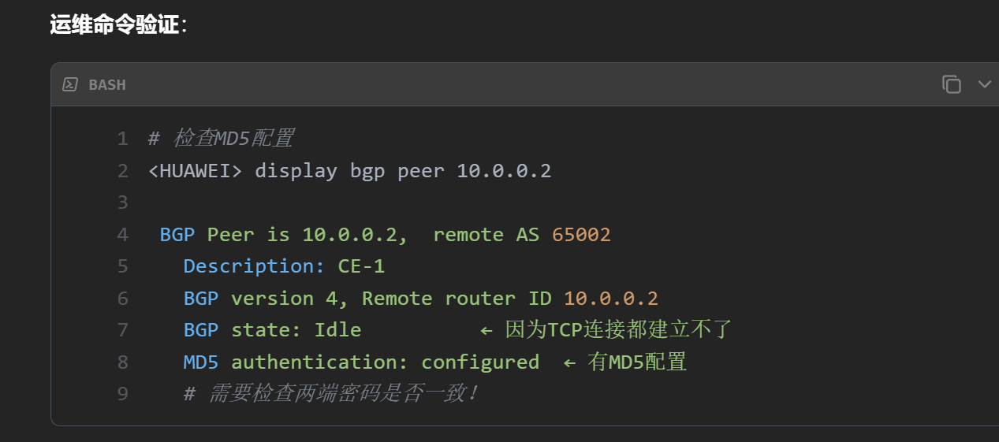
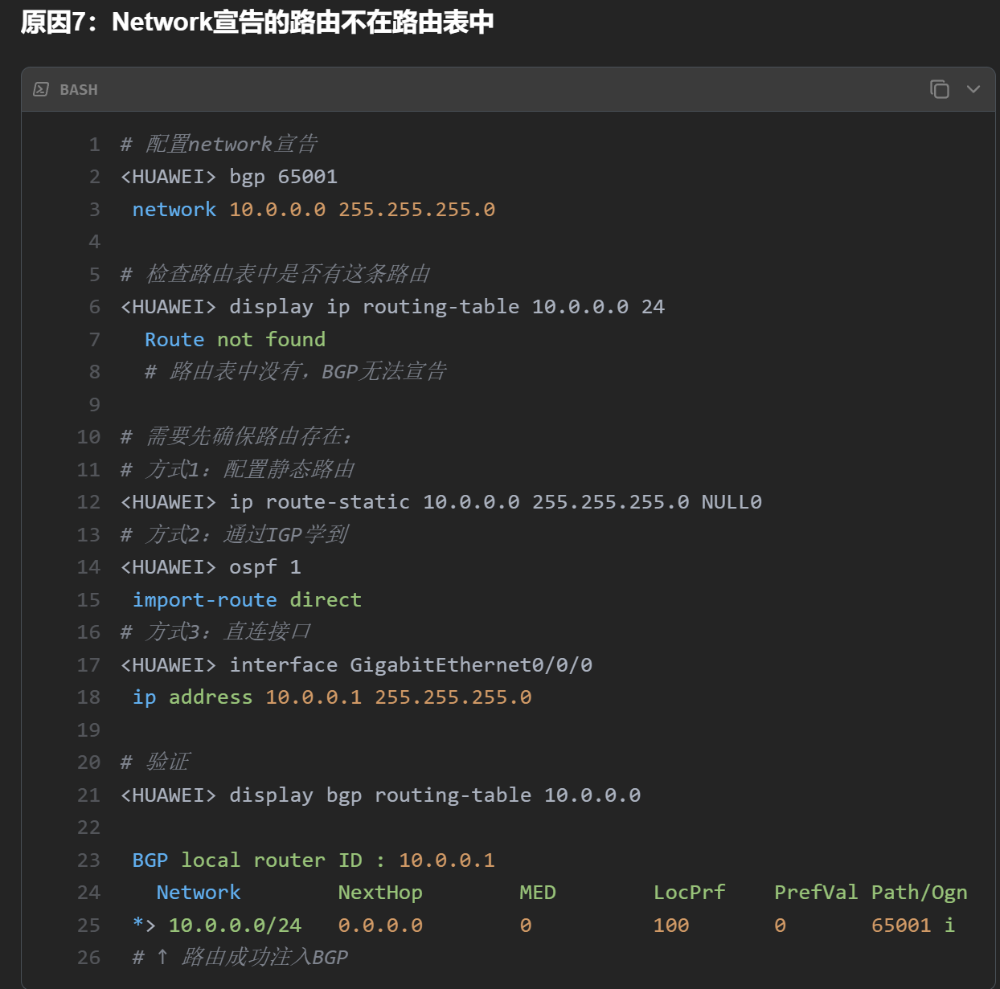

# 总结各个状态下建立失败的原因？

## BGP Neighbor State Failure Analysis 

### State-to-Failure Mapping Table

| Current State | Possible Cause | Detailed Explanation |
|---------------|----------------|----------------------|
| **Idle** | BGP not started, configuration error, admin shutdown | • BGP process not enabled • Missing or incorrect `neighbor` command • `shutdown` manually disabled the neighbor • Router-ID not configured |
| **Connect** | TCP connection is being established (normal) | • TCP connection delays |
| **Active** | TCP connection failure | • **Route unreachable** — no route to neighbor IP • **Firewall/ACL blocking** — TCP port 179 filtered • **MD5 authentication mismatch** — password mismatch • **TTL security check** — TTL value too low • **Neighbor not configured** — peer doesn't have BGP configured |
| **OpenSent** | OPEN message issues | • **Router-ID duplicate** — same Router-ID on both ends (EBGP scenario) • **AS number mismatch** — configured ASN doesn't match expected value • **BGP version mismatch** — one side is BGP-3, other is BGP-4 • **Hold Time negotiation failure** — special cases with Hold Time = 0 |
| **OpenConfirm** | Hold Time expired, Keepalive not received | • **Hold Time timeout** — no Keepalive received within Hold Time • **Keepalive interval issue** — actual interval exceeds peer's Hold Time • **TCP connection broken** — underlying TCP session dropped • **Peer BGP process crashed** — peer router rebooted or BGP process restarted |
| **Established** | Neighbor successfully established (normal) | • This is the **final stable state** • Frequent flapping back to OpenConfirm or Active indicates network instability |

---

### Troubleshooting Logic (Interview Bonus Points)

#### 1. State Machine Regression Analysis

| Pattern | Likely Cause |
|---------|--------------|
| **Idle → Active → Idle** (oscillating) | TCP connects then drops immediately — check peer ASN or if peer is configured |
| **Active → Connect → Active** (flapping) | TCP connection unstable — check routing and firewall policies |
| **OpenSent → Active** | OPEN message negotiation failed — check Router-ID and ASN |
| **OpenConfirm → Idle** | Hold Time expired — check Keepalive delivery |

#### 3. Troubleshooting Mnemonic (Memory Aid)

> **Idle → Check config**
> **Active → Check routing**
> **OpenSent → Check ASN and Router-ID**
> **OpenConfirm → Check Keepalive**
> **Established → Success**

---

### Sample Interview Answer (English)

> "BGP neighbor establishment failures can be diagnosed by analyzing each state machine phase. In the **Idle state**, the issue is usually that BGP is not started or the configuration is incorrect. When the state stays in **Active** or oscillates between Active and Connect, it indicates a TCP connection failure — common causes include route unreachability, firewall blocking port 179, or MD5 authentication mismatch. If the session reaches **OpenSent** and then fails, it's typically an OPEN message negotiation problem — such as Router-ID duplication, AS number mismatch, or BGP version incompatibility. Finally, failure in the **OpenConfirm** state is due to Hold Time expiration — the router didn't receive a Keepalive message within the negotiated Hold Time. Only after successfully passing through all these states does the BGP neighbor reach the **Established** state."

---

Would you like me to also prepare **BGP Path Selection (route selection algorithm)** or **BGP Route Reflector principles** in an English interview format?

# 9.BGP 邻居失效的原因？

# TCP建立失败（只有SYN没有SYN-ACK）

# 同样是3次握手，MD5校验失败（display bgp peer 10.0.0.2查看配置）

# 重要：Network宣告的路由不在路由表中
