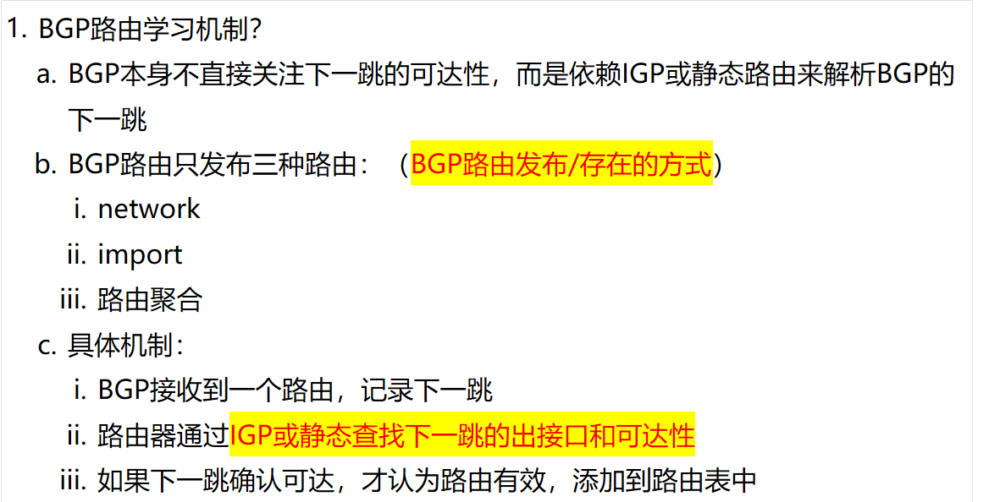

# 1. BGP 有哪些报文？

# 2. BGP 邻居建立过程？状态机的转变？

# 3. BGP 怎么认证？

# 4. AS 号有几位？AS23456 是什么？

# 5. BGP 路由学习和通告机制？

# 6. BGP 怎么判断路由失效/路由衰减机制？

# 7. 什么是 BGP 同步？

# 8. BGP 哪些路由进入路由表？能宣告哪些路由？

# 9.BGP 邻居失效的原因？

# 10. BGP是几层协议？
