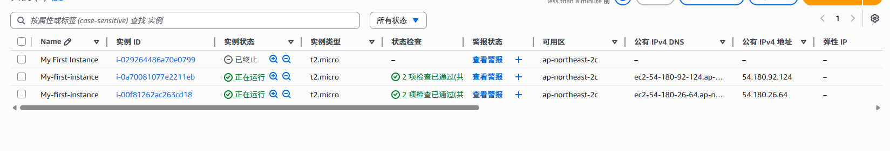
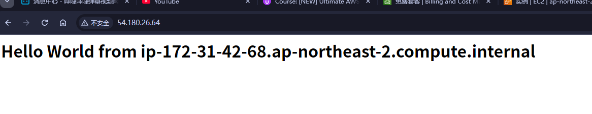
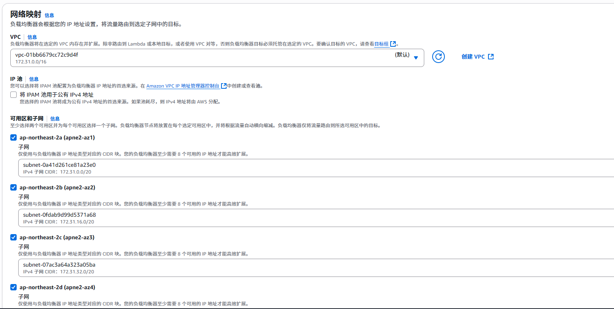
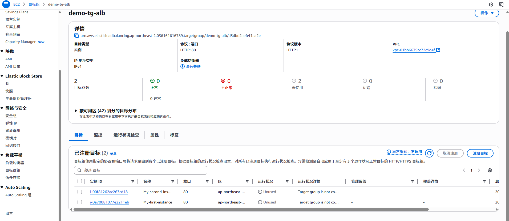
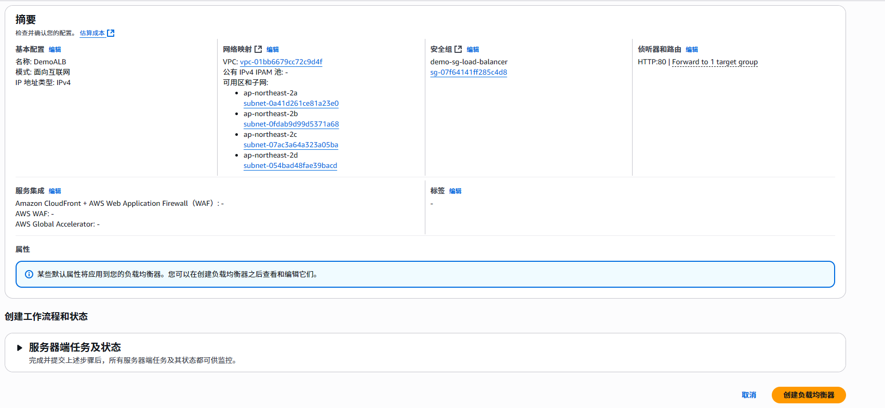

# 先创建两个实例，user data如下
```sh
#!/bin/bash
# Use this for your user data (script from top to bottom)
# install httpd (Linux 2 version)
yum update -y
yum install -y httpd
systemctl start httpd
systemctl enable httpd
echo "<h1>Hello World from $(hostname -f)</h1>" > /var/www/html/index.html
```


# 测试公网



# VPC这里就全选就行


# 创建目标群组



# 复制dns

