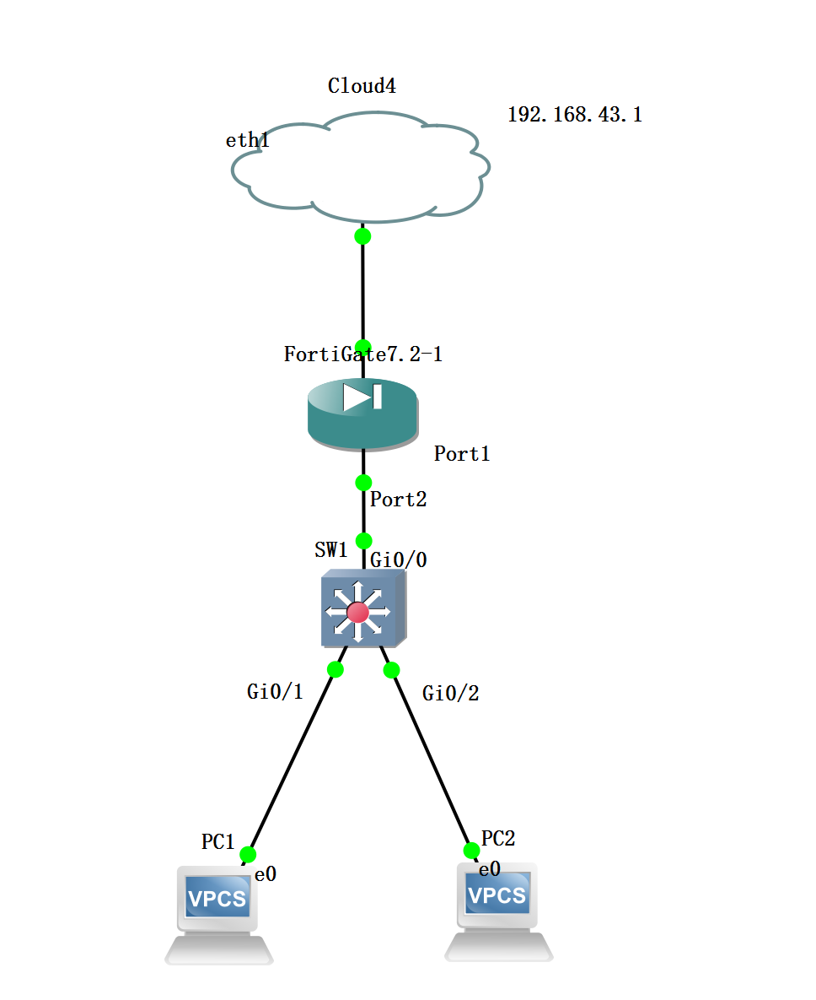
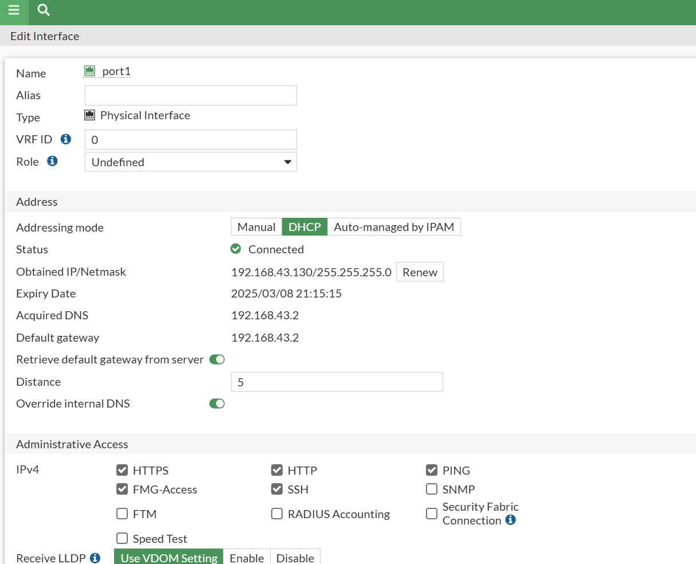
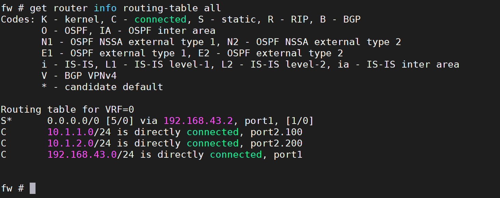
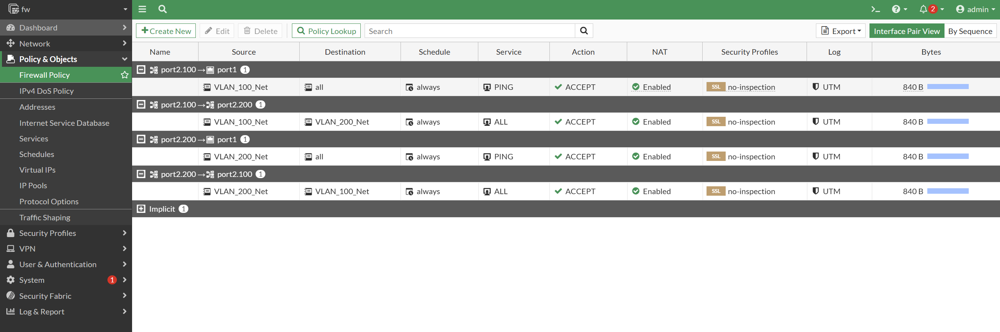
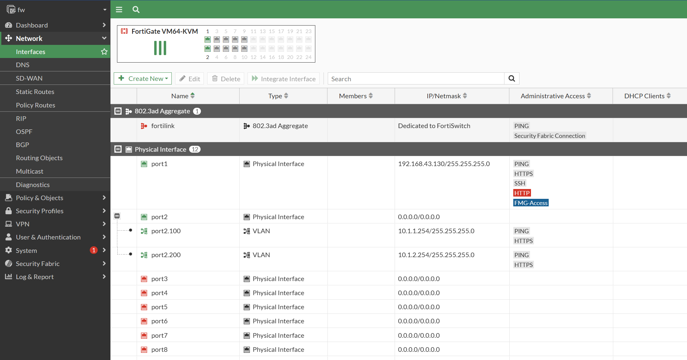
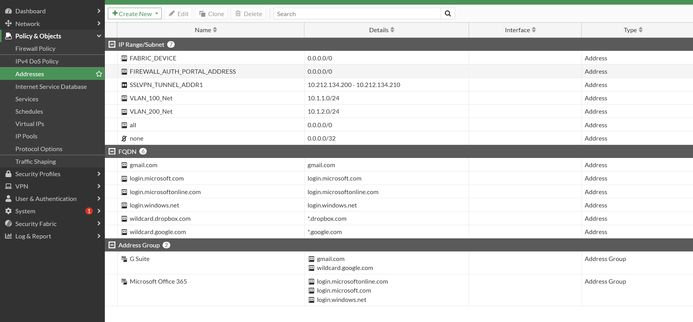

# 1. 拓扑



# 2. 预配置

### SW1 放通 VLAN 100,200

### SW1 的 G0/0 设置为 trunk 放通 vlan 100，200

### sw1 的 G0/1 为 access 100,G0/2 为 access 200

```sh
vlan 100
vlan 200
int g 0/0
no shutdown
switchport trunk encapsulation dot1q
switchport mode trunk
switchport trunk allowed vlan 100,200
write memory
```

```sh
int g 0/1
switchport mode access
switchport access vlan 100
int g 0/2
switchport mode access
switchport access vlan 200
```

### PC1

```
ip 10.1.1.1 24 10.1.1.254
```

### PC2

```
ip 10.1.2.1 24 10.1.2.254
```

### FW

# 3. 去 GUI 页面看看服务器网关是`192.168.43.2`而不是 192.168.43.1



### FW 常用命令

### `get router info routing-table all`查看路由表



### 查看防火墙策略 policy（实现互访控制）(这里开启 nat 访问公网)



### 创建子接口（vlan 分段`port2.100=10.1.1.254` `port2.200=10.1.2.254`)



### 查看地址分配



# 4. 结果就是所有互通，且能访问外网
