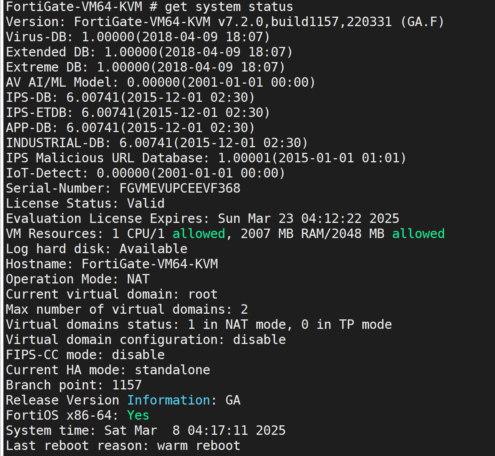
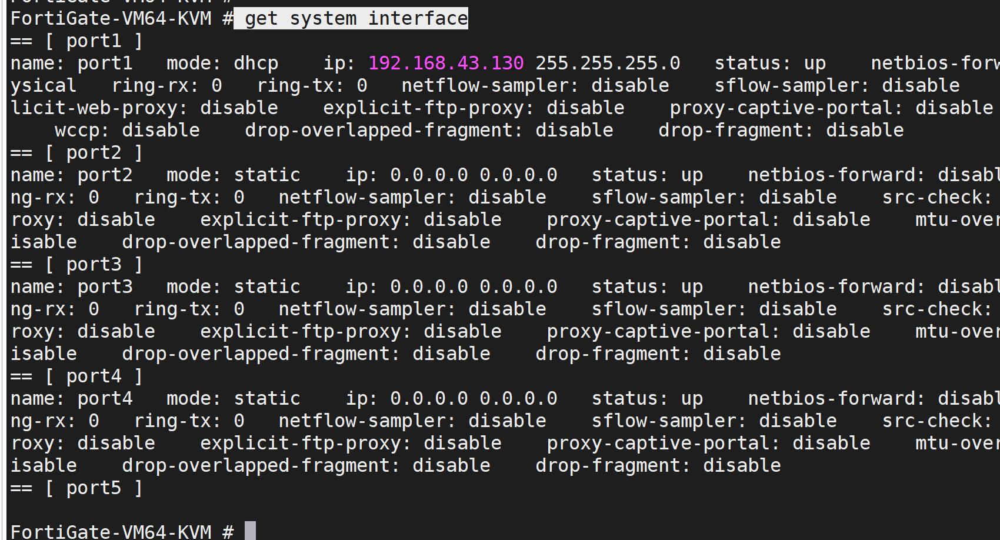

<h1 align="center">FortiGate 7.2.0版本学习</h1>

[官方文档](https://docs.fortinet.com/document/fortigate/7.2.11/administration-guide/345190/dashboards-and-monitors)

# 1. 用户名`admin`,初始`空密码`，可以设置`123456`

# 2. `get system status`查看版本型号

# 3.GUI 的地址 ` get system interface`查看接口地址

