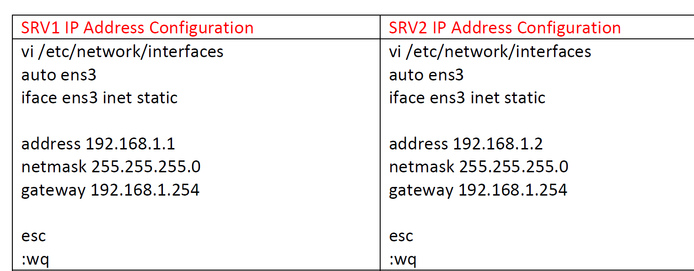
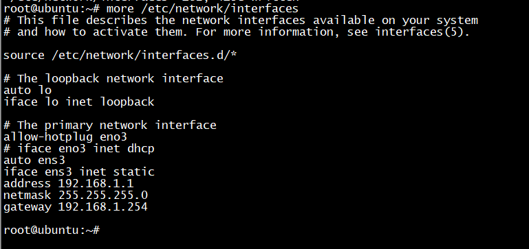
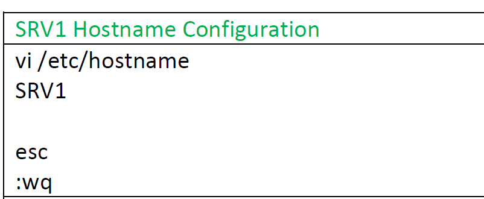
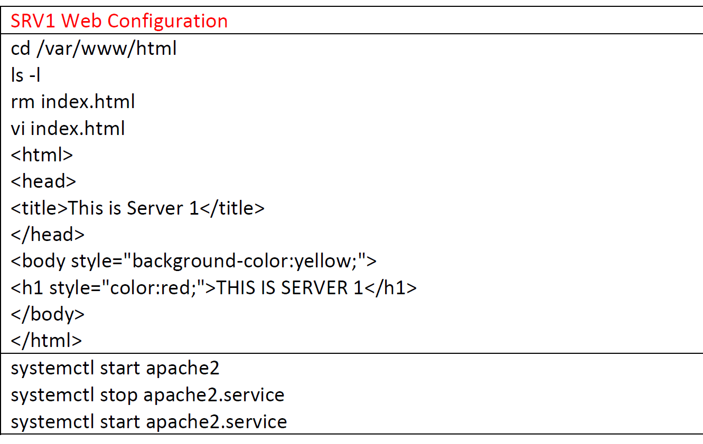
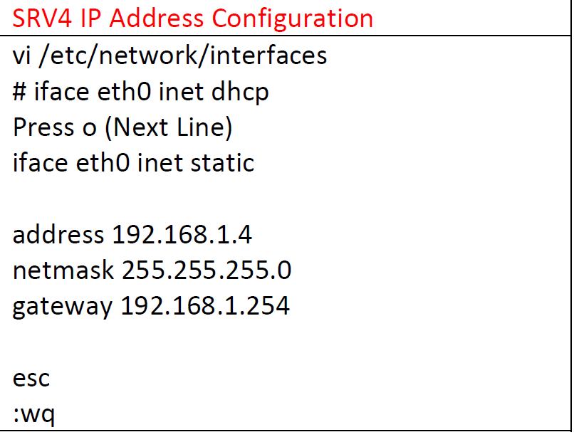
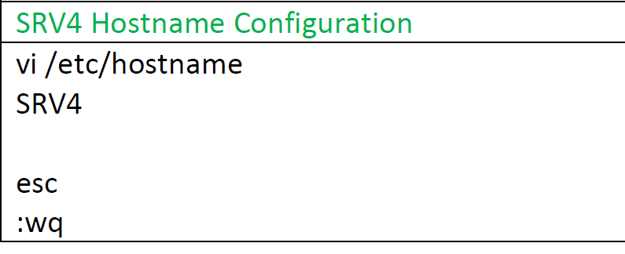
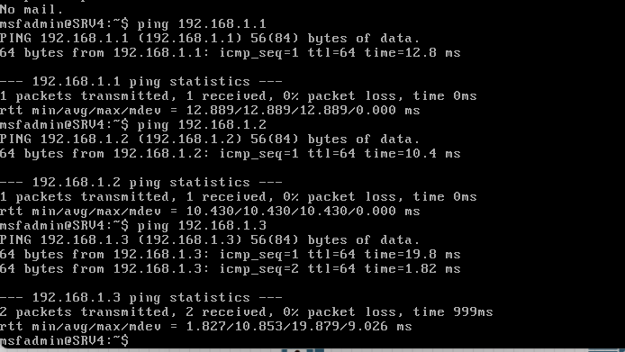

# 先配右边实际服务器集群

# 密码 root/root，sec的是msfadmin/msfadmin



# （这里建议直接刷)配网卡/sec/network/interfaces

```sh
#!/bin/bash
sudo cat > /etc/network/interfaces << EOF
auto ens3
iface ens3 inet static
address 192.168.1.1
gateway 192.168.1.254
netmask 255.255.255.0
network 192.168.1.0
EOF
#!/bin/bash
sudo cat > /etc/hostname << EOF
SRV1
EOF
#!/bin/bash
sudo cat > /var/www/html/index.html << EOF
<html>
<head>
<title>This is Server 1</title>
</head>
<body style="background-color:yellow;">
<h1 style="color:red;">THIS IS SERVER 1</h1>
</body>
</html>
EOF
```

```sh
auto ens3
iface ens3 inet static
address 192.168.1.1
netmask 255.255.255.0
gateway 192.168.1.254
```



# 配 host name



# 配 html，先 rm 之前的/var/www/html



```html
<html>
  <head>
    <title>This is Server2</title>
  </head>
  <body style="background-color:yellow;">
    <h1 style="color:red;">This is Server2</h1>
  </body>
</html>
```

# 重启 web 服务

```sh
systemctl start apache2
systemctl stop apache2.service
systemctl start apache2.service
```

# SRV1，SRV2，SRV3 都可以根据手册刷

# SRV4 自己配，用 vnc 配而不是 telnet，用户名 msfadmin/msfadmin




# 最后结果就是全通


