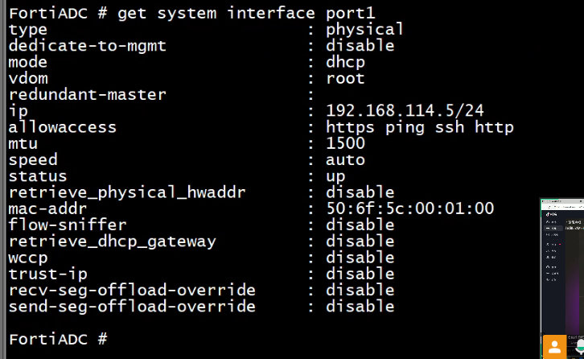
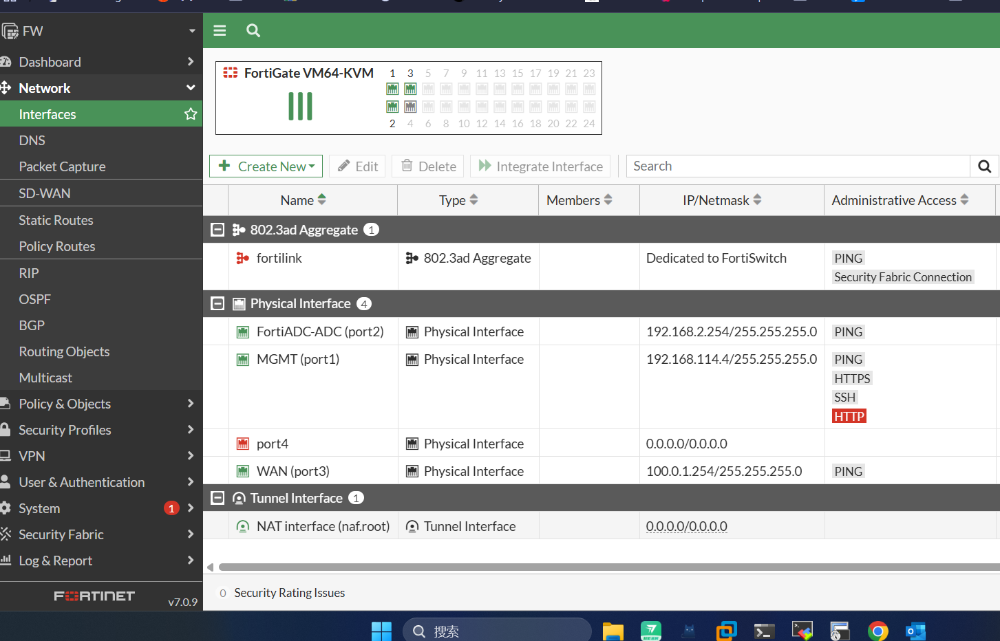
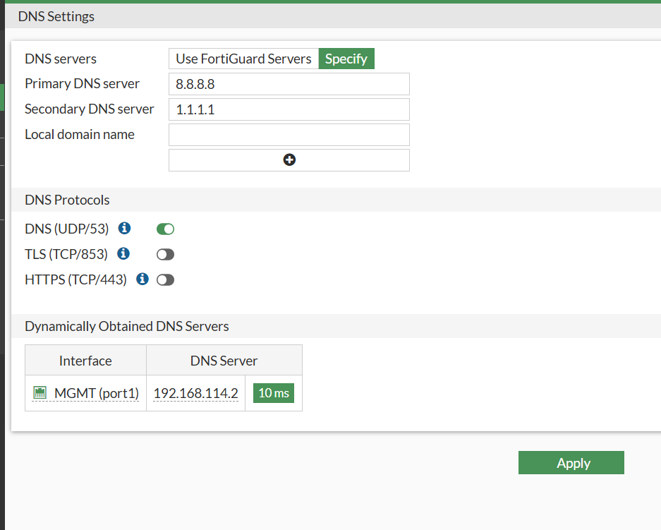
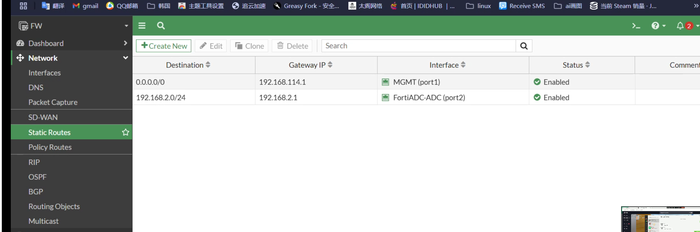
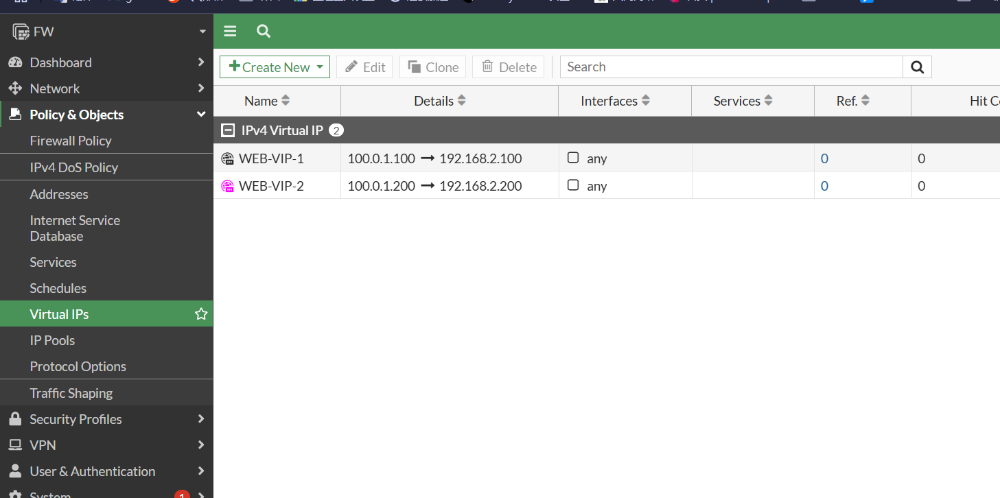
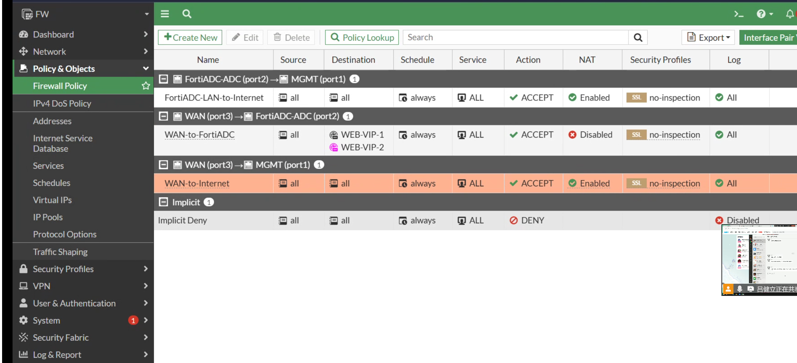
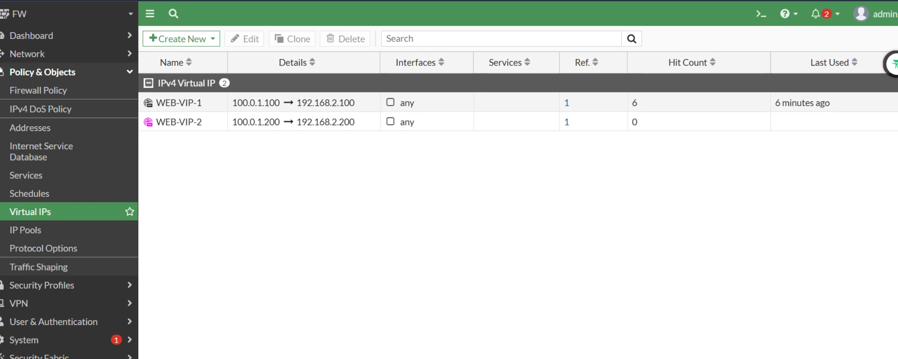

# admin/123

# 强制 1cpu,2048 内存

# 配 port1 口

# 地址是 192.168.114.4(dhcp 配置的),通过 `get system interface port1`查看(或者`get system interface  physical port1`)

# 配 IP

# 配 DNS

# 加路由

# 加虚拟服务器

# 加策略

# LAN-to-SRV 是访问的虚 IP 服务器

# SRV-to-公网

# SRV-to-LAN

# 创建 vip 后，下面的 linux 就能通了

# 后续负载均衡后可以看到 hit 到的情况

