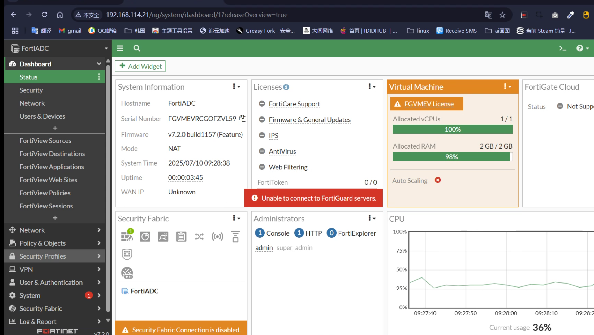

# 192.168.114.21

# 界面配置按照配置配

# admin/123

# 记住只能 1cpu,2048 内存，不然就会要授权（吐了）

# 记住用 http 而不是 https

```sh
config system global
set hostname FortiADC
end
```

```sh
config system interface
edit port1
set allowaccess https http ping ssh
set mode static
set ip 192.168.114.21/24
end
```

# 进去界面



# 调整一下内存占用

```sh
config system global
    set https-redirect disable
    set admin-idle-timeout 300
    set performance-mode enable
    set sync-slb-statistics disable
    set port-telnet 0
    set ssh-hmac-md5 disable
    set ssh-hmac-sha1 disable
    set pre-login-banner disable
    set addrbook disable
    set total-sessions 50
end
```
