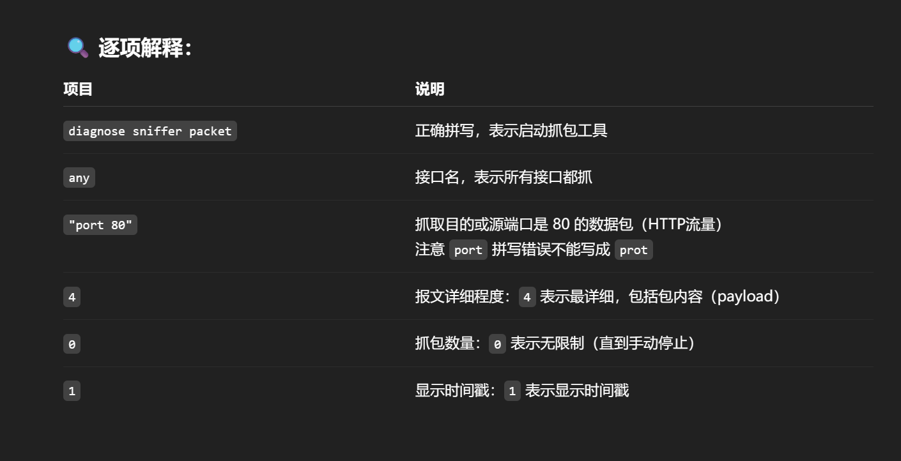
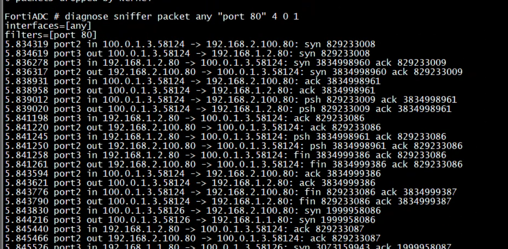
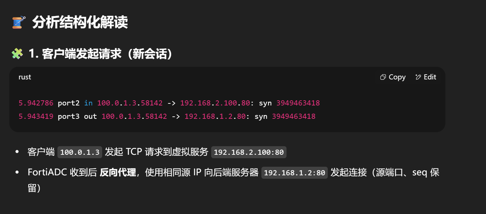
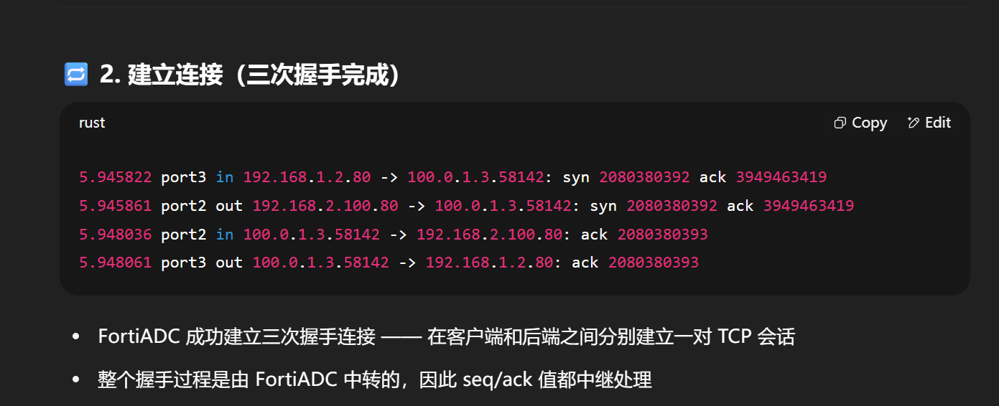
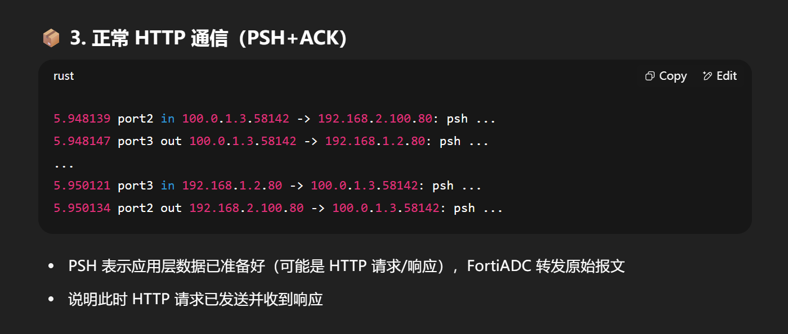
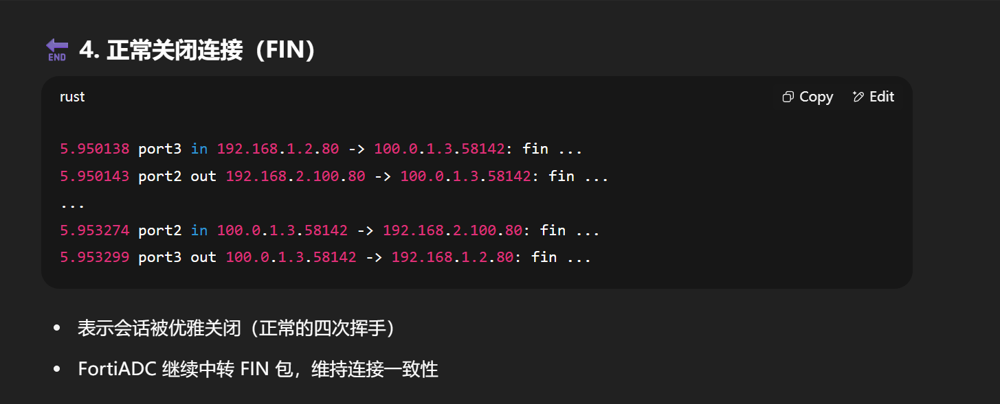
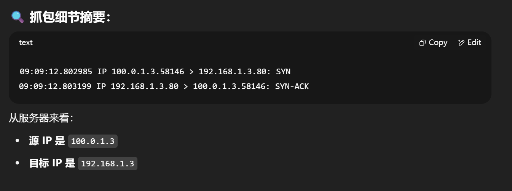
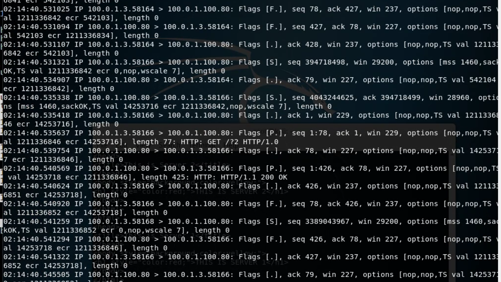

# 先禁用健康检测的抓包（防治影响观察）

# 使用飞塔专用的抓包工具 diagnose sniffer

```sh
diagnose sniffer packer any "port 80" 4 0 1
```



# 解读抓包



# 客户端发起请求，发挥反向代理的作用



# 握手连接（两对）分别是访问 ip 和实际的服务器 ip,虚 ip 和实际的服务器 ip

# 注意，只有 ADC 上能看到真实服务器 ip，但是实际上 100.0.1.3 上是看不到真实服务器 ip:192.168.1.2 的



# psh 代表应用层的正常通信



# fin 表示正常关闭连接



# 服务器上的抓包看不见 vip，但是能看见真实的客户端地址



# 但是客户端上，连虚 IP 都看不到


