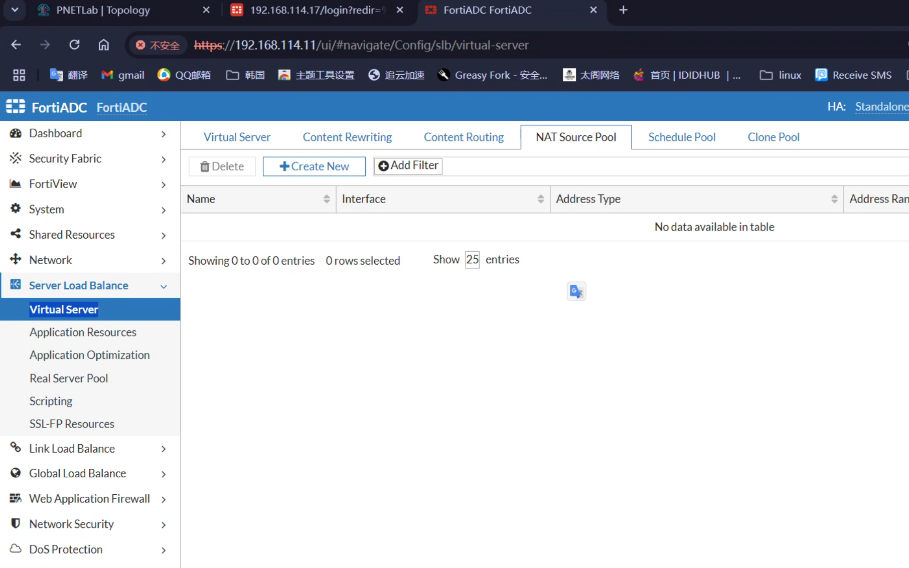
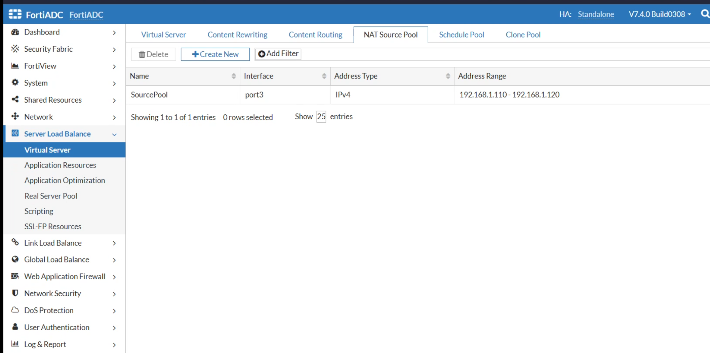
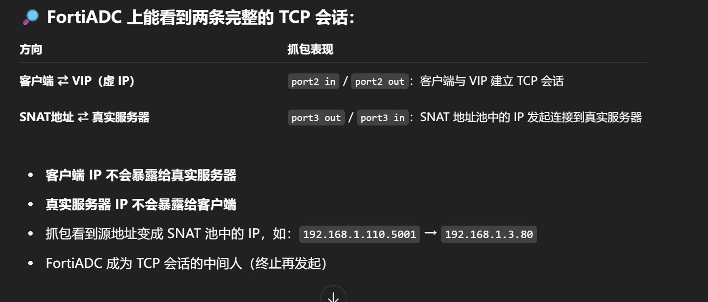

# 在虚拟服务器-添加 Nat source pool




# 然后再抓包分析

## fortiADC

```sh
FortiADC # diagnose sniffer packet any "port 80" 4 0 1
interfaces=[any]
filters=[port 80]
11.558888 port2 in 100.0.1.3.58184 -> 192.168.2.100.80: syn 3979005989
11.559529 port3 out 192.168.1.110.5001 -> 192.168.1.3.80: syn 2033227596
11.564384 port3 in 192.168.1.3.80 -> 192.168.1.110.5001: syn 3566553495 ack 2033227597
11.564480 port2 out 192.168.2.100.80 -> 100.0.1.3.58184: syn 3566553495 ack 3979005990
11.567175 port2 in 100.0.1.3.58184 -> 192.168.2.100.80: ack 3566553496
11.567210 port3 out 192.168.1.110.5001 -> 192.168.1.3.80: ack 3566553496
11.567367 port2 in 100.0.1.3.58184 -> 192.168.2.100.80: psh 3979005990 ack 3566553496
11.567381 port3 out 192.168.1.110.5001 -> 192.168.1.3.80: psh 2033227597 ack 3566553496
11.569389 port3 in 192.168.1.3.80 -> 192.168.1.110.5001: ack 2033227674
11.569412 port2 out 192.168.2.100.80 -> 100.0.1.3.58184: ack 3979006067
11.574201 port3 in 192.168.1.3.80 -> 192.168.1.110.5001: psh 3566553496 ack 2033227674
11.574240 port2 out 192.168.2.100.80 -> 100.0.1.3.58184: psh 3566553496 ack 3979006067
11.574329 port3 in 192.168.1.3.80 -> 192.168.1.110.5001: fin 3566553922 ack 2033227674
11.574345 port2 out 192.168.2.100.80 -> 100.0.1.3.58184: fin 3566553922 ack 3979006067
11.576697 port2 in 100.0.1.3.58184 -> 192.168.2.100.80: ack 3566553922
11.576727 port3 out 192.168.1.110.5001 -> 192.168.1.3.80: ack 3566553922
11.577345 port2 in 100.0.1.3.58184 -> 192.168.2.100.80: fin 3979006067 ack 3566553923
11.577370 port3 out 192.168.1.110.5001 -> 192.168.1.3.80: fin 2033227674 ack 3566553923
11.577427 port2 in 100.0.1.3.58186 -> 192.168.2.100.80: syn 4196336059
11.577911 port3 out 192.168.1.111.5001 -> 192.168.1.2.80: syn 3619854578
11.579353 port3 in 192.168.1.3.80 -> 192.168.1.110.5001: ack 2033227675
11.579385 port2 out 192.168.2.100.80 -> 100.0.1.3.58184: ack 3979006068
11.582386 port3 in 192.168.1.2.80 -> 192.168.1.111.5001: syn 3292162233 ack 3619854579
11.582421 port2 out 192.168.2.100.80 -> 100.0.1.3.58186: syn 3292162233 ack 4196336060
11.585084 port2 in 100.0.1.3.58186 -> 192.168.2.100.80: ack 3292162234
11.585108 port3 out 192.168.1.111.5001 -> 192.168.1.2.80: ack 3292162234
11.585168 port2 in 100.0.1.3.58186 -> 192.168.2.100.80: psh 4196336060 ack 3292162234
11.585177 port3 out 192.168.1.111.5001 -> 192.168.1.2.80: psh 3619854579 ack 3292162234
11.587754 port3 in 192.168.1.2.80 -> 192.168.1.111.5001: ack 3619854656
```

# 客户端不会暴露真实 ip 给服务器（相比于 DNAT）


