# 前提是在 Virtual Server 中选择七层负载均衡的 http

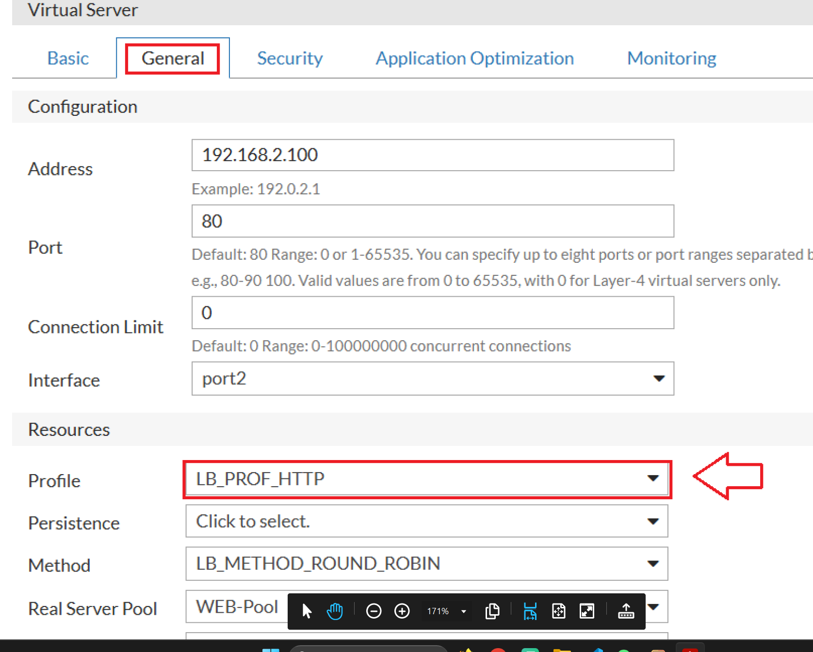

# 只在 SRv1 创建 apache 下的/var/www/html/rs.html

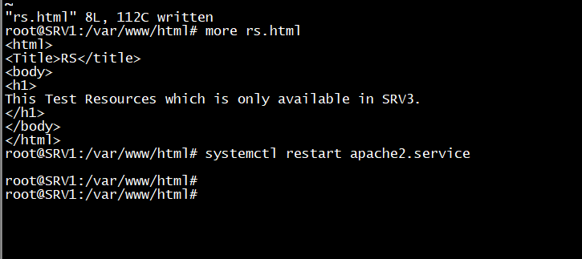

# 访问，只从 SRV1 响应

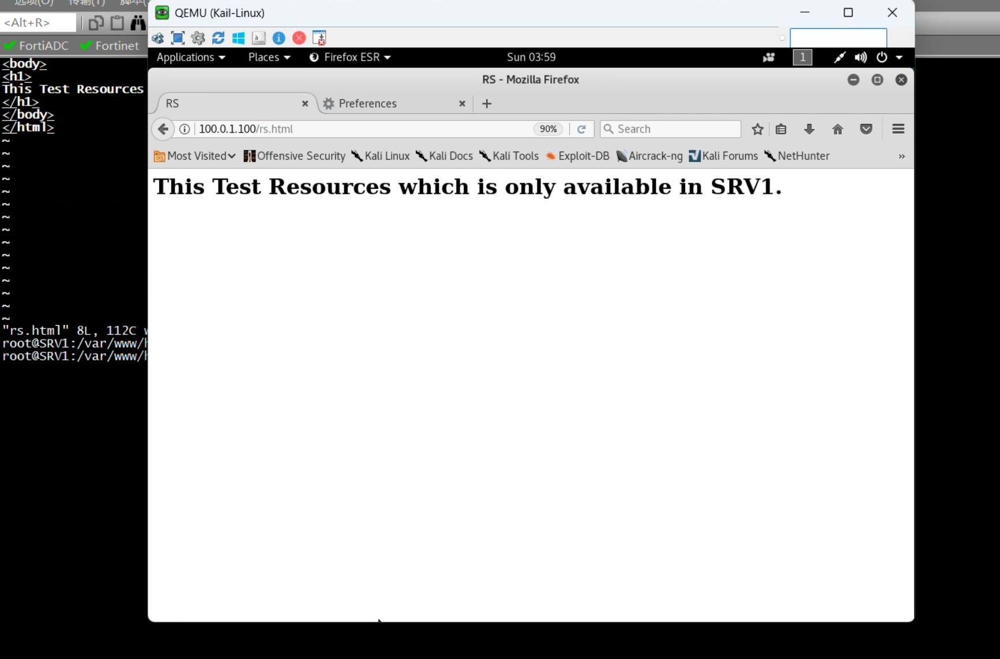

# 但是问题就是由于其他服务器也存活，但是没有 rs.html，当轮询后可能导致页面访问失败

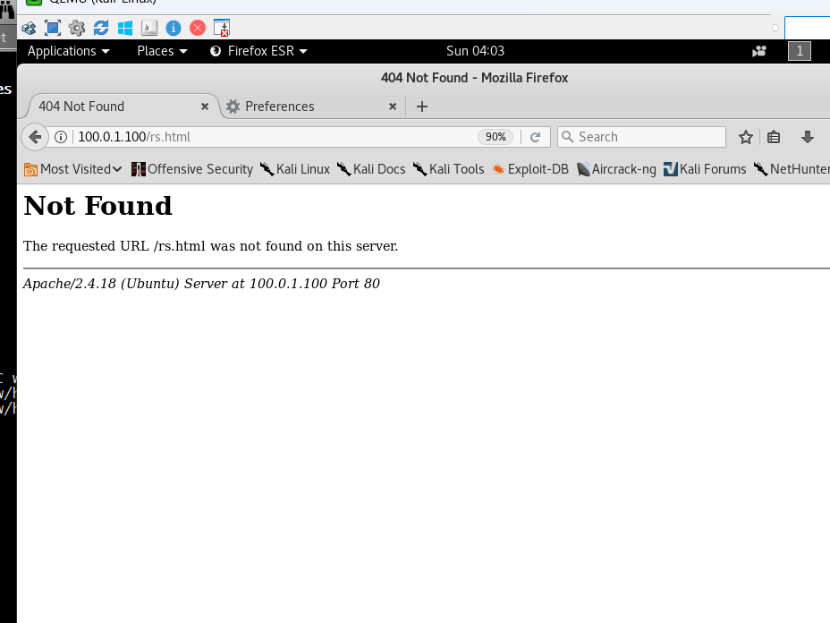

# 解决办法：先添加 `real server`资源

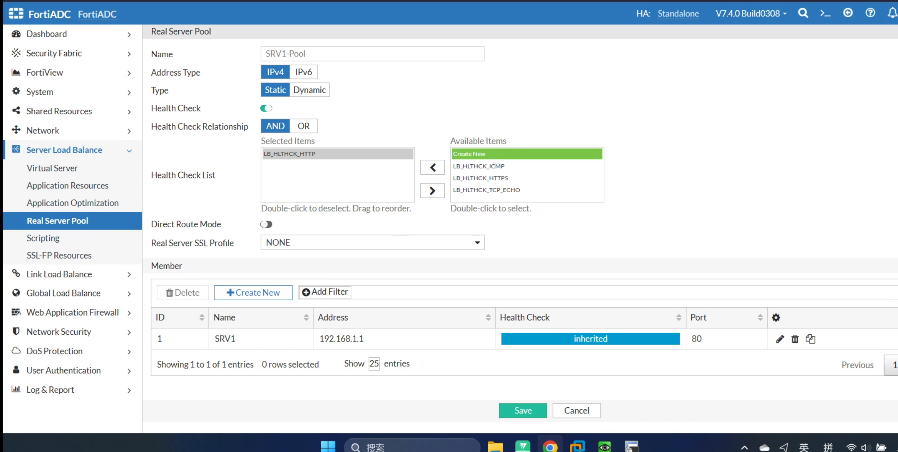

# 再在 Virtual Server 中添加 content routing 内容路由

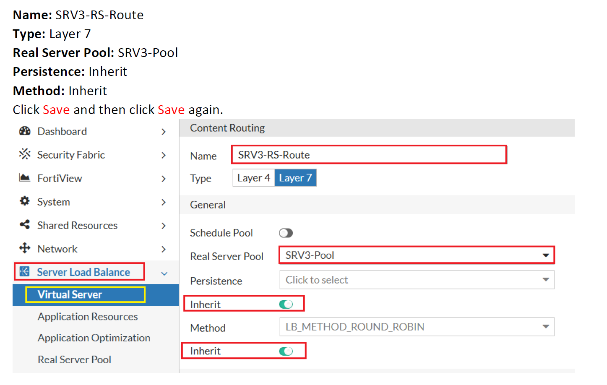
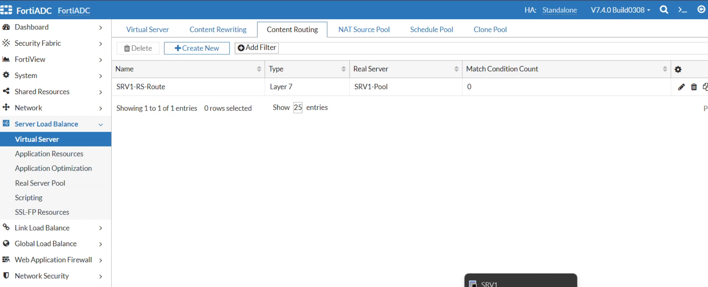

# 也得添加一个 all 的

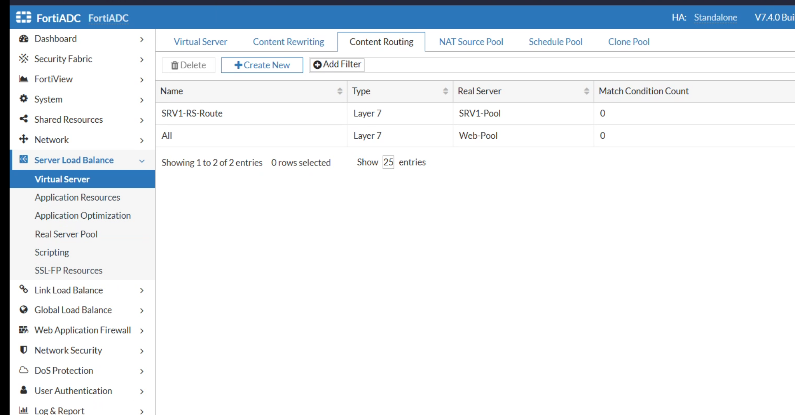

# 添加七层的 rs.html 的内容

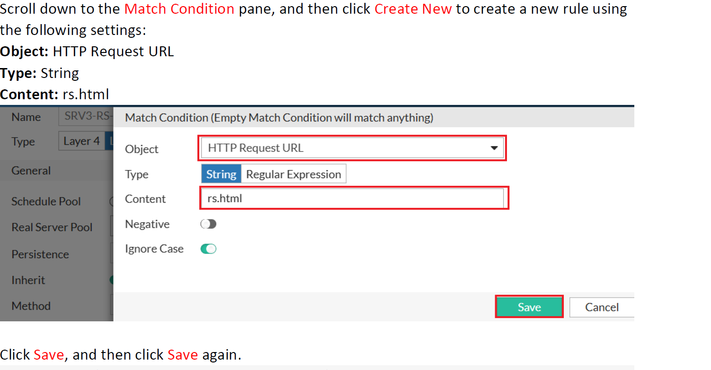
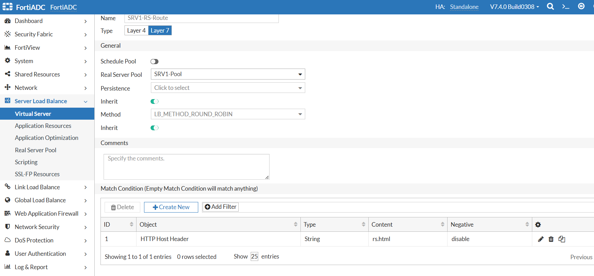

# 在 all 里面也添加规则

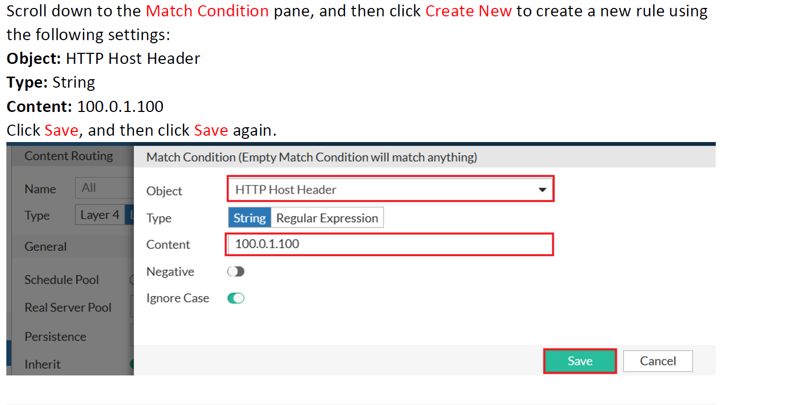

# 在 virtual server 上加上要调用 content routing

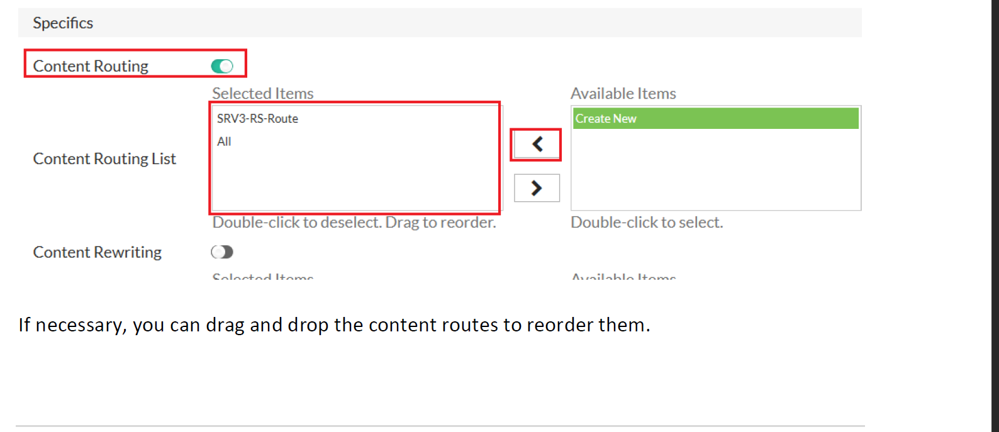

# 再写个报错页面

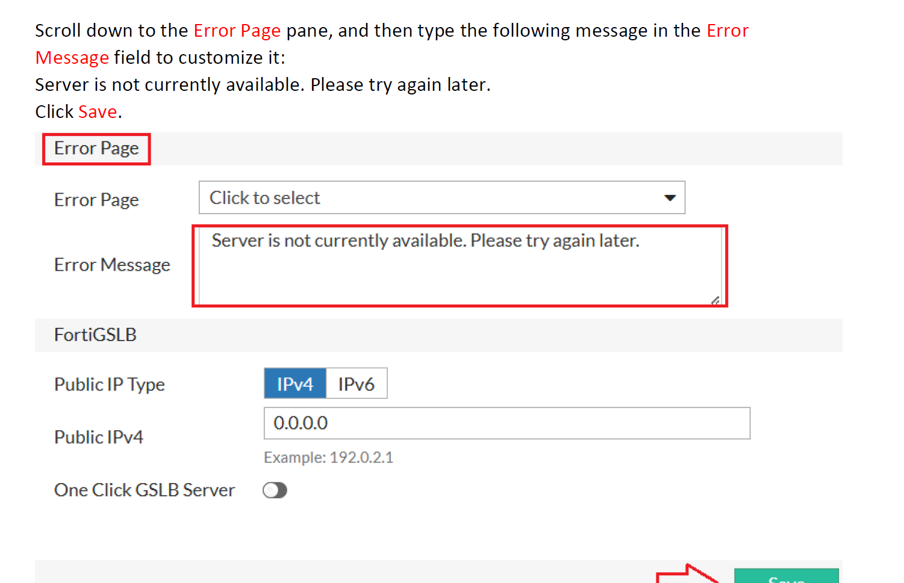

# 测试一下效果

```sh
service apache2 stop
```

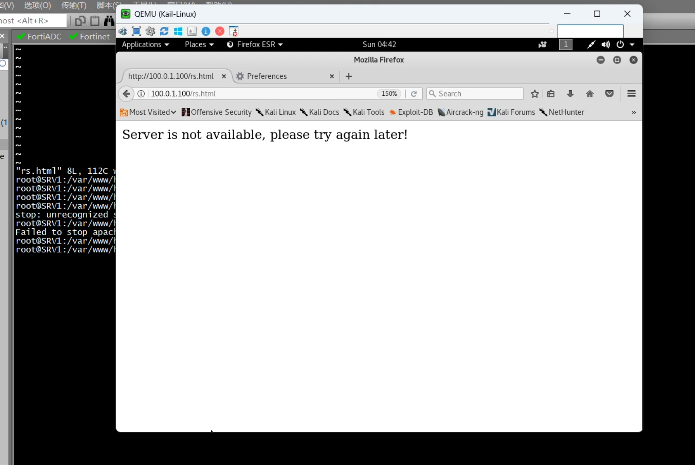
