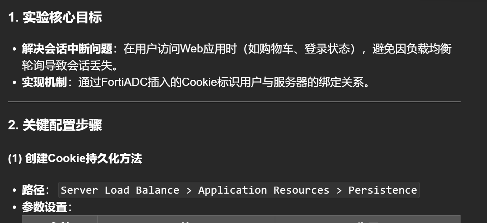
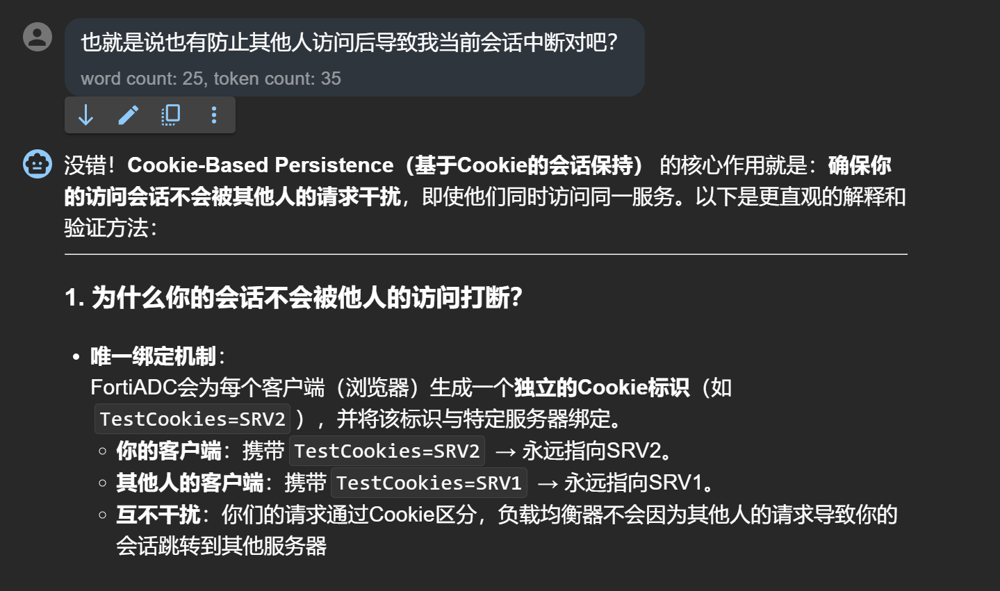
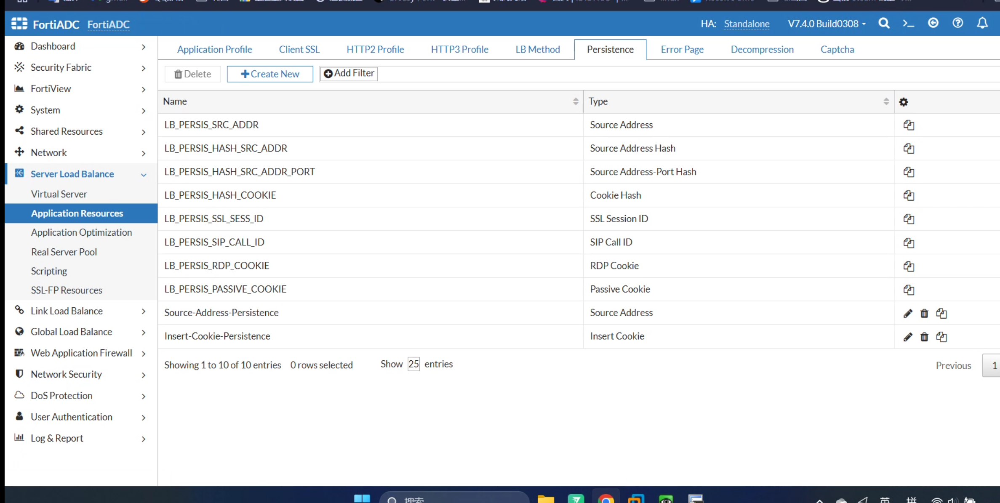
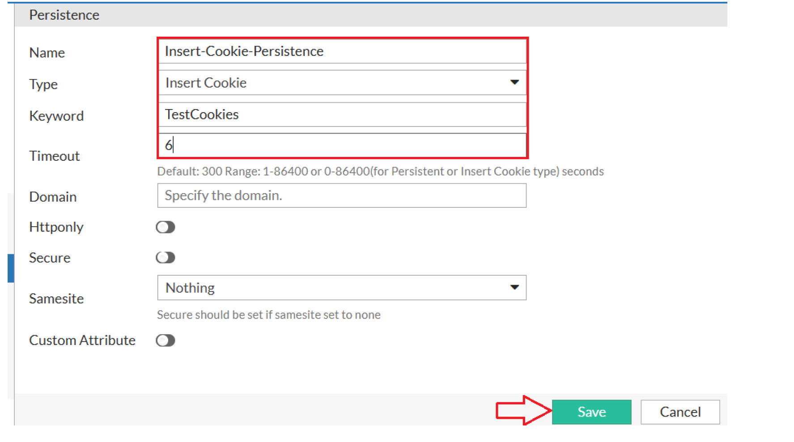
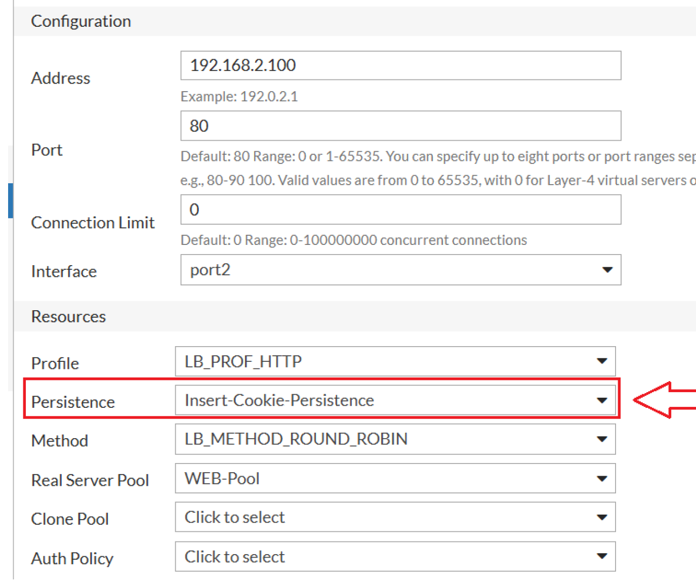
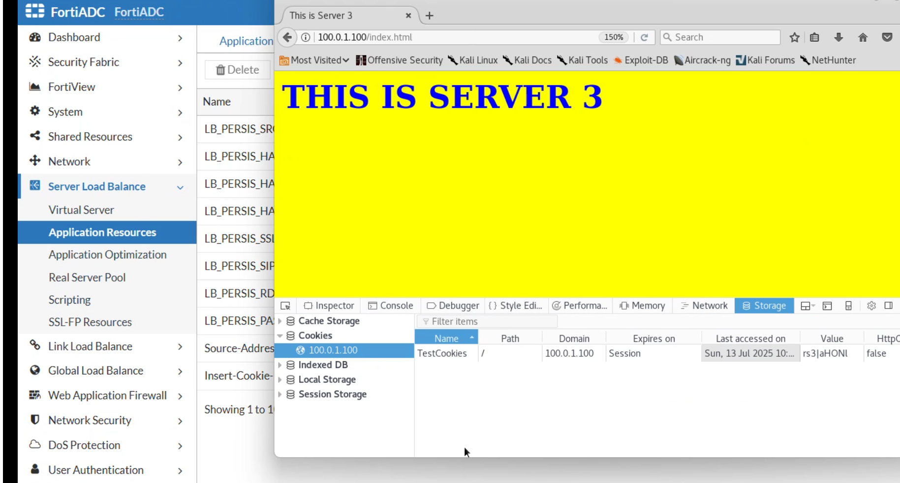

# 基于 Cookie 的会话保持（Cookie-Based Persistence）


# 不被其他人干扰你当前的会话

# 第一步-添加持久性策略




# 第二部，在 Virtual-Server 中调用



# 第三步，进行网络访问，看 cookies



# 访问会基于会话 cookie 保证不断连

# deepseek 表示

<details>

<summary>deepseek</summary>

````sh
这份文档是**基于Cookie的会话保持（Cookie-Based Persistence）实验指南**，详细演示了如何在FortiADC上配置会话粘性（Session Persistence），确保同一用户的请求始终转发到同一台后端服务器。以下是核心内容的系统化解析：

---

### **1. 实验核心目标**

- **解决会话中断问题**：在用户访问 Web 应用时（如购物车、登录状态），避免因负载均衡轮询导致会话丢失。
- **实现机制**：通过 FortiADC 插入的 Cookie 标识用户与服务器的绑定关系。

---

### **2. 关键配置步骤**

#### **(1) 创建 Cookie 持久化方法**

- **路径**：`Server Load Balance > Application Resources > Persistence`
- **参数设置**：
  | **参数** | **值** | **作用** |
  |-------------------|--------------------------|-----------------------------------|
  | **Name** | `Insert-Cookie-Persistence` | 自定义名称 |
  | **Type** | `Insert Cookie` | FortiADC 主动插入 Cookie |
  | **Keyword** | `TestCookies` | Cookie 的名称（客户端可见） |
  | **Timeout** | `6秒` | Cookie 有效期（控制会话保持时间） |

#### **(2) 绑定到虚拟服务器**

- **路径**：`Server Load Balance > Virtual Server > WEB-VS`
- **操作**：在`General`选项卡中，将`Persistence`设置为`Insert-Cookie-Persistence`。

---

### **3. 工作原理**

#### **(1) 首次请求流程**

```mermaid
sequenceDiagram
    participant Client
    participant FortiADC
    participant Server
    Client->>FortiADC: 请求 http://100.0.1.100
    FortiADC->>Server: 轮询选择服务器（如SRV2）
    Server-->>FortiADC: 返回响应
    FortiADC->>Client: 插入Cookie: TestCookies=SRV2
````

- **客户端 Cookie**：
  ```http
  Set-Cookie: TestCookies=SRV2; Path=/; Expires=6秒后
  ```

#### **(2) 后续请求流程**

- 客户端携带 Cookie 访问时，FortiADC 直接路由至`SRV2`，无视负载均衡算法。
- **超时机制**：6 秒后 Cookie 失效，重新触发服务器选择。

---

### **4. 验证方法**

#### **(1) 浏览器测试**

- **操作**：
  1. 访问`http://100.0.1.100`，多次刷新页面（`CTRL+SHIFT+R`）。
  2. **预期结果**：所有请求均由同一服务器（如 SRV2）处理。
  3. 关闭浏览器等待 6 秒后重新访问，可能分配新服务器。

#### **(2) 检查工具**

| **验证方式**         | **操作步骤**                                             | **预期输出**                               |
| -------------------- | -------------------------------------------------------- | ------------------------------------------ |
| **浏览器开发者工具** | 查看`Storage > Cookies`                                  | 显示`TestCookies=SRV2`                     |
| **FortiADC 日志**    | `Log & Report > Traffic Log` 过滤`virtual_server:WEB-VS` | 记录相同服务器 IP（如 192.168.1.2）        |
| **CLI 抓包**         | `diagnose sniffer packet any "port 80" 4`                | 观察 HTTP 头中的`Cookie: TestCookies=SRV2` |

---

### **5. 高级配置建议**

#### **(1) 超时时间优化**

- **短超时**（如 60 秒）：适用于高并发短会话场景（如 API）。
- **长超时**（如 3600 秒）：适用于购物车、登录状态等长会话。

#### **(2) 安全增强**

- **Secure/HttpOnly 标记**：防止 XSS 攻击窃取 Cookie。
  ```bash
  config firewall vip
      edit "WEB-VS"
          set persistence-cookie-secure enable
          set persistence-cookie-httponly enable
      next
  end
  ```

#### **(3) 自定义 Cookie 值**

- **基于服务器 IP 或哈希**：
  ```bash
  set persistence-cookie-value "server-ip"  # 或 "server-hash"
  ```

---

### **6. 排错指南**

| **问题现象**         | **排查步骤**                                                                 |
| -------------------- | ---------------------------------------------------------------------------- |
| **Cookie 未插入**    | 1. 确认虚拟服务器为`Layer 7`模式。<br>2. 检查 Persistence 方法是否绑定正确。 |
| **会话不保持**       | 1. 检查客户端是否禁用 Cookie。<br>2. 确认超时时间未过期。                    |
| **多浏览器共享会话** | 需配置`Source IP Persistence`（非本实验范围）。                              |

---

### **7. 典型应用场景**

#### **(1) 电商平台**

- **需求**：用户购物车数据一致性。
- **方案**：Cookie 绑定至特定服务器，超时设为会话周期（如 30 分钟）。

#### **(2) 在线支付**

- **需求**：支付流程不可中断。
- **方案**：启用`Secure+HttpOnly` Cookie，超时匹配支付网关限制。

---

### **8. 总结**

- **优势**：
  - **用户体验**：避免会话丢失导致的重复登录或数据不一致。
  - **灵活性**：可通过 Cookie 控制会话保持粒度。
- **注意事项**：
  - **性能影响**：需权衡会话保持与负载均衡的公平性。
  - **客户端依赖**：需确保客户端支持 Cookie（禁用 Cookie 时需回退到 IP 持久化）。

如需配置混合持久化策略（如 Cookie+源 IP），可进一步探讨！

```
</details>
```
