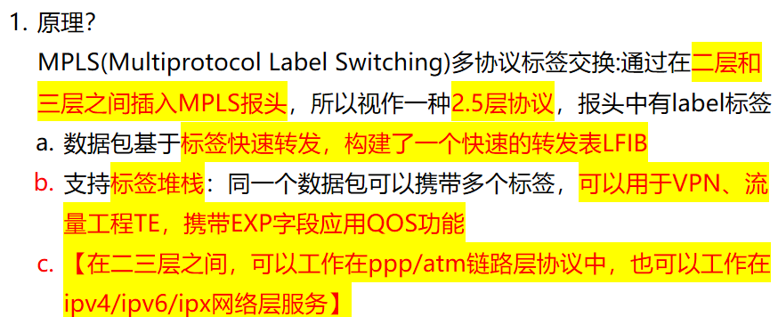
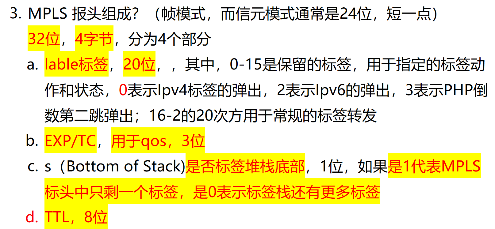
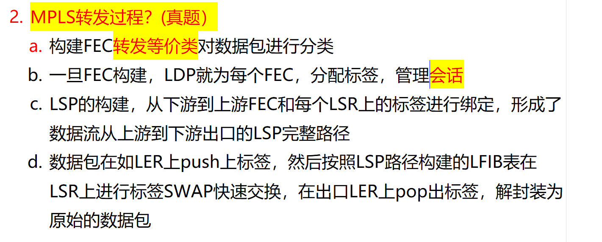

# 1. MPLS 原理？

<!-- en-interview -->
### English Interview

**Question:** Can you explain the working principle of MPLS (Multiprotocol Label Switching)?

**Answer:**

Sure. MPLS is a protocol that operates between Layer 2 and Layer 3, often considered a Layer 2.5 technology. Its core idea is to insert a label header into packets, enabling faster forwarding through a Label Forwarding Information Base (LFIB) instead of relying on traditional IP routing lookups. This label-based switching significantly improves performance and scalability. One key feature is label stacking — multiple labels can be carried in a single packet, which supports advanced functions like VPNs, Traffic Engineering (TE), and QoS via the EXP field. MPLS is flexible: it can work over various link-layer protocols such as PPP or ATM, and also over network-layer services like IPv4, IPv6, or IPX. This makes it highly adaptable for different network environments. In practice, it’s widely used in service provider networks to optimize traffic flow and support virtual private networks efficiently.

# 2.MPLS 标签的取值范围是多少？(重点)

<!-- en-interview -->
### English Interview

**Question:** What is the valid range of MPLS label values?

**Answer:**

MPLS labels are 20 bits long, so the theoretical range is from 0 to 2^20 - 1, which is 0 to 1,048,575. However, not all values are used for regular forwarding. Labels 0 to 15 are reserved for special purposes. For example, label 0 is used for IPv4 explicit null, meaning the label is popped at the egress LSR. Label 2 is for IPv6 explicit null, and label 3 is for PHP (Penultimate Hop Popping), where the label is removed at the penultimate hop. These reserved labels help control label operations and improve efficiency. The rest, from 16 to 1,048,575, are available for normal label switching and forwarding. It's important to note that while the label space is large, in practice, labels are often allocated dynamically by LDP or RSVP-TE, and the actual usage depends on the network design and scale. So, the full range is 0 to 1,048,575, but only 16 to 1,048,575 are typically used for regular data forwarding.

# 3. MPLS 标签转发过程？

<!-- en-interview -->
### English Interview

**Question:** Can you explain the MPLS label forwarding process?

**Answer:**

Sure. MPLS forwarding is based on label switching, which enables faster packet forwarding by replacing complex IP routing lookups with simple label-based switching. The process starts with classifying packets into Forwarding Equivalence Classes (FECs) based on criteria like destination IP, VLAN, or QoS. Once FECs are defined, the Label Distribution Protocol (LDP) assigns unique labels to each FEC and establishes label distribution sessions between Label Switch Routers (LSRs). Then, Label Switched Paths (LSPs) are built from downstream to upstream, binding each FEC to a specific label at every LSR along the path. When a packet enters the MPLS network at the ingress LER, a label is pushed onto it. As it traverses the core, each LSR performs a label swap using its Local Forwarding Information Base (LFIB) to quickly forward the packet. Finally, at the egress LER, the label is popped off, and the original IP packet is restored for delivery to its destination. This mechanism significantly improves forwarding efficiency and supports traffic engineering and QoS.

# 4. 如何判断是一个 MPLS 标签？

<!-- en-interview -->
### English Interview

**Question:** How can a router determine whether a packet carries an MPLS label?

**Answer:**

A router identifies if a packet carries an MPLS label by checking specific protocol fields in the packet’s encapsulation. For Ethernet frames, it examines the EtherType field in Layer 2. If the EtherType value is 0x8847, it indicates a unicast packet with an MPLS label; 0x8848 means a multicast MPLS packet. On PPP or POS links, the router checks the protocol field of the frame. A value of 0x0281 indicates a unicast MPLS packet, while 0x0283 denotes a multicast MPLS packet. These values are standardized and allow the router to quickly distinguish MPLS-labeled traffic from regular IP packets without needing to parse the entire payload. This mechanism is essential for efficient label switching in MPLS networks, enabling routers to forward packets based on labels rather than IP addresses. The identification happens at the ingress of the MPLS domain, ensuring proper label imposition and forwarding.

# 5. 如何判断 IP 报文即将进入 mpls 域？

<!-- en-interview -->
### English Interview

**Question:** How can you determine if an IP packet is about to enter an MPLS domain?

**Answer:**

To determine if an IP packet is entering an MPLS domain, the key is to check the forwarding decision made by the router based on its routing and label forwarding tables. The core mechanism lies in the Label Forwarding Information Base (LFIB) and the Forwarding Information Base (FIB). When a packet arrives, the router looks up the destination prefix in the FIB. If that prefix is associated with a label in the LFIB—meaning it’s bound to an MPLS label—then the packet will enter the MPLS forwarding path. Another way, especially in tunneling scenarios, is to inspect the Tunnel ID. If the Tunnel ID is 0x0, it indicates a normal IP forwarding process. But if the Tunnel ID is non-zero, it means the packet is being steered into an MPLS LSP (Label Switched Path), and thus enters the MPLS domain. For example, in a VPN or TE tunnel, the Tunnel ID would be assigned by the control plane (like LDP or RSVP-TE), signaling the packet to follow the MPLS path instead of traditional IP routing.

# 6. MPLS 上游和下游指的是什么？

<!-- en-interview -->
### English Interview

**Question:** In MPLS, what do upstream and downstream mean?

**Answer:**

In MPLS, upstream and downstream refer to the direction of label distribution and data flow. The core concept is that data flows from upstream to downstream — from the source to the destination — but label distribution works in the reverse direction. Downstream devices are responsible for assigning labels to specific IP prefixes and then advertising those labels to upstream devices using protocols like LDP. So, downstream is the label allocator, while upstream receives the labels and uses them for forwarding packets. For example, if Router A is upstream to Router B, Router B (downstream) will assign a label for a particular route and send that label mapping to Router A. Then, when data arrives at Router A, it forwards the packet using the received label, pushing it onto the packet and sending it toward Router B. This mechanism allows for efficient, label-switched paths without requiring complex routing lookups at each hop. It’s a key part of MPLS’s ability to provide fast, scalable traffic engineering and QoS.

# 7. 为什么说 MPLS 比 IP 高效？

<!-- en-interview -->
### English Interview

**Question:** Why is MPLS considered more efficient than traditional IP routing?

**Answer:**

MPLS is more efficient than IP because it replaces complex IP lookup with simple label switching. In traditional IP forwarding, routers use the longest prefix match algorithm, which requires scanning the entire routing table for each packet. For example, if a destination IP like 10.10.10.10 is covered by four different routes, the router must compare all of them to choose the best path—this is computationally heavy and slows down forwarding. In contrast, MPLS uses short, fixed-length labels to make forwarding decisions. When a packet enters an MPLS network, the ingress router assigns a label based on the destination, and each intermediate router simply swaps the label based on a label forwarding table—no IP lookup needed. This leads to much faster, hardware-accelerated forwarding. Additionally, while ATM also uses fixed-length labels, it’s more complex and expensive, making MPLS a more practical and scalable solution. So, MPLS combines the speed of ATM with the flexibility of IP, resulting in higher efficiency and better performance for modern networks.
