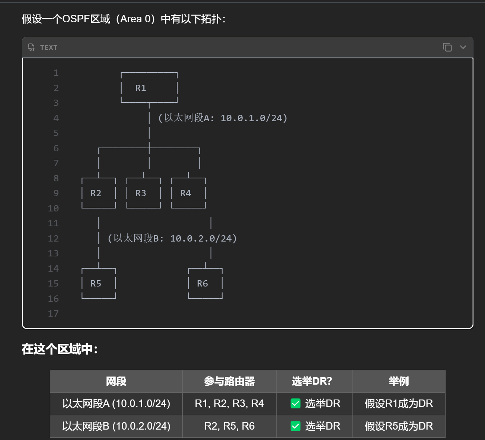
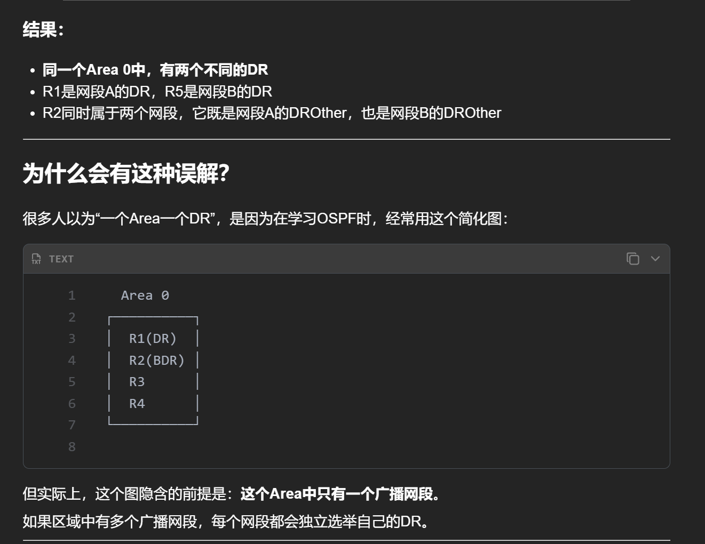
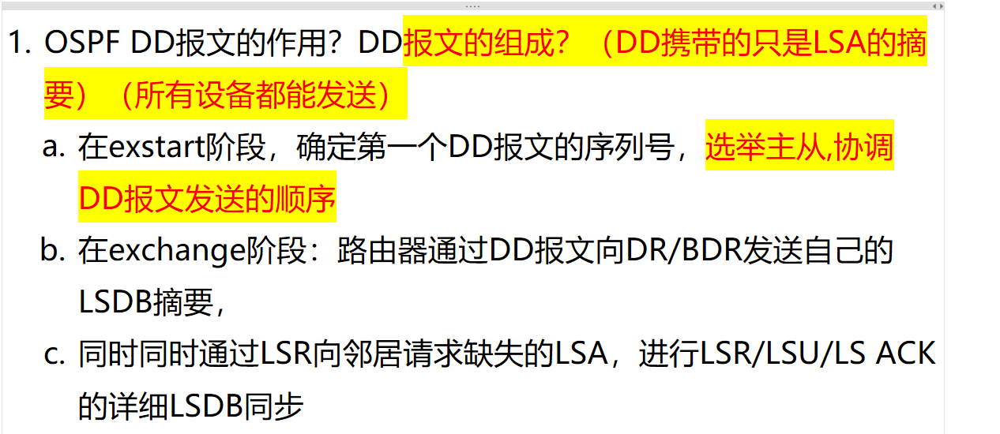
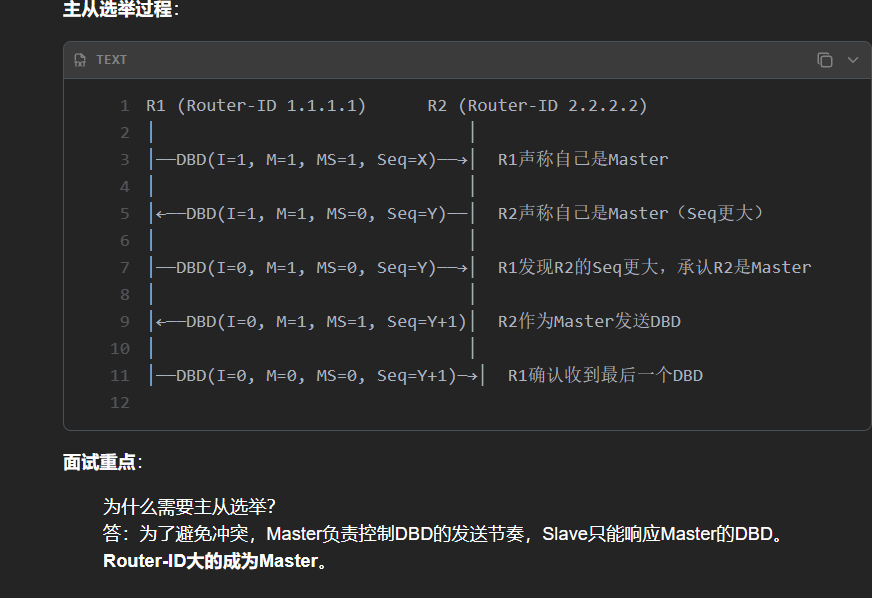
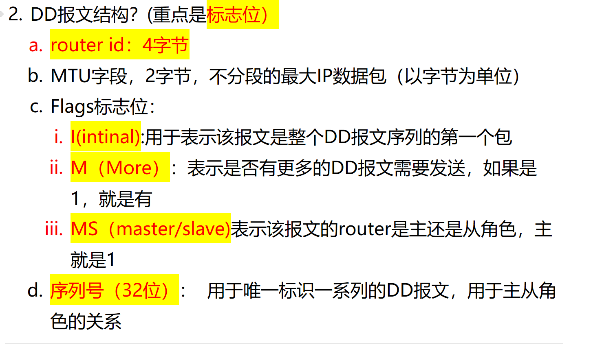
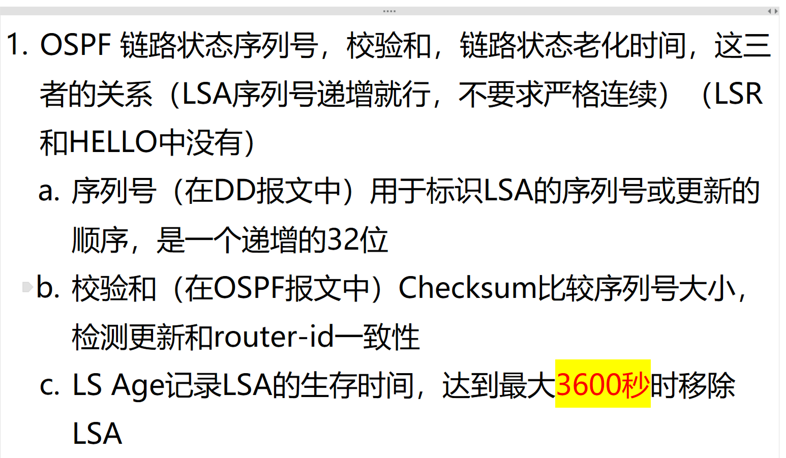
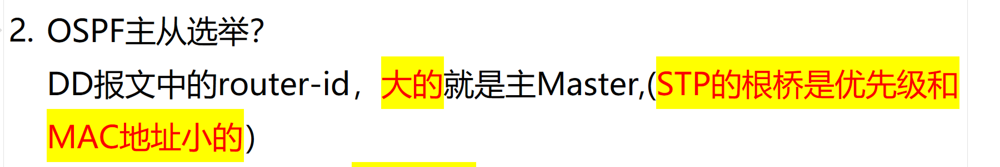

# DR是什么？一个OSPF只能有一个DR角色吗？

<!-- en-interview -->
### English Interview

**Question:** What is a DR in OSPF, and can there be only one DR per OSPF area?

**Answer:**

No, there isn’t necessarily only one DR per OSPF area. The DR, or Designated Router, is elected per broadcast or non-broadcast multi-access network segment, not per area. So if an OSPF area contains multiple broadcast segments, each segment will independently elect its own DR. For example, in Area 0 with two subnets—say, 10.0.1.0/24 and 10.0.2.0/24—each will have its own DR. One router might be DR for subnet A, while another is DR for subnet B. Routers connected to multiple segments, like R2 in this case, can be a DROther on one segment and DR or BDR on another. The common misconception that “one area, one DR” comes from simplified diagrams that assume only one broadcast segment exists in the area. But in reality, OSPF elects DRs per network segment to reduce flooding and optimize LSDB synchronization. So, the key point is: DR election is per segment, not per area.

# 1. OSPF DD 报文的作用？

<!-- en-interview -->
### English Interview

**Question:** What is the role of OSPF Database Description (DD) packets?

**Answer:**

DD packets in OSPF are primarily used for exchanging Link State Database (LSDB) summaries between routers during the neighbor adjacency formation process. They enable routers to compare their LSDBs and identify any missing or outdated Link State Advertisements (LSAs). The key mechanism involves the DD exchange occurring in the Exchange state, where each router sends DD packets containing LSA headers—essentially summaries, not full LSAs—allowing both sides to know what LSAs they need to request. Before this, during the ExStart state, routers negotiate a Master-Slave relationship based on Router ID, with the higher Router ID becoming Master. The Master controls the DD packet transmission sequence, ensuring orderly exchange. For example, in a typical scenario, R1 and R2 exchange DD packets with flags like I (Init), M (More), and MS (Master/Slave). Once the Master is elected, it sends DDs with Seq=Y, and the Slave responds with Seq=Y+1, continuing until all LSA summaries are exchanged. This process is crucial for efficient and synchronized LSDB synchronization, avoiding redundant full LSA floods.

# 2. DD 报文结构？携带标志位？

<!-- en-interview -->
### English Interview

**Question:** What is the structure of a DD packet in OSPF, and what are the key flag bits it carries?

**Answer:**

The DD packet, or Database Description packet, is used during OSPF neighbor adjacency formation to exchange routing database summaries. Its structure includes several key fields. First, the Router ID, which is 4 bytes, uniquely identifies the router. Next, the MTU field, 2 bytes, indicates the maximum transmission unit for unfragmented IP packets. The most important part is the Flags field, which contains three critical bits: the I-bit (Initial), which marks the first DD packet in a sequence; the M-bit (More), which indicates if more DD packets follow (1 means more are coming); and the MS-bit (Master/Slave), which determines the master-slave relationship between routers—set to 1 if the sender is the master. Finally, the 32-bit sequence number uniquely identifies each DD packet series and helps maintain synchronization between master and slave routers during the exchange. These flags ensure reliable, ordered, and synchronized database exchange between OSPF neighbors.

# 3. 序列号的作用？

<!-- en-interview -->
### English Interview

**Question:** What is the purpose of the sequence number in OSPF?

**Answer:**

The sequence number in OSPF is primarily used to identify and order Link State Advertisements (LSAs), ensuring routers can detect and process the most up-to-date topology information. It’s a 32-bit field that increments with each new LSA version, allowing routers to determine which LSA is newer—higher sequence number means newer. Importantly, it doesn’t need to be strictly consecutive, just monotonically increasing. This helps avoid loops and ensures consistency during database synchronization, especially during the exchange of DD (Database Description) packets. When a router receives an LSA, it compares the sequence number with its existing copy. If the new one has a higher number, it’s accepted and installed. If the sequence number is lower, the LSA is discarded as outdated. This mechanism, combined with checksums and LS Age, forms a robust way to maintain a consistent and accurate link-state database across the OSPF domain.

# 4. OSPF 主从选举？

<!-- en-interview -->
### English Interview

**Question:** How does OSPF elect the Master and Slave routers during neighbor establishment?

**Answer:**

In OSPF, the Master-Slave relationship is established during the Exchange state of neighbor adjacency formation. The key point is that the router with the higher Router ID becomes the Master. This is determined by comparing the Router IDs exchanged in the Database Description (DD) packets. The router with the larger Router ID takes on the Master role, while the other becomes the Slave. This election is purely based on Router ID value, not priority or MAC address — which is different from STP, where the root bridge is elected based on a combination of priority and MAC address (lower is better). The Master-Slave relationship is used to coordinate the exchange of Link State Database information. The Master controls the sequence number for DD packets, and both routers use this to ensure synchronization and avoid unnecessary retransmissions. Importantly, this is a per-interface, per-neighbor relationship, not a global election like in STP. So, in summary, higher Router ID wins the Master role in OSPF DD packet exchange.
