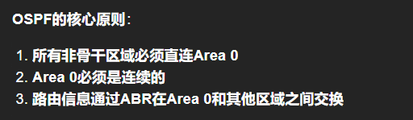
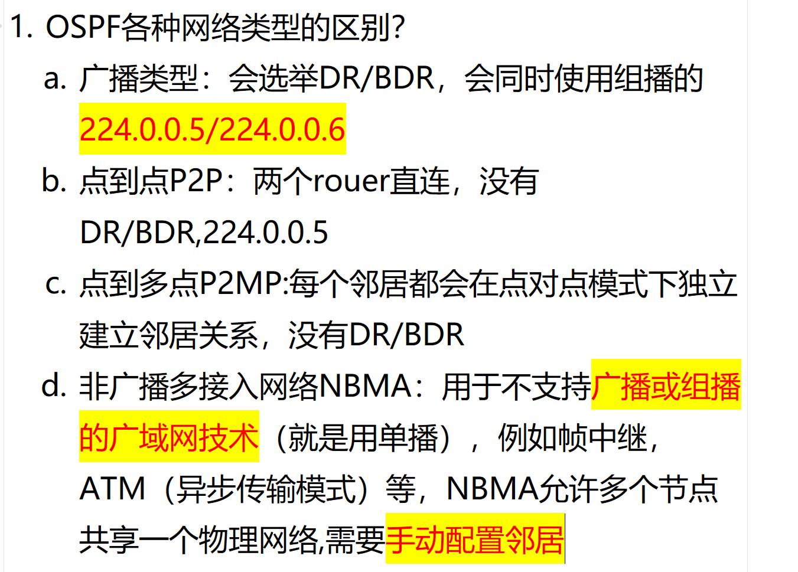
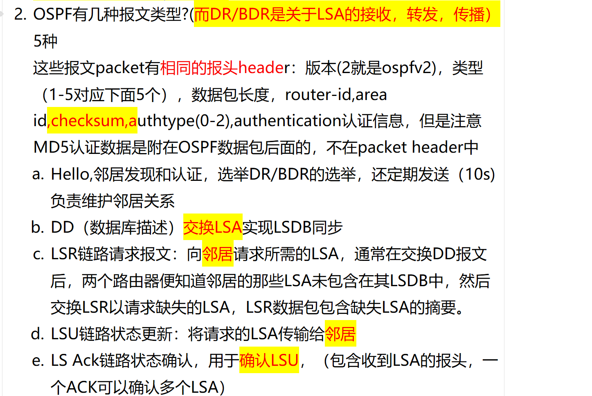
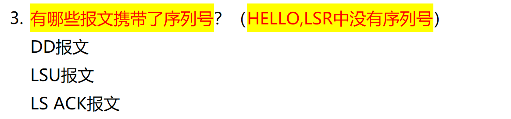
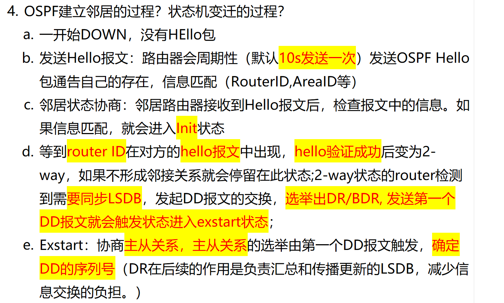
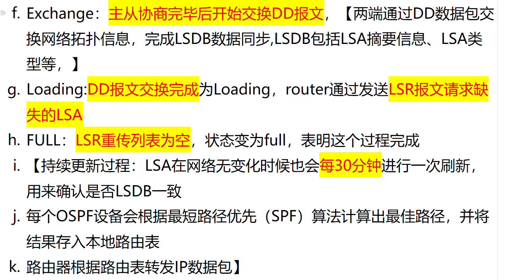
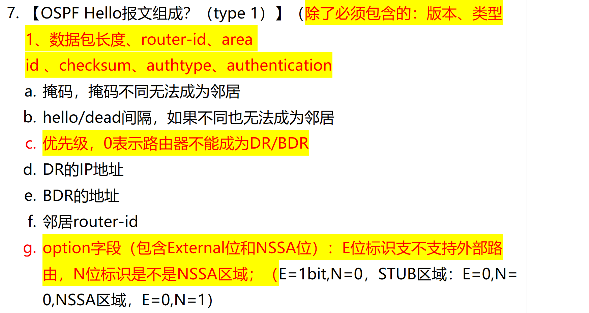
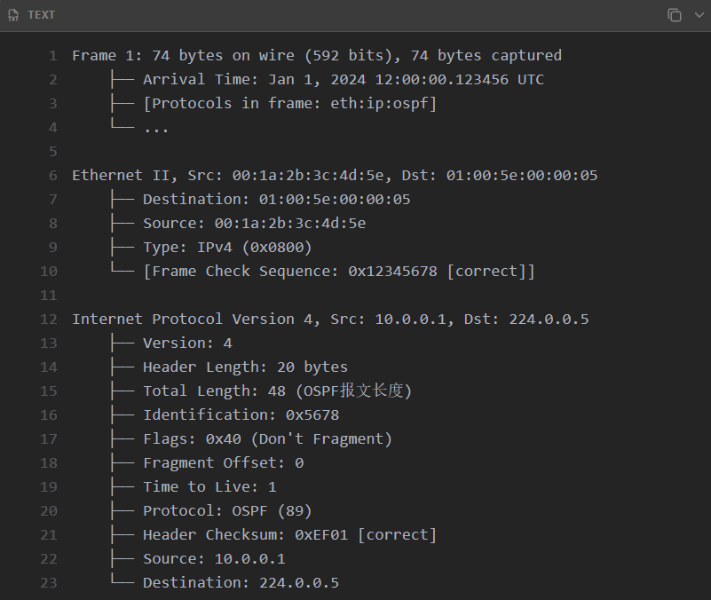
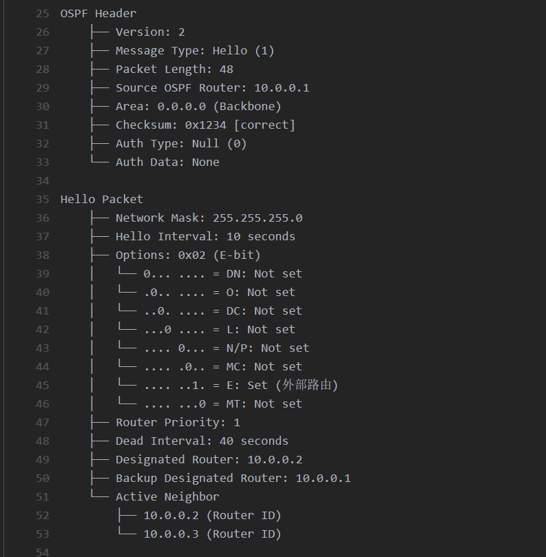
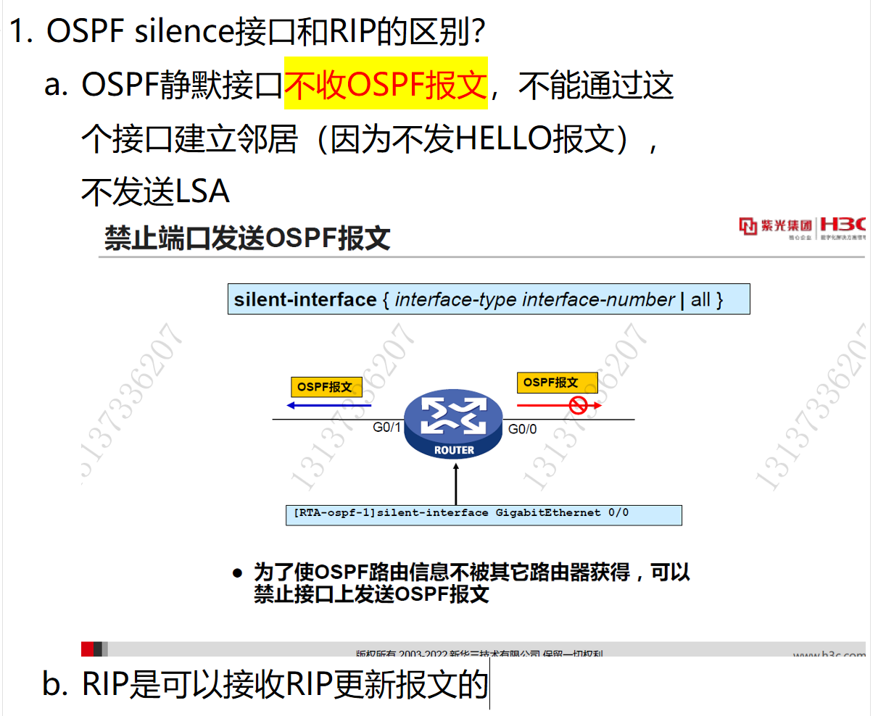

# 协议号89（不是端口89）
# 0. ospf的核心原则？

<!-- en-interview -->
### English Interview

**Question:** What are the core principles of OSPF?

**Answer:**

The core principles of OSPF revolve around ensuring a stable and scalable routing environment. First, all non-backbone areas must be directly connected to Area 0, the backbone area. This is critical for maintaining a logical topology where all routing information flows through a central hub. Second, Area 0 itself must be contiguous—meaning it should form a continuous path without gaps. If it’s not, the network may become partitioned, leading to routing issues. Third, routing information is exchanged between Area 0 and other areas through ABRs, or Area Border Routers. These routers act as bridges, summarizing and propagating routes between areas to reduce overhead and improve efficiency. For example, if you have Area 1 and Area 2, both must connect to Area 0. The ABRs in each area will advertise summarized routes into Area 0, which then distributes them appropriately. This hierarchical design helps scale OSPF across large networks while maintaining stability and fast convergence.

# 1. OSPF 网络类型？

<!-- en-interview -->
### English Interview

**Question:** What are the different OSPF network types and how do they differ?

**Answer:**

OSPF supports several network types, each with distinct behaviors. The main types are Broadcast, Point-to-Point (P2P), Point-to-Multipoint (P2MP), and Non-Broadcast Multi-Access (NBMA). In Broadcast networks, like Ethernet, a Designated Router (DR) and Backup DR (BDR) are elected to reduce traffic, and OSPF uses multicast addresses 224.0.0.5 and 224.0.0.6 for communication. For Point-to-Point links, such as direct router connections, no DR/BDR is needed, and only 224.0.0.5 is used. Point-to-Multipoint treats each neighbor as a separate P2P link, so no DR/BDR exists either. NBMA networks, like Frame Relay or ATM, don’t support broadcast or multicast, so they rely on unicast and require manual neighbor configuration. This is key because OSPF can’t discover neighbors automatically in NBMA environments. Understanding these types helps in proper network design and troubleshooting.

# 2. OSPF 报文类型？

<!-- en-interview -->
### English Interview

**Question:** What are the different types of OSPF packets and their functions?

**Answer:**

There are five types of OSPF packets, all sharing the same header structure which includes version, type, packet length, router ID, area ID, checksum, authentication type, and authentication data—note that MD5 authentication data is appended after the packet, not in the header. First, Hello packets are used for neighbor discovery, authentication, DR/BDR election, and maintaining neighbor relationships, sent every 10 seconds. Second, Database Description (DD) packets exchange LSA summaries to synchronize the Link State Database (LSDB). Third, Link State Request (LSR) packets ask neighbors for specific missing LSAs after DD exchange, containing the LSA headers of needed updates. Fourth, Link State Update (LSU) packets transmit the requested LSAs to neighbors. Finally, Link State Acknowledgment (LS Ack) packets confirm receipt of LSAs—each ACK can acknowledge multiple LSAs. These packets work together to ensure consistent routing information across the OSPF domain.

# 3. OSPF 邻居建立过程？状态机的变化？

<!-- en-interview -->
### English Interview

**Question:** Can you explain the OSPF neighbor establishment process and the state machine transitions?

**Answer:**

Sure. OSPF neighbor establishment follows a well-defined state machine. Initially, routers start in the DOWN state with no communication. Then, they send Hello packets every 10 seconds to discover neighbors and check for matching parameters like Router ID and Area ID. Upon receiving a Hello, if the info matches, the neighbor enters the INIT state. Once the local router sees its own Router ID in the peer's Hello, and authentication passes, it moves to 2-WAY state. At this point, if LSDB synchronization is needed, the router sends a DD packet, triggering the EXSTART state. Here, master-slave roles are negotiated, and DD sequence numbers are determined. After that, in EXCHANGE state, full DD packet exchange occurs to synchronize LSDB summaries. Then, in LOADING state, routers request missing LSAs via LSR packets. Finally, when the LSR retransmission list is empty, the state becomes FULL, indicating complete LSDB synchronization. DR/BDR election happens in 2-WAY to reduce overhead. Routers then run SPF algorithm to compute routes and forward packets based on the routing table. LSA refreshes occur every 30 minutes to maintain consistency.

# 4. Secondary 能作为 OSPF 的备用地址吗？

<!-- en-interview -->
### English Interview

**Question:** Can a secondary IP address be used as a backup for OSPF neighbor communication when the primary address fails?

**Answer:**

No, a secondary IP address cannot serve as a backup for OSPF neighbor communication. The core reason is that OSPF uses the primary IP address of the interface for forming and maintaining neighbor relationships. Even if you configure a secondary IP address on the interface, OSPF will not automatically switch to it if the primary address becomes unavailable. The secondary address is primarily used for route advertisement — meaning it can be included in routing updates to propagate reachability information — but it does not participate in the OSPF neighbor discovery or adjacency formation process. For example, if the primary IP goes down due to a link failure, OSPF neighbors will go down, and no automatic failover to the secondary address occurs. To achieve redundancy, you must use mechanisms like manual configuration of backup links or protocols such as VRRP to provide active-standby failover at the IP layer. In summary, secondary addresses are not a substitute for primary addresses in OSPF neighbor establishment.

# 5. Hello 报文的组成？

<!-- en-interview -->
### English Interview

**Question:** What are the components of an OSPF Hello packet?

**Answer:**

The OSPF Hello packet, which is Type 1, is essential for neighbor discovery and adjacency formation. It contains several key fields beyond the common OSPF header elements like version and packet type. First, it includes the packet length, router ID, area ID, checksum, authentication type, and authentication data. These ensure basic compatibility and security. The network mask is also included, and mismatched masks prevent neighbor formation. The Hello and Dead intervals must match between routers; otherwise, adjacency won’t form. The router priority field determines DR/BDR election—setting it to 0 means the router won’t become DR or BDR. The packet lists the current DR and BDR IP addresses, and includes a list of active neighbors’ router IDs. Crucially, the Options field carries flags like E-bit (external routing support) and N-bit (NSSA area identification). For example, in a STUB area, E-bit is 0 and N-bit is 0; in NSSA, E-bit is 0 and N-bit is 1. These fields collectively enable routers to verify compatibility and establish stable adjacencies.

# 6. OSPF 静默接口的作用？

<!-- en-interview -->
### English Interview

**Question:** What is the purpose of an OSPF silent interface?

**Answer:**

An OSPF silent interface is used to prevent a router from sending OSPF packets out a specific interface, while still allowing it to receive OSPF packets. The main purpose is to stop the router from advertising its own OSPF routing information through that interface, which helps control route propagation and enhance network security. For example, if you have a router connected to a management network or a less secure segment, you might configure the interface as silent to prevent OSPF updates from being sent there. This is done using the command "silent-interface" followed by the interface name. Even though the interface doesn’t send Hello packets or LSA updates, it can still receive OSPF packets, which means the router can still learn routes from neighbors on that interface. This is different from RIP, where silent interfaces typically don’t receive updates either. So, in OSPF, a silent interface is "receive-only" for OSPF traffic, which gives you fine-grained control over route advertisement without disrupting route learning.
