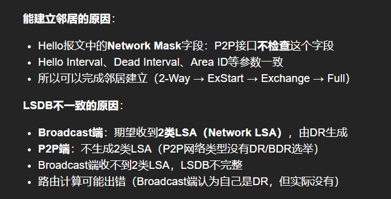
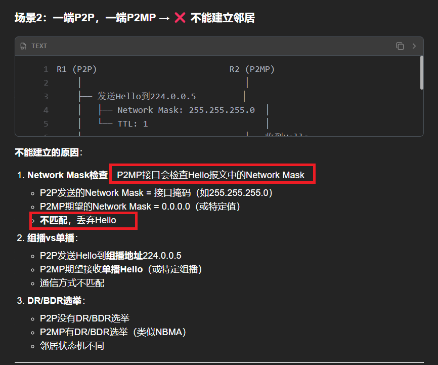
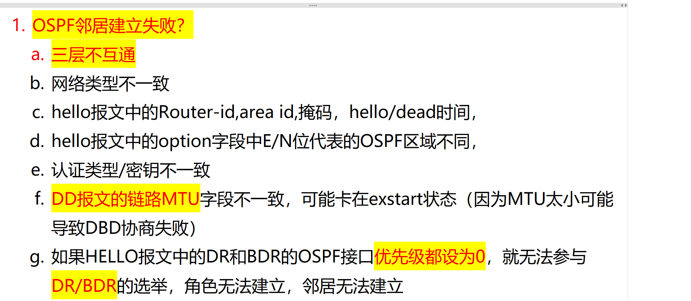
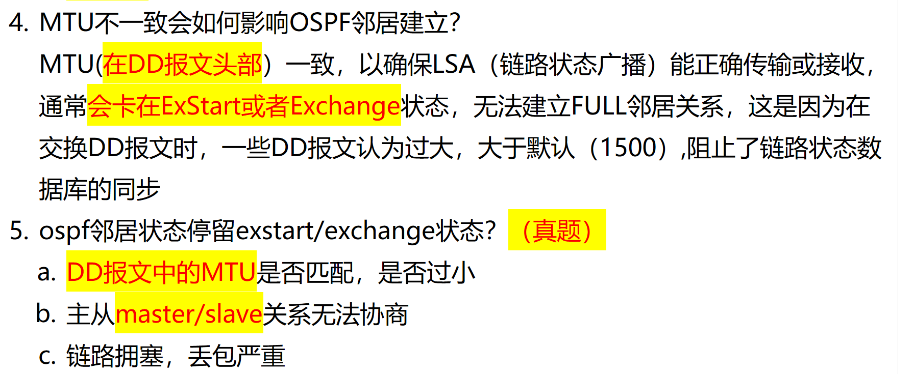
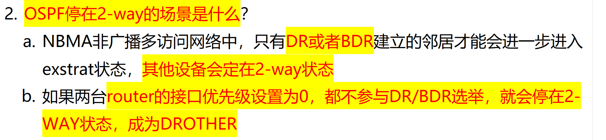
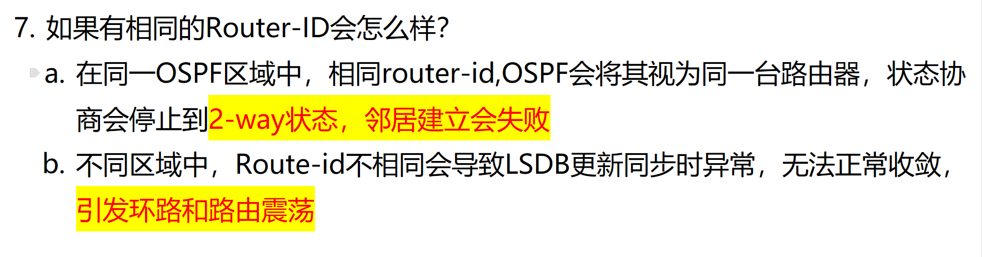

# 1. 一端广播类型，一端 P2P 能建立邻居吗？

# 其他情况一般是失败的

# 2. OSPF 邻居建立失败的原因？

# 3. 如果 MTU 不一致，OSPF 邻居还能成功建立吗？

# 4. OSPF 为什么会停留在 2-WAY 状态？

# 5. 如果 router-id 重复会怎么样？

处于不同区域的area0,area1，的R2，它在area0区域的邻居R1的router-id是1.1.1.1，但是他在area1区域的邻居R3的router-id也是1.1.1.1,会出现什么问题吗？

这个情况，**会有严重问题！**  
直接告诉你答案：  
> **OSPF要求每台路由器的Router-ID必须全网唯一（跨区域也必须唯一）！**

你描述的是：

- R2 在 area 0 邻居 R1，Router-ID 是 1.1.1.1。
- R2 在 area 1 邻居 R3，Router-ID 也**是 1.1.1.1**。

也就是说，**两个不同区域的邻居，Router-ID 撞了**。  
这在 OSPF 里面是**严重违规**，结果通常是：

---

### 会发生什么问题？

- **R2 根本无法同时跟 R1 和 R3 建立邻居关系。**
- OSPF 在建邻居时会检测到 Router-ID 冲突，直接拒绝建立邻居（neighbor stuck 在 INIT、EXSTART 状态）。
- 最典型现象：
  - Debug 里看到"**Neighbor router ID duplicate detected**"类似的报错。
  - 邻居状态一直不上（不会到 Full）。

---

### 为什么？

因为在 OSPF 内部，Router-ID 被认为是**每台路由器全球唯一的身份证**。

- 交换 LSA（链路状态广告）时，靠 Router-ID 区分谁是谁。
- 如果两台机器用同一个 Router-ID，会导致 LSDB（链路状态数据库）乱套。
- 所以 OSPF 的设计是**直接拒绝跟 Router-ID 冲突的设备建立邻居**，以避免更严重的数据错乱。

---

### 真实场景举例

在真实公司或考试中，比如：

- 复制设备配置的时候忘了改 Router-ID，就特别容易出现这种问题。
- 或者换设备后手滑把老的 Router-ID 复制了，也一样爆炸。

所以经验法则是：

> **不管跨不跨区域，所有 OSPF 路由器的 Router-ID 必须唯一。**

---

要不要我顺便也给你列一版“OSPF 邻居不上最常见的几大原因+排查思路”？Router-ID 冲突其实是其中一个，还有 MTU 不一致、认证错、区域错这种，很常考又很实用。要的话告诉我！🚀

