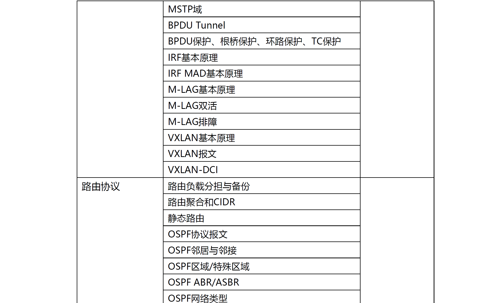
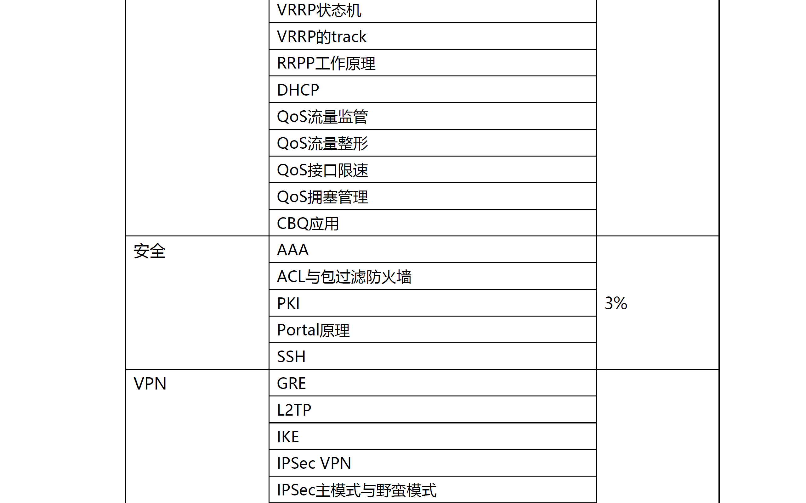
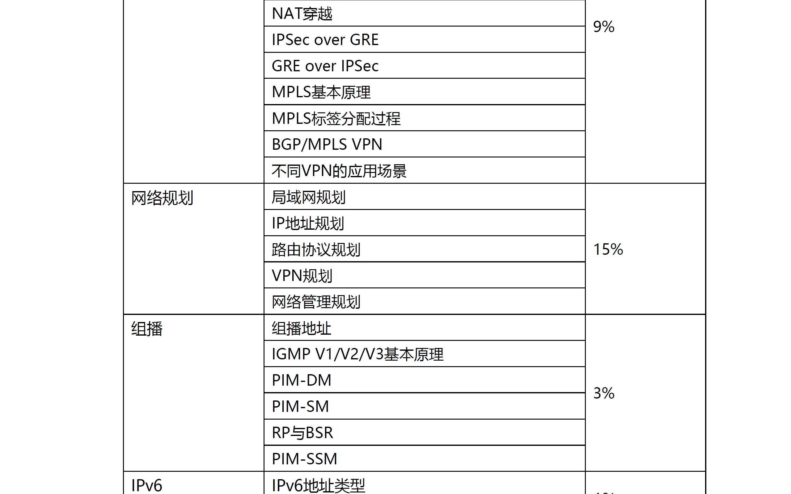
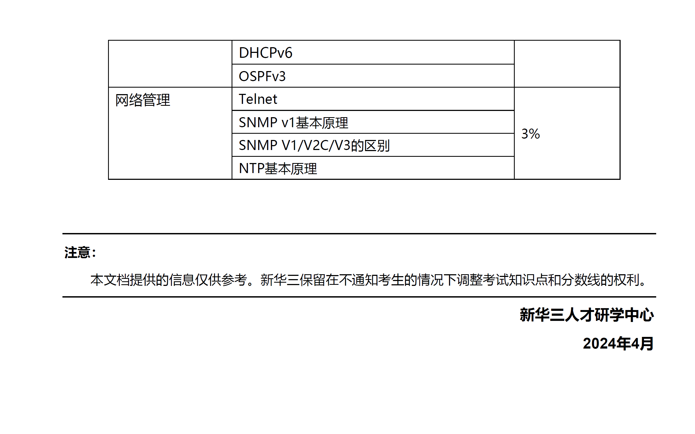

# 这篇文档是为 H3CIE RS+面试准备的笔记

### 2024/4 月的考纲

- ## [OSI 七层模型](/OSI专题/面试题---OSI基础.md)
- ## [MAC 地址](/MAC专题/面试题---MAC基础.md)
  - [mac 地址漂移](/MAC专题/面试题---MAC地址漂移.md)
- ## [单播组播广播](/BUM单播组播广播专题/面试题---组播基础.md)
  - ### [PIM-SM](/PIM组播路由协议专题/面试题---PIM-SM基础.md)
    - [BSR](/PIM组播路由协议专题/面试题---BSR.md)
    - [DR 和 RP](/PIM组播路由协议专题/面试题---PIM-SM%20DR和RP.md)
  - ### [PIM-DM](/PIM组播路由协议专题/面试题---PIM-DM基础.md)
  - ### [PIM-SSM](/PIM组播路由协议专题/面试题---PIM-SSM基础.md)
- ## [IGMP](/IGMP专题/面试题---IGMP基础.md)
  - [IGMP 侦听](/IGMP专题/面试题---IGMP%20Snooping.md)
- ## [IPv4 和 Ipv6](/IPv4和IPv6专题/面试题---IPv4基础.md)

  - [ICMPv4]
    - [Ping 和 Tracert](/Ping和Tracert专题/面试题---基础.md)
  - [IPv6](/IPv4和IPv6专题/面试题---IPV6基础.md)

    - [ICMPv6](/ICMP专题/面试题---ICMPV6.md)
    - [NDP 协议](/IPv4和IPv6专题/面试题---NDP协议.md)
    - [ipv4 和 ipv6 互通技术](/IPv4和IPv6专题/面试题---IPV4和IPV6互通.md)

  - [DHCP](/DHCP专题/面试题---DHCP基础.md)
    - [DHCP 攻击和防范](/DHCP专题/面试题---DHCP攻击防范.md)
  - [DHCPv6](/DHCP专题/面试题---DHCPv6基础.md)
    - [SLAAC 无状态](/IPv4和IPv6专题/面试题---无状态SLAAC.md)
  - [IPX(不在考纲)](/IPv4和IPv6专题/面试题---IPX.md)

- ## [ARP](/ARP专题/面试题---ARP基础.md)

  - [广播风暴](/ARP专题/面试题---广播风暴.md)
  - [ARP 代理](/ARP专题/面试题---ARP代理.md)
  - [免费 ARP](/ARP专题/面试题---免费ARP.md)
  - [ARP 攻击](/ARP专题/面试题---ARP攻击.md)

- ## [TCP UDP](/TCP和UDP专题/面试题---TCP基础.md)
  - [分片](/TCP和UDP专题/面试题---TCP&IP分片.md)
- ## [静态路由](/静态路由专题/面试题---静态路由基础.md)
  - [黑洞路由](/静态路由专题/面试题---黑洞路由.md)
  - [路由迭代规则](/静态路由专题/面试题---路由迭代规则.md)
- ## [AAA 专题](/AAA专题/面试题---AAA基础.md)
  - [RADIUS](/AAA专题/面试题---RADIUS.md)
  - [TACACS+]
- ## [QOS 专题](/QoS专题/面试题---QoS基础.md)

  - [CBQ 队列](/QoS专题/面试题---CBQ.md)
  - [令牌桶-接口限速](/QoS专题/面试题---接口限速.md)
  - [令牌桶-流量监管](/QoS专题/面试题---流量监管.md)
  - [流量整形](/QoS专题/面试题---流量整形.md)
  - [队列-拥塞管理](/QoS专题/面试题---拥塞管理.md)
    - [CBQ 队列调度](/QoS专题/面试题---CBQ.md)
    - [LLQ 队列调度](/QoS专题/面试题---LLQ.md)

- ## [STP 专题](/STP专题/面试题---STP基础.md)
  - [BPDU](/STP专题/面试题---BPDU.md)
    - [BPDU 隧道](/STP专题/面试题---BPDU隧道.md)
  - [边缘端口](/STP专题/面试题---边缘端口.md)
  - [RSTP](/STP专题/面试题---RSTP.md)
  - [MSTP](/STP专题/面试题---MSTP基础.md)
    - [MST](/STP专题/面试题---MSTP-MST域.md)
    - [MSTI](/STP专题/面试题---MSTP-MSTI.md)
    - [IST](/STP专题/面试题---MSTP-IST.MD)
    - [CST](/STP专题/面试题---MSTP-CST.md)
  - [网络直径](/STP专题/面试题---网络直径.md)
  - [STP 保护措施](/STP专题/面试题---安全保护.md)
  - [RRPP](/RRPP专题/面试题---RRPP基础.md)
- ## [VRRP 专题](/VRRP专题/面试题---VRRP基础.md)

- ## [NAT 专题](/NAT专题/面试题---NAT基础.md)
  - [NAPT](/NAT专题/面试题---NAPT.md)
  - [EASY IP](/NAT专题/)
  - [NAT ALG](/NAT专题/面试题---NAT%20ALG技术.md)
  - [NAT Server](/NAT专题/面试题---NAT%20Server.md)
  - [NAT-PT 协议转换](/NAT专题/面试题---NAT-PT技术.md)
- ## 动态路由协议
  - ### [BGP ](/BGP专题/面试题---BGP基础.md)
    - [BGP 选路](/BGP专题/面试题---BGP选路.md)
    - [MP-BGP EVPN(不在考纲)](/BGP专题/面试题---EVPN基础.md)
    - [BGP 联盟(不在考纲)](/BGP专题/面试题---BGP联盟.md)
    - [BGP 路由聚合(不在考纲)](/BGP专题/面试题---BGP路由聚合.md)
  - ### [OSPF ](/OSPF专题/面试题---OSPF基础.md)
    - [DD 报文](/OSPF专题/面试题---DD报文.md)
    - [DR/BRD 选举](/OSPF专题/面试题---DR,BDR.md)
    - [LSA 类型](/OSPF专题/面试题---OSPF%20LSA类型.md)
    - [LSDB](/OSPF专题/面试题---OSPF%20LSDB.md)
    - [OSPF 防环](/OSPF专题/面试题---OSPF防环.md)
    - [OSPF 聚合](/OSPF专题/面试题---OSPF聚合.md)
    - [OSPF 特殊区域](/OSPF专题/面试题---OSPF特殊区域.md)
    - [OSPF 虚链路](/OSPF专题/面试题---OSPF虚链路.md)
    - [OSPF 选路](/OSPF专题/面试题---OSPF选路.md)
    - [OSPFv3](/OSPF专题/面试题---OSPFv3.md)
    - [OSPF 过滤](/OSPF专题/面试题---OSPF过滤.md)
    - [OSPF 排障](/OSPF专题/面试题---OSPF排障.md)
    - [加快 OSPF 收敛](/OSPF专题/面试题---OSPF优化.md)
    - [OSPF 验证](/OSPF专题/面试题---OSPF验证.md)
    - [OSPF 优化](/OSPF专题/面试题---OSPF优化.md)
  - ### [RIP(不在考纲)](/RIP专题/)
  - ### [ISIS](/ISIS专题/面试题---ISIS基础.md)
    - [NET 地址](/ISIS专题/面试题---net地址.md)
    - [DIS 选举](/ISIS专题/面试题---DIS基础.md)
    - [路由渗透](/ISIS专题/面试题---路由渗透.md)
    - [ISIS 防环](/ISIS专题/面试题---ISIS防环.md)
    - [ISIS 验证](/ISIS专题/面试题---ISIS验证.md)
- ## [ACL](/ACL专题/面试题---ACL基础.md)
  - [包过滤防火墙](/防火墙专题/面试题---包过滤防火墙.md)
- ## [路由策略](/路由策略专题/面试题---路由策略基础.md)
  - [策略路由 PBR](/路由策略专题/面试题---策略路由PBR.md)
  - [ip 前缀列表](/路由策略专题/面试题---前缀列表.md)
  - [路由引入](/路由策略专题/面试题---路由引入.md)
- ## [VLAN](/VLAN专题/面试题---VLAN基础.md)
  - [Access/Trunk/Hybrid 区别](/Access和Trunk专题/面试题---Hybrid原理.md)
  - [VLAN 子接口](/VLAN专题/面试题---VLAN子接口.md)
  - [PVLAN 私有 VLAN](/VLAN专题/面试题---私有VLAN.md)
  - [聚合 VLAN](/VLAN专题/面试题---VLAN聚合.md)
  - [Q-in-Q](/Q-in-Q专题/面试题---QINQ基础.md)
- ## [VXLAN](/VXLAN专题/面试题---VXLAN基础.md)
  - [VXLAN 组网](/VXLAN专题/面试题---VXLAN组网.md)
  - [DCI 站点通信](/VXLAN专题/面试题---VXLAN%20DCI.md)
- ## [MPLS](/MPLS专题/面试题---MPLS%20基础.md)
  - [RD,RT](/MPLS专题/面试题---MPLS%20VPN.md)
  - [VRF](/MPLS专题/面试题---MPLS%20VPN%20VRF.MD)
- ## [SNMP 网管](/SNMP专题/面试题---snmp基础.md)
  - [MIB 管理信息库](/SNMP专题/面试题---MIB.md)
- ## [M-LAG](/M-LAG专题/面试题---M-LAG基础.md)
  - [keepalive 链路](/M-LAG专题/面试题---keepalive链路.md)
  - [和 IRF 区别](/M-LAG专题/面试题---M-LAG和IRF区别.md)
  - [M-LAG 排障](/M-LAG专题/面试题---M-LAG排障.md)
- ## [IRF](/IRF专题/面试题---IRF基础.md)

  - [MAD 分裂检测](/IRF专题/面试题---MAD分裂检测.md)

- ## [PPP 链路(不在考纲)](/PPP专题/面试题---PPP.md)
  - [LCP 链路控制](/PPP专题/面试题---LCP.MD)
  - [PAP 和 CHAP 验证](/PPP专题/面试题---PAP和CHAP认证.md)
  - [PPPoE 拨号](/PPP专题/面试题---PPPoE基础.md)
- ## [FTP(不在考纲)](/FTP专题/面试题---FTP原理.md)

  - [TFTP](/FTP专题/面试题---TFTP.md)

- ## [BFD 双向转发检测](/BFD专题/面试题---BFD基础.md)

- ## [链路聚合 LACP](/LACP链路聚合/面试题---LACP基础.md)
- ## [NTP 时钟同步](/NTP专题/面试题---NTP基础.md)
- ## 网络规划

  - [广域网规划](/网络规划专题/面试题---广域网规划.md)
  - [局域网规划](/网络规划专题/面试题---局域网规划.md)
  - [ip 地址规划](/网络规划专题/面试题---IP地址规划.md)

- ## [SDN(不在考纲)](/SDN专题/面试题---SDN基础.md)
- ## 其他
  - [路由聚合](/其他/面试题---聚合路由.md)
  - [负载分担](/其他/面试题---负载分担.md)
  - [SmartLink](/其他/面试题---Smart-link.md)
  - [MonitorLink](/其他/面试题---Moniter-link.md)
  - [三层交换机](/其他/面试题---三层交换机.md)
  - [可靠性](/其他/面试题---可靠性.md)
  - [环路](/其他/面试题---环路.md)
  - [HTTP 和 HTTPS(不在考纲)](/HTTP专题/面试题---HTTP基础.md)
  - [NQA 技术(不在考纲)](/NQA专题/面试题---NQA基础.md)
  - [PKI 证书颁发](/PKI专题/面试题---PKI基础.md)
  - [Portal 门户认证](/Portal专题/面试题---Portal基础.md)
  - [SSH](/SSH专题/面试题---SSH基础.md)
