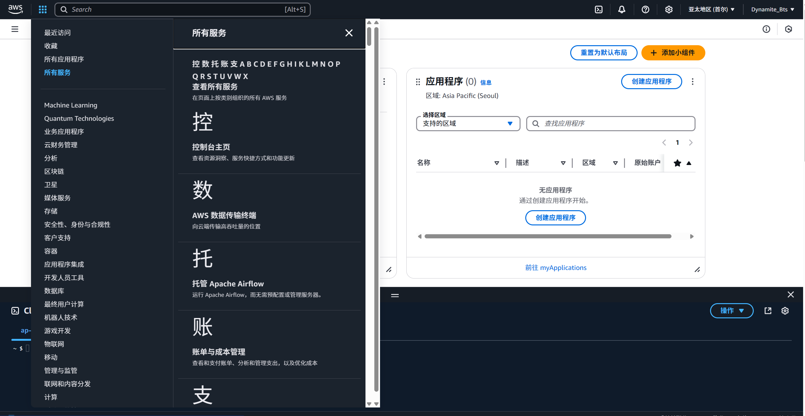
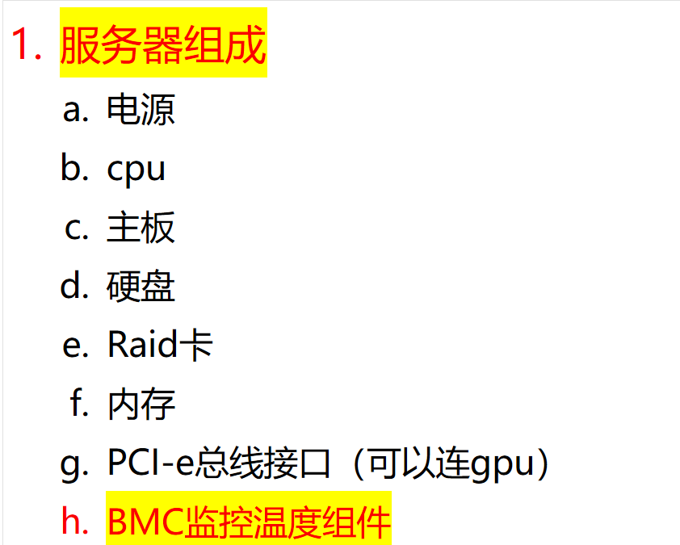
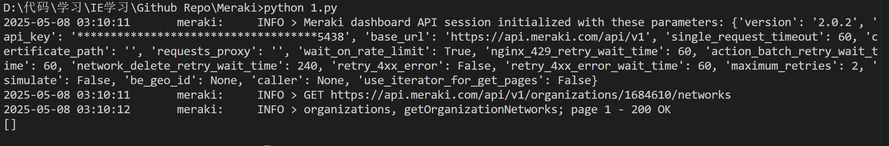
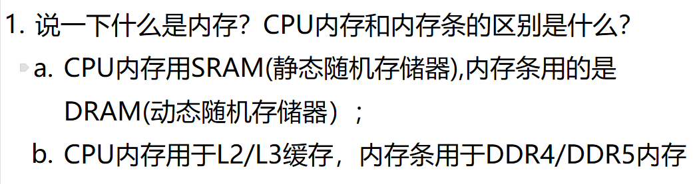
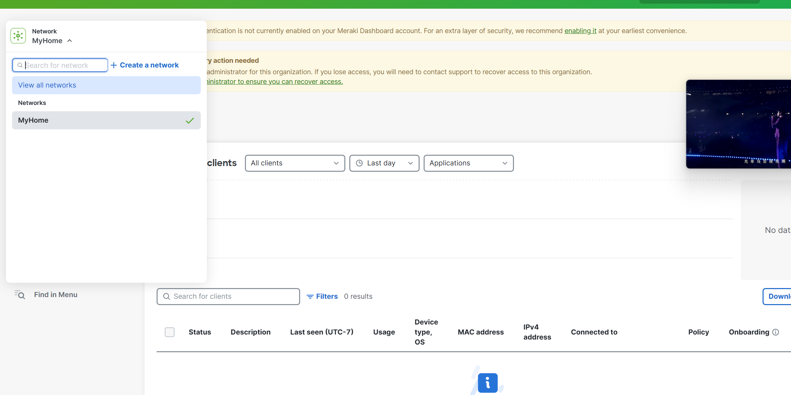
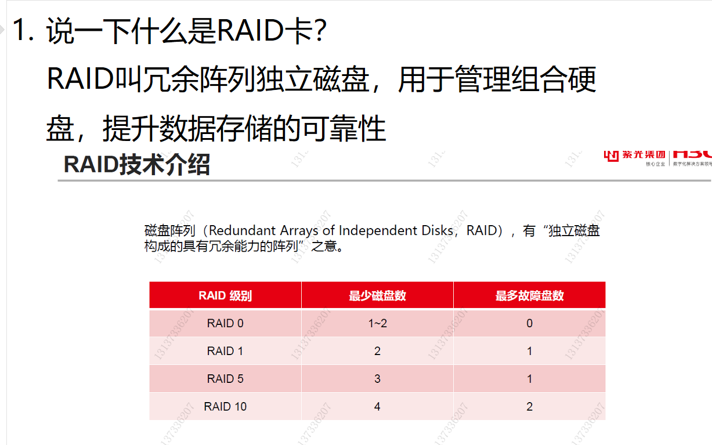
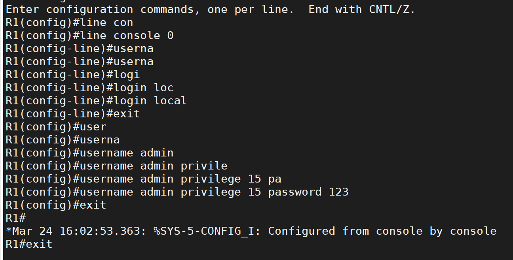
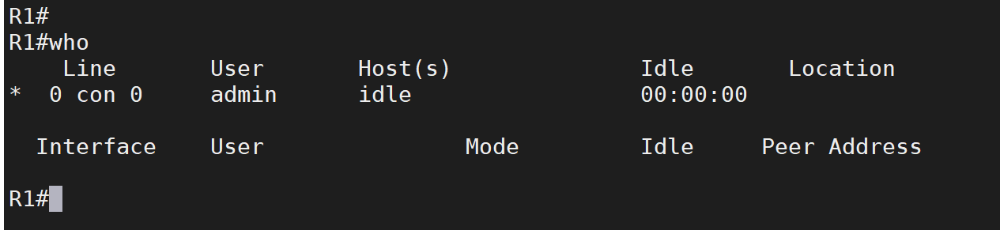
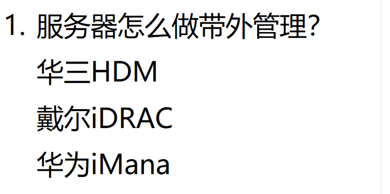

<h1 align="center">服务器面试背调</h1>

```sh
git init
git checkout -b Server
git add .
git commit -m "first commit"
git remote add origin git@github.com:lushiheng123/Networking.git
git branch
git push -u origin Server
```

```sh
git init
git remote add origin git@github.com:lushiheng123/Networking.git
git remote -v
git fetch origin
git branch -r
git pull origin Server
```

# 1. 你用过哪些服务器？



# 2. 服务器的组成？



# 3. 服务器的架构有哪些？



# 4.说一下什么是内存？CPU 内存和内存条的区别是什么？



# 5. 说一下有哪些存储？



# 6. 说一下 RAID 卡？



# 7. 你知道哪些服务器系统？



# 8. 怎么做 BIOS？



# 9. 服务器怎么做带外管理？


