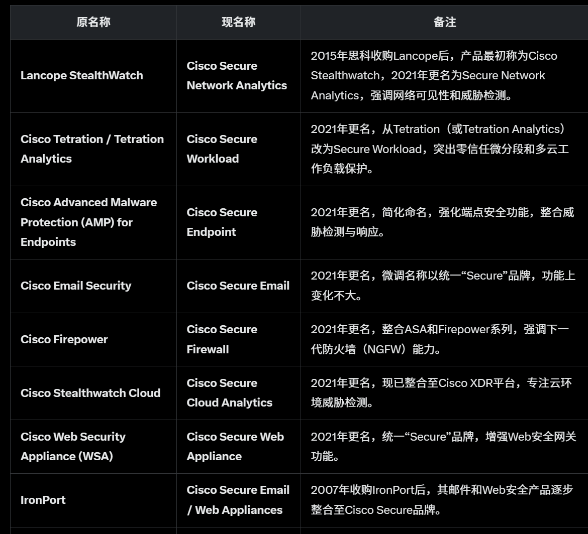
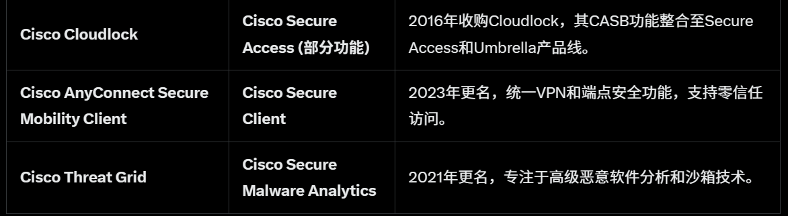

<h1 align="center">CCIE Security考试，实验CCIE Security 6.1</h1>

```sh
git init

git checkout -b Security

git add .和 git status 常规进行

git commit -m "first commit"设置任务

git remote add origin git@github.com:lushiheng123/Networking.git

git push -u origin Security
```

# 目录

- ## [考试要求](#1-考试要求)
- ## [SQL Injection](./contents/SQL注入攻击/基础.md)
- ## [XSS](./contents/跨站脚本攻击/基础.md)
- ## [Phishing](./contents/网络钓鱼攻击/基础.md)
- ## [Path Traversal](./contents/路径遍历/基础.md)
- ## [MITM](./contents/中间人攻击/基础.md)
- ## [Dos/DDos](./contents/Dos/基础.md)
- ## [课件 33,思科 CDP](./contents/思科发现协议/基础.md)
- ## [DNS 域名系统](./contents/DNS/基础.md)
- ## [NTP](./contents/NTP时钟同步/基础.md)
- ## [密码学]
- ## [DMVPN]()
- ## [Cisco ASA](./contents/ASA/基础.md)
  - ### [安全区域](./contents/ASA/安全区域.md)
- ## [Flex VPN](./contents/VPN/FlexVPN.md)
- ## [路由协议认证安全](./contents/路由协议安全/OSPF认证.md)
- ## [ikev2](./contents/IKEv2/基础.md)
- ## [ssl](./contents/SSL/基础.md)
- ## [MFA 多因素认证](./contents/多因素认证/基础.md)
- ## [Grafana](./contents/Grafana/基础.md)

# 1. 考试要求:<a href="https://learningnetwork.cisco.com/s/ccie-security">官网</a>

# 2. SCOR 是什么？

## 350-701 SCOR: Implementing and Operating Cisco Security Core Technologies 实施和操作思科安全核心技术

# 3. 笔试考纲：<a href="https://learningnetwork.cisco.com/s/scor-exam-topics">网页</a>

## 120 分钟

# 4. 上机考纲：<a href="https://learningnetwork.cisco.com/s/scor-exam-topics">网页</a>

## 8 个小时

# 5. 实验所需要的设备清单:[设备](./设备清单/CCIE_Security_v6.1_HW_and_SW_REVISED.pdf)

# 6. 官网登录注册申请考试的过程？

## 这个网站去登录:https://cp.certmetrics.com/cisco/en/home/dashboard

# 7.思科名称对应

