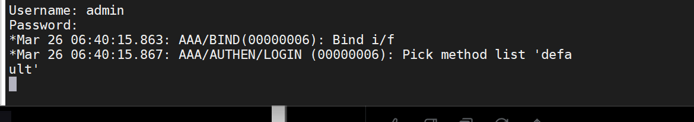
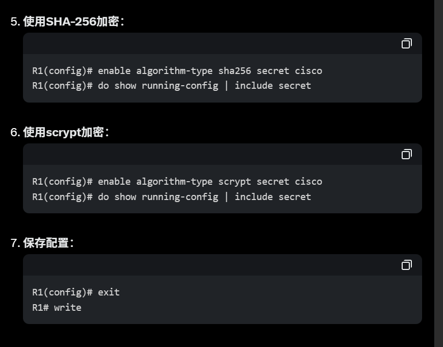

<h1 align="center">CCIE Security考试，实验CCIE Security 6.1</h1>

```sh
git init

git checkout -b Security

git add .和 git status 常规进行

git commit -m "first commit"设置任务

git remote add origin git@github.com:lushiheng123/Networking.git

git push -u origin Security
```

# 目录

- ## [考试要求](#1-考试要求)
- ## [SQL Injection](./contents/SQL注入攻击/基础.md)
- ## [XSS](./contents/跨站脚本攻击/基础.md)
- ## [Phishing](./contents/网络钓鱼攻击/基础.md)
- ## [Path Traversal](./contents/路径遍历/基础.md)
- ## [MITM](./contents/中间人攻击/基础.md)
- ## [Dos/DDos](./contents/Dos/基础.md)
- ## [课件 33,思科 CDP](./contents/思科发现协议/基础.md)
- ## [DNS 域名系统](./contents/DNS/基础.md)
- ## [NTP](./contents/NTP时钟同步/基础.md)
- ## [密码学]
- ## [DMVPN]()
- ## [Cisco ASA](./contents/ASA/基础.md)
  - ### [安全区域](./contents/ASA/安全区域.md)
- ## [Flex VPN](./contents/VPN/FlexVPN.md)
- ## [路由协议认证安全](./contents/路由协议安全/OSPF认证.md)

# 1. 考试要求:<a href="https://learningnetwork.cisco.com/s/ccie-security">官网</a>

# 2. SCOR 是什么？

## 350-701 SCOR: Implementing and Operating Cisco Security Core Technologies 实施和操作思科安全核心技术

# 3. 笔试考纲：<a href="https://learningnetwork.cisco.com/s/scor-exam-topics">网页</a>

## 120 分钟

# 4. 上机考纲：<a href=">https://learningnetwork.cisco.com/s/scor-exam-topics">网页</a>

## 8 个小时

# 5. 实验所需要的设备清单:[设备](./设备清单/CCIE_Security_v6.1_HW_and_SW_REVISED.pdf)

# 6. 官网登录注册申请考试的过程？

## 这个网站去登录:https://cp.certmetrics.com/cisco/en/home/dashboard

# 思科设备登录(login local 切换回来)

### (1)只用密码

### `who`查看接口


### [config]# `line console 0`进入控制口，`password 123`设置密码，`login`设置登录模式，`exit`退出再登录，发现要用密码登录


### (2)用用户名+密码, `privilege`代表权限,`login local`代表使用本地数据库


### (3)aaa

```sh
R1> enable                           # 进入特权模式
R1# configure terminal               # 进入全局配置模式
R1(config)# aaa new-model            # 启用AAA功能
R1(config)# aaa authentication login default local  # 配置默认登录认证使用本地数据库
R1(config)# username admin password 123  # 创建本地用户admin，密码123
R1(config)# line console 0           # 进入Console端口配置模式
R1(config-line)# login authentication default  # 指定Console使用default方法列表进行认证
R1(config-line)# exit                # 退出Console配置模式
R1(config)# exit                     # 退出全局配置模式
R1# write                            # 保存配置（或用 "copy running-config startup-config"）
```

### 用`debug`指令验证 aaa 是否开启




### （4）各种加密方式

### Ⅰ. 明文

```sh
R1(config)#enable password cisco
R1(config)#do show running-config | include password
no service password-encryption
enable password cisco
```

### Ⅱ. 默认密码

```sh
R1(config)#service password-encryption
R1(config)#do show run
R1(config)#do show running
R1(config)#do show running-co
R1(config)#do show running-config | include password
service password-encryption
enable password 7 1511021F0725
R1(config)#enable secret cisco
```

### Ⅲ. secret 是用的 md5 加密

```sh
R1(config)#enable secret cisco1
R1(config)#do show running-config | include secret
enable secret 5 $1$JZSg$RyrsypT4agD/dqbjmwnsW1
```

### Ⅳ. 其他加密


