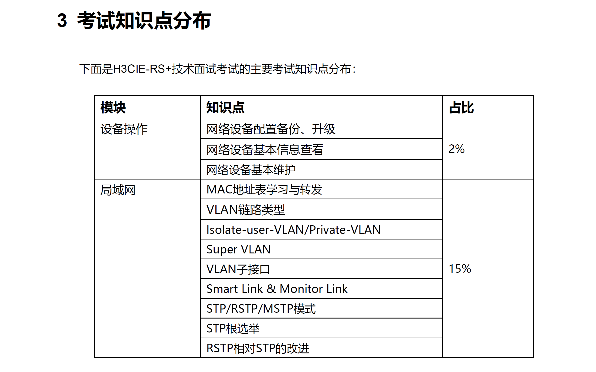

# 这篇文档是为 H3CIE RS+面试准备的笔记

### 2024/4 月的考纲

- [AAA 专题](/AAA专题/面试题---AAA基础.md)
  - [RADIUS](/AAA专题/面试题---RADIUS.md)
  - [TACACS+]
- [QOS 专题](/QoS专题/面试题---QoS基础.md)
  - [CBQ 队列](/QoS专题/面试题---CBQ.md)
  - [令牌桶-接口限速](/QoS专题/面试题---接口限速.md)
  - [令牌桶-流量监管](/QoS专题/面试题---流量监管.md)
  - [流量整形](/QoS专题/面试题---流量整形.md)
  - [队列-拥塞管理](/QoS专题/面试题---拥塞管理.md)
    - [CBQ 队列调度](/QoS专题/面试题---CBQ.md)
    - [LLQ 队列调度](/QoS专题/面试题---LLQ.md)
- [IPv4 和 Ipv6](/IPv4和IPv6专题/面试题---IPv4基础.md)
    - [DHCP](/DHCP专题/面试题---DHCP基础.md)