# Ansible 实验环境搭建指南

## 目录

- [1. 环境准备](#1-环境准备)
  - [1.1 基础镜像获取](#11-基础镜像获取)
  - [1.2 容器环境初始化](#12-容器环境初始化)
- [2. SSH 服务配置](#2-ssh-服务配置)
  - [2.1 安装 SSH 服务](#21-安装-ssh-服务)
  - [2.2 配置 SSH 服务](#22-配置-ssh-服务)
- [3. 系统环境配置](#3-系统环境配置)
  - [3.1 配置 EPEL 源](#31-配置-epel-源)
  - [3.2 安装基础工具](#32-安装基础工具)
- [4. SSH 免密配置](#4-ssh-免密配置)
  - [4.1 创建用户](#41-创建用户)
  - [4.2 配置 SSH 免密登录](#42-配置-ssh-免密登录)
- [5. Ansible 安装与配置](#5-ansible-安装与配置)
  - [5.1 Python 环境准备](#51-python-环境准备)
  - [5.2 Ansible 安装](#52-ansible-安装)
  - [5.3 相关工具安装](#53-相关工具安装)

## 1. 环境准备

### 1.1 基础镜像获取

拉取 Red Hat Universal Base Image 9 作为基础环境：

```sh
docker pull redhat/ubi9:latest
```


### 1.2 容器环境初始化

创建一个控制节点和两个被管理节点：

```sh
docker run -d --name ansible-controller -h controller redhat/ubi9:latest /bin/bash -c "while true; do sleep 1000; done"
docker run -d --name node1 -h node1 redhat/ubi9:latest /bin/bash -c "while true; do sleep 1000; done"
docker run -d --name node2 -h node2 redhat/ubi9:latest /bin/bash -c "while true; do sleep 1000; done"
```

## 2. SSH 服务配置

### 2.1 安装 SSH 服务

在所有节点上安装 SSH 服务：

```sh
# 在控制节点安装
docker exec -it ansible-controller /bin/bash
dnf install -y openssh-server
sshd

# 在node1安装
docker exec -it node1 /bin/bash
dnf install -y openssh-server

# 在node2安装
docker exec -it node2 /bin/bash
dnf install -y openssh-server
```

### 2.2 配置 SSH 服务

验证 SSH 服务状态和配置：

```sh
# 检查 SSH 密钥
ls -la ~/.ssh
# 如果没有密钥，创建新的
ssh-keygen -t rsa
# 生成主机密钥
ssh-keygen -A
```


验证 SSH 服务运行状态：

```sh
# 安装进程查看工具
dnf install -y procps-ng
# 检查 SSH 服务状态
ps aux | grep sshd
# 检查 SSH 端口
ss -tnlp | grep :22
```

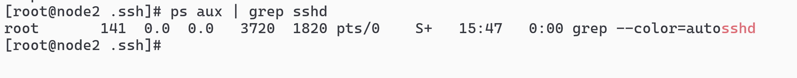


## 3. 系统环境配置

### 3.1 配置 EPEL 源

添加 EPEL 源以获取更多软件包：

```sh
# 安装 wget
dnf install -y wget
# 下载 EPEL 源
wget https://dl.fedoraproject.org/pub/epel/epel-release-latest-9.noarch.rpm
# 安装 EPEL 源
dnf install -y ./epel-release-latest-9.noarch.rpm
```


更新软件源缓存：

```sh
dnf clean all
dnf makecache
```

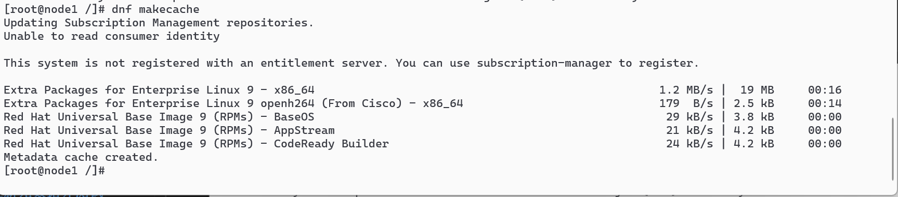

### 3.2 安装基础工具

安装网络工具：

```sh
dnf install -y net-tools iproute
```

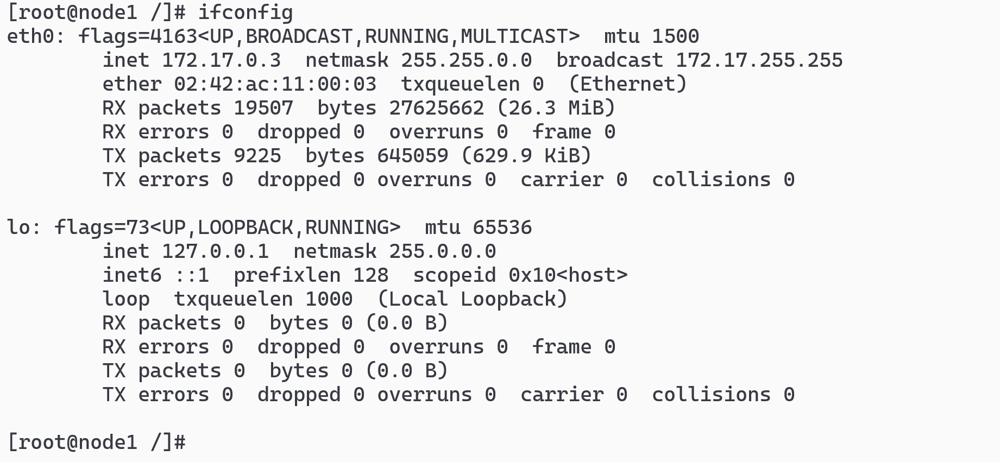

检查网络配置：

> controller: 172.17.0.2, node1/node2: 172.17.0.3/4

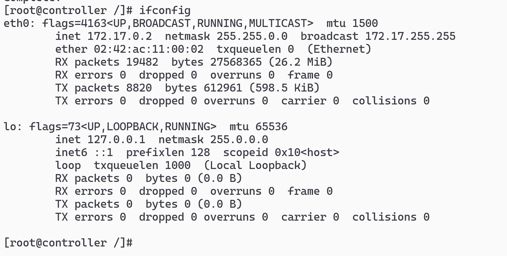

## 4. SSH 免密配置

### 4.1 创建用户

创建 devops 用户并设置密码：

```sh
useradd devops
passwd devops   # 设置密码：123456
```

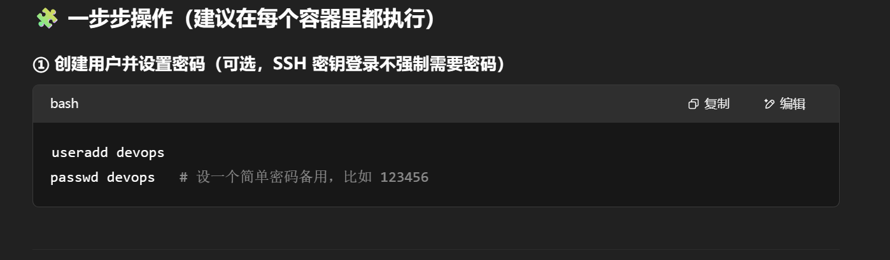

配置 SSH 目录权限：

```sh
mkdir -p /home/devops/.ssh
chmod 700 /home/devops/.ssh
chown devops:devops /home/devops/.ssh
```

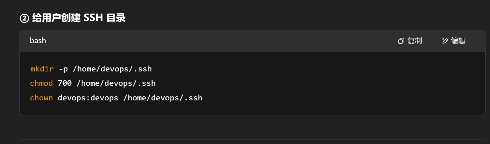

安装 SSH 客户端：

```sh
dnf install -y openssh-clients
```

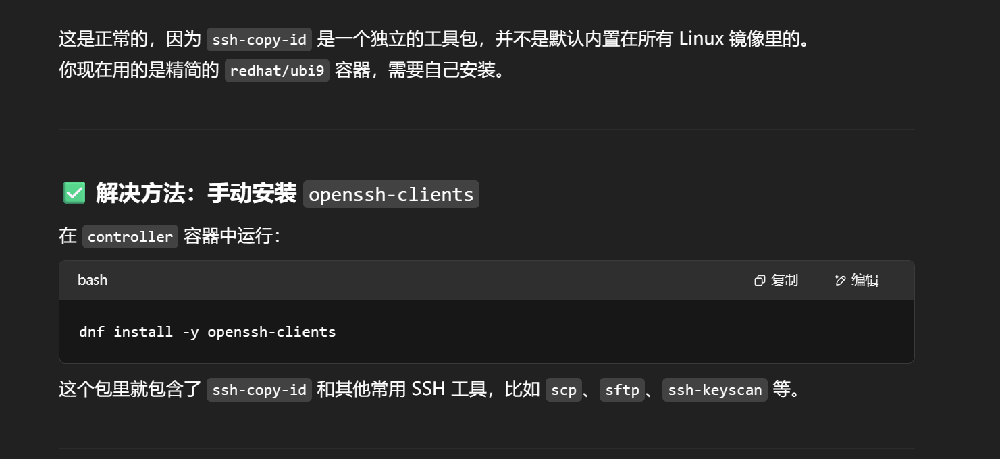

### 4.2 配置 SSH 免密登录

测试 SSH 连接并配置免密登录：

```sh
# 测试 SSH 连接
ssh devops@172.17.0.3

# 配置免密登录
ssh-copy-id devops@172.17.0.3
```


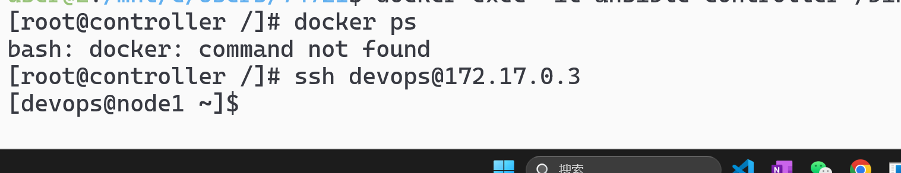

## 5. Ansible 安装与配置

### 5.1 Python 环境准备

安装 Python 和 pip：

```sh
dnf install -y python3 python3-pip
pip3 install --upgrade pip
```

### 5.2 Ansible 安装

安装 Ansible 并验证版本：

```sh
pip3 install ansible
ansible --version
```

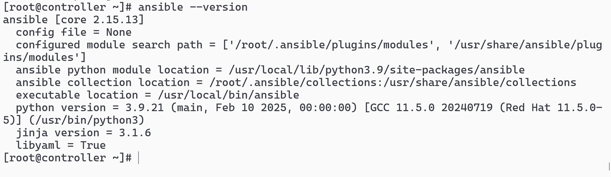

### 5.3 相关工具安装

安装容器工具和 Ansible Navigator：

```sh
# 安装容器工具
dnf install -y container-tools
```

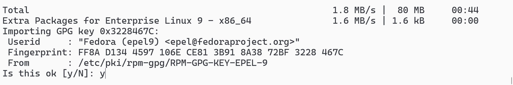
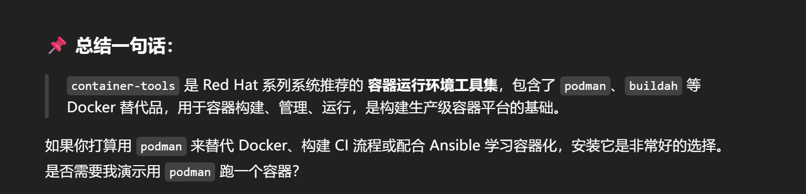

```sh
# 安装 Ansible Navigator
pip3 install ansible-navigator
```

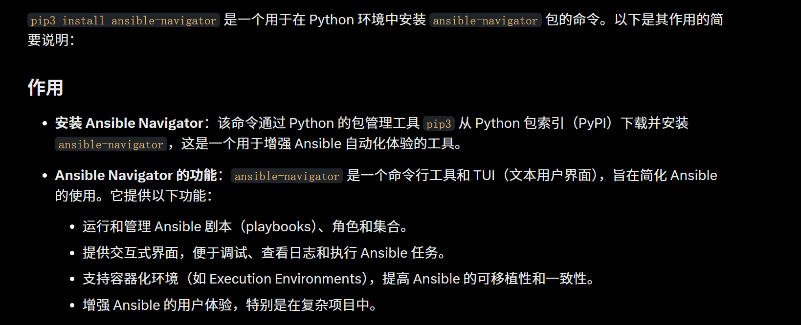

查看 Ansible Navigator 帮助信息：

```sh
ansible-navigator --help
```

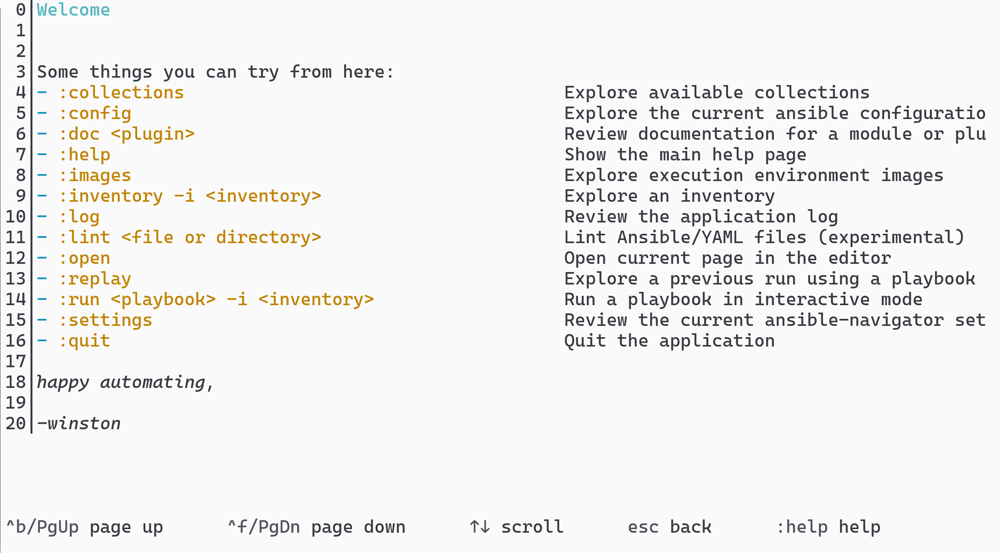
