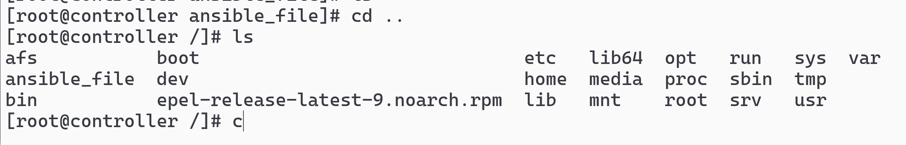
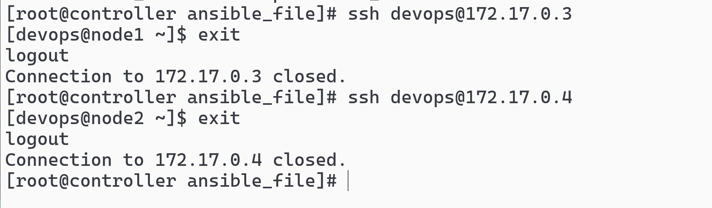
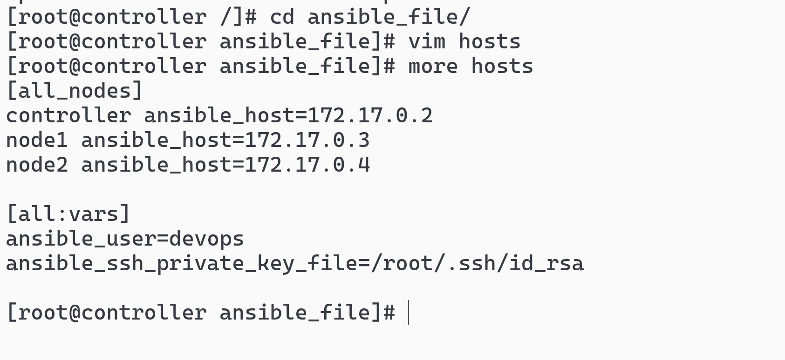
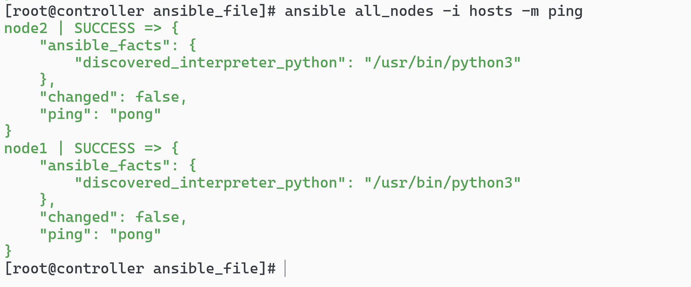
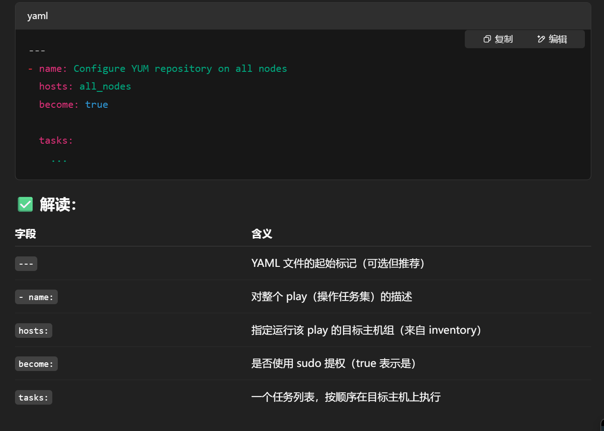
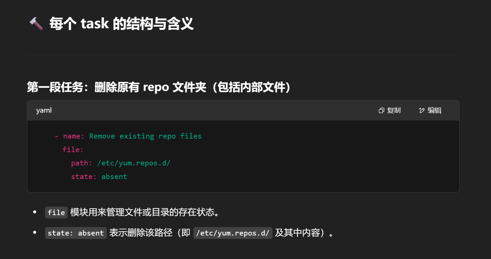
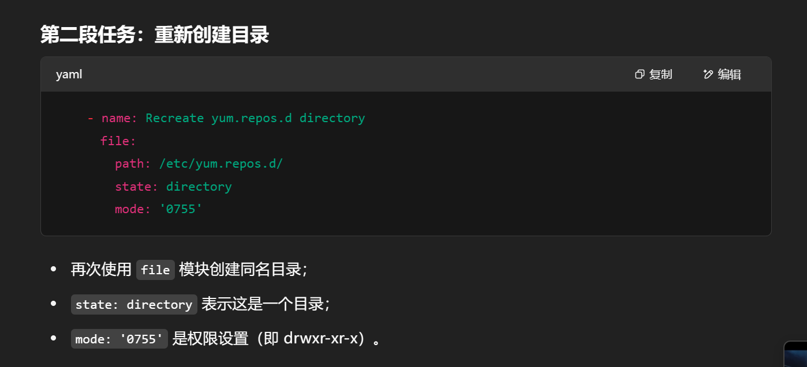
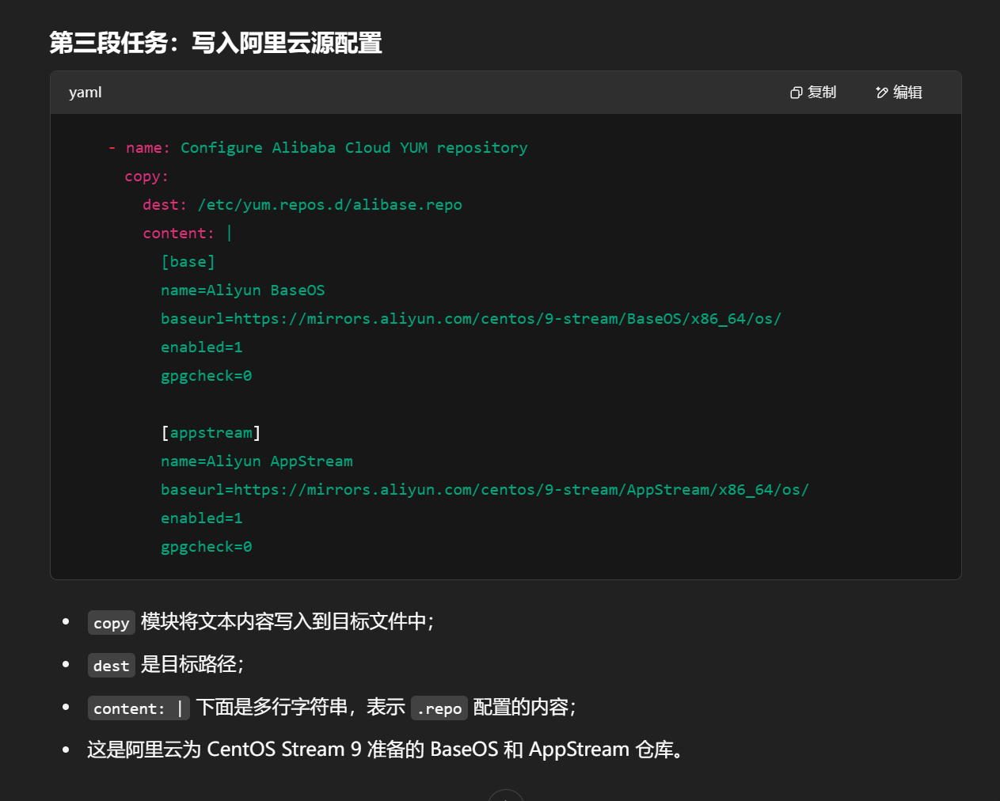
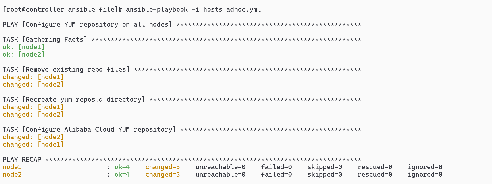
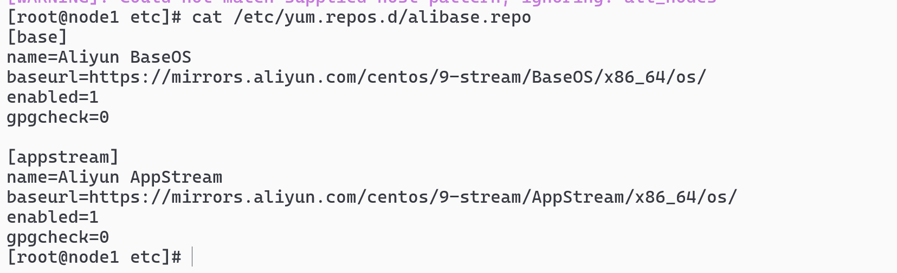

# Ansible Playbook 配置源仓库实践指南

## 目录

- [1. 环境准备](#1-环境准备)
  - [1.1 创建工作目录](#11-创建工作目录)
  - [1.2 验证网络连通性](#12-验证网络连通性)
- [2. Ansible 基础配置](#2-ansible-基础配置)
  - [2.1 配置 Inventory](#21-配置-inventory)
  - [2.2 配置 sudo 权限](#22-配置-sudo-权限)
  - [2.3 测试 Ansible 连通性](#23-测试-ansible-连通性)
- [3. Playbook 配置与执行](#3-playbook-配置与执行)
  - [3.1 创建 Playbook](#31-创建-playbook)
  - [3.2 Playbook 详解](#32-playbook-详解)
  - [3.3 执行 Playbook](#33-执行-playbook)
  - [3.4 验证配置结果](#34-验证配置结果)

## 1. 环境准备

### 1.1 创建工作目录

在 Ansible 控制节点上创建工作目录：

```sh
mkdir ansible
```



### 1.2 验证网络连通性

确保各节点之间网络连通：



## 2. Ansible 基础配置

### 2.1 配置 Inventory

创建 Ansible 的 hosts 文件：



配置内容如下：

```ini
[all_nodes]
node1 ansible_host=172.17.0.3
node2 ansible_host=172.17.0.4

[all:vars]
ansible_user=devops
ansible_ssh_private_key_file=/root/.ssh/id_rsa
```

### 2.2 配置 sudo 权限

在所有节点上配置 sudo 权限：

```sh
dnf install -y sudo
echo 'devops ALL=(ALL) NOPASSWD: ALL' > /etc/sudoers.d/devops
chmod 440 /etc/sudoers.d/devops
```

### 2.3 测试 Ansible 连通性

使用 ping 模块测试连通性：

```sh
ansible all_nodes -i hosts -m ping
```



## 3. Playbook 配置与执行

### 3.1 创建 Playbook

创建 `adhoc.yml` 文件，用于配置 YUM 源：

```yaml
---
- name: Configure YUM repository on all nodes
  hosts: all_nodes
  become: true

  tasks:
    - name: Remove existing repo files
      file:
        path: /etc/yum.repos.d/
        state: absent

    - name: Recreate yum.repos.d directory
      file:
        path: /etc/yum.repos.d/
        state: directory
        mode: "0755"

    - name: Configure Alibaba Cloud YUM repository
      copy:
        dest: /etc/yum.repos.d/alibase.repo
        content: |
          [base]
          name=Aliyun BaseOS
          baseurl=https://mirrors.aliyun.com/centos/9-stream
          enabled=1
          gpgcheck=0

          [appstream]
          name=Aliyun AppStream
          baseurl=https://mirrors.aliyun.com/centos-stream/9-stream
          enabled=1
          gpgcheck=0
```

### 3.2 Playbook 详解

Playbook 的主要组成部分说明：

1. **基本信息**：
   

2. **任务配置**：
   
   
   

### 3.3 执行 Playbook

运行 Playbook 配置源仓库：

```sh
ansible-playbook -i hosts adhoc.yml
```



### 3.4 验证配置结果

在节点上检查配置结果：

```sh
cat /etc/yum.repos.d/alibase.repo
```


