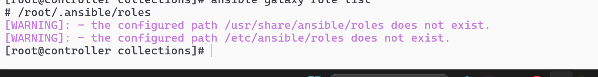
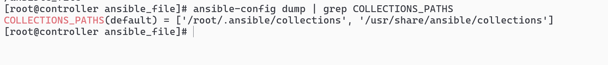
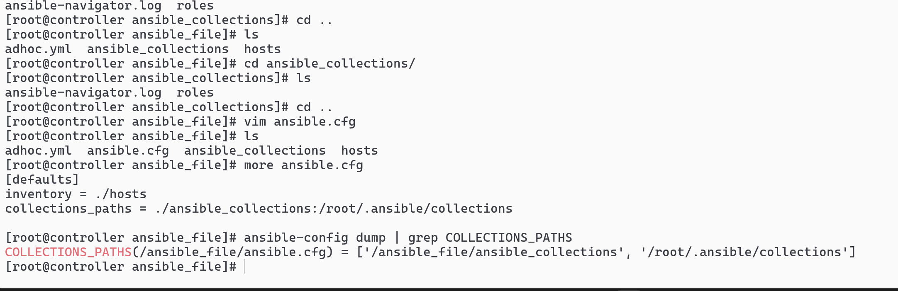
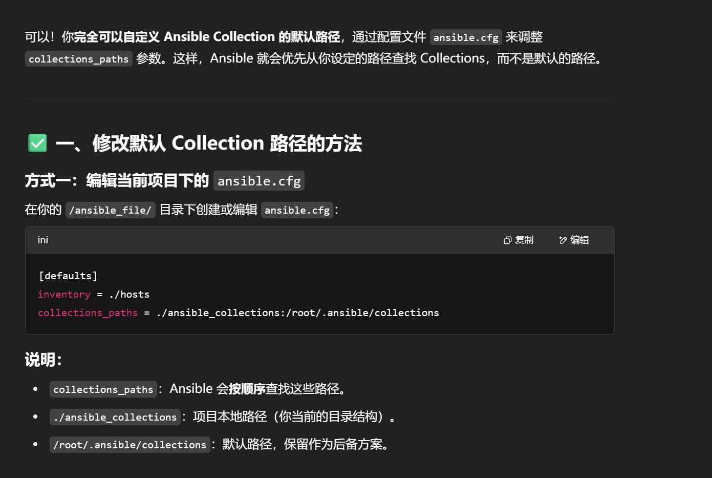
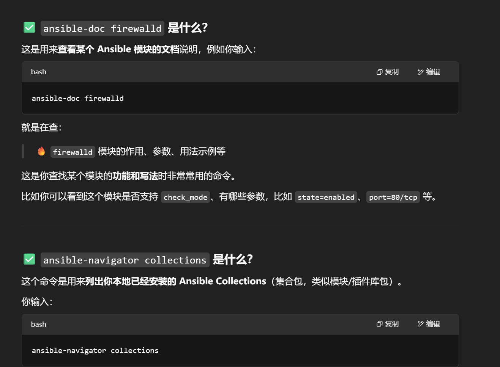
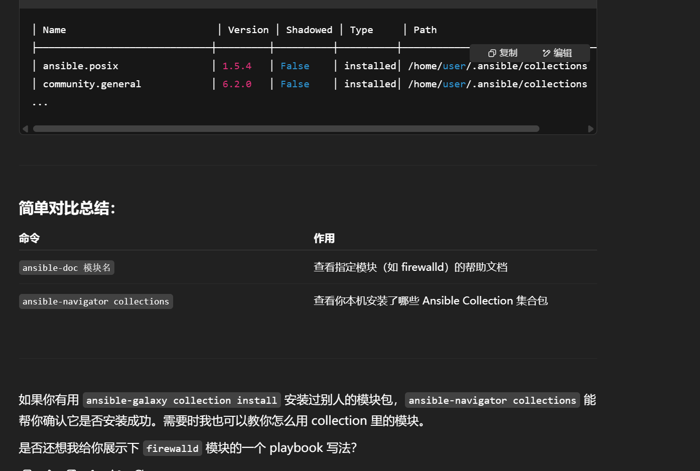

# 安装

# ansible-galaxy role list



```sh
ansible-galaxy collection install ansible.posix
ansible-galaxy collection install community.general
ansible-galaxy role install linux-system-roles.sudo --roles-path ./roles
```


# ansible-config dump | grep COLLECTIONS_PATHS 看看 ansible collection 默认用什么路径的 collection



# 更改 collection 的路径

```sh
[defaults]
inventory = ./hosts
collections_paths = ./ansible_collections:/root/.ansible/collections
```




# 验证配置是否生效（路径成功得到了更换)

```sh
ansible-config dump | grep COLLECTIONS_PATHS
```


# 安装部分依赖（暂时没做）

```sh
sudo dnf install -y fuse fuse-libs
```

# ansible-doc firewalld，ansible-navigator collections 常用指令



