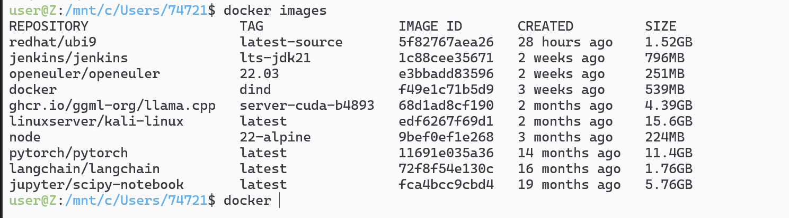
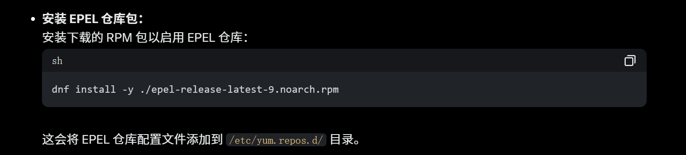
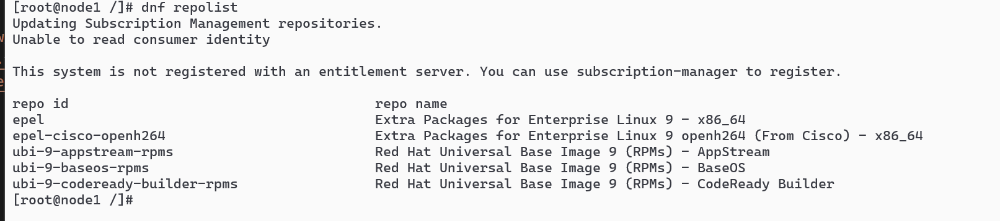
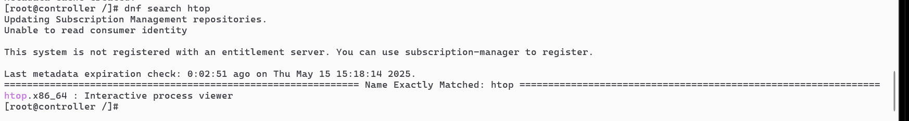
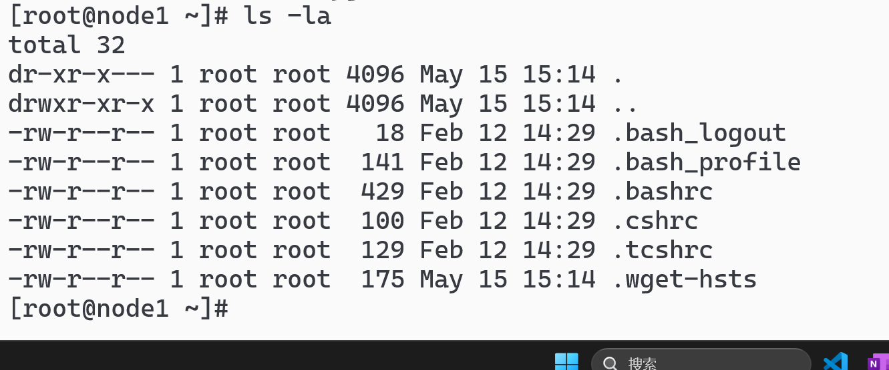
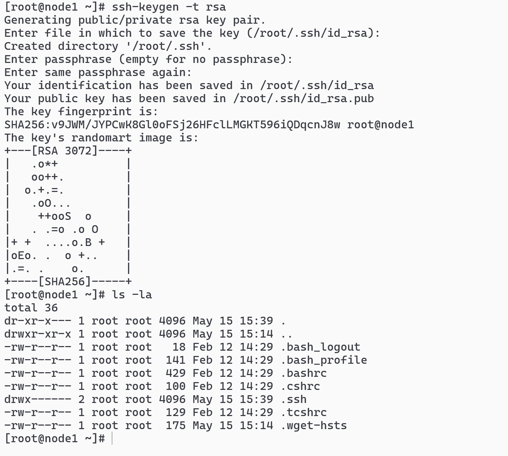
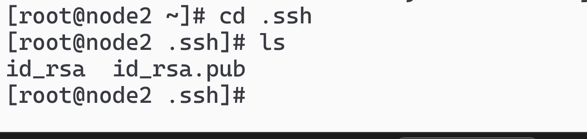
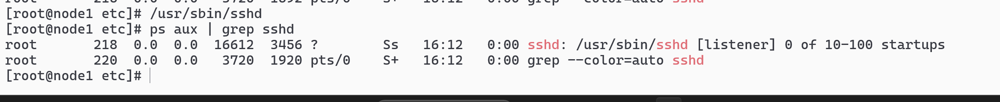
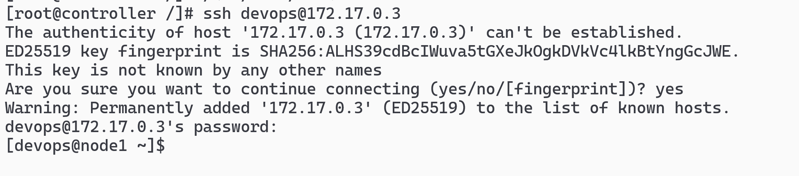
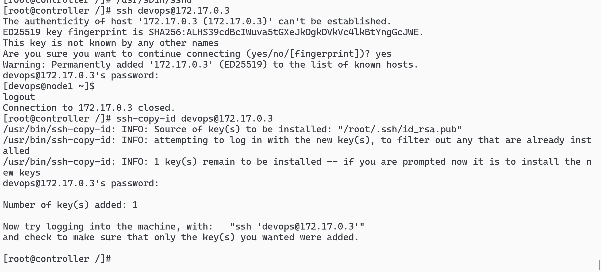

# 初始化状态

```sh
docker pull redhat/ubi9:latest
```



# 一个控制器和两个节点

```sh
docker run -d --name ansible-controller -h controller redhat/ubi9:latest /bin/bash -c "while true; do sleep 1000; done"
docker run -d --name node1 -h node1 redhat/ubi9:latest /bin/bash -c "while true; do sleep 1000; done"
docker run -d --name node2 -h node2 redhat/ubi9:latest /bin/bash -c "while true; do sleep 1000; done"
```

# 安装 ssh 服务

```sh
docker exec -it ansible-controller /bin/bash
dnf install -y openssh-server
sshd
docker exec -it node1 /bin/bash
dnf install -y openssh-server
docker exec -it node2 /bin/bash
dnf install -y openssh-server
```

# dnf repolist 查一下现在的源

# 都下载 wget，通过 fedora 下载

```sh
dnf install -y wget
wget https://dl.fedoraproject.org/pub/epel/epel-release-latest-9.noarch.rpm
```

# 这一步我也不懂

```sh
dnf install -y ./epel-release-latest-9.noarch.rpm
```



# 再查一下源 dnf repolist



# dnf makecache 更新元数据并测试


# 测试能不能看见库 dnf search htop



# dnf install -y net-tools iproute 安装 ifconfig 网卡工具


# controller:是 172.17.0.2，另外两个节点是 2，3


# ls -la 看有没有 ssh 服务



## 没有就 ssh-keygen -t rsa 创建



## ssh-keygen -A 生成主机密钥

## 进入目录看看是否有了



# 安装 ps 服务 dnf install -y procps-ng

# ps aux | grep sshd 看看 sshd 服务是否真的运行了（因为我没有 systemctl)


## 一般是只有一个，需要/usr/sbin/sshd 手动启动，ss -tnlp | grep :22



# 可以互相 ping 通

# ssh 配用户 devops，密码 123456

```sh
useradd devops
passwd devops   # 设一个简单密码备用，比如 123456
```


## 给用户创建 SSH 目录

```sh
mkdir -p /home/devops/.ssh
chmod 700 /home/devops/.ssh
chown devops:devops /home/devops/.ssh
```


## 安装包 dnf install -y openssh-clients


# ssh devops@172.17.0.3终于通了



# ssh-copy-id devops@172.17.0.3设置免密操作，真的免密



