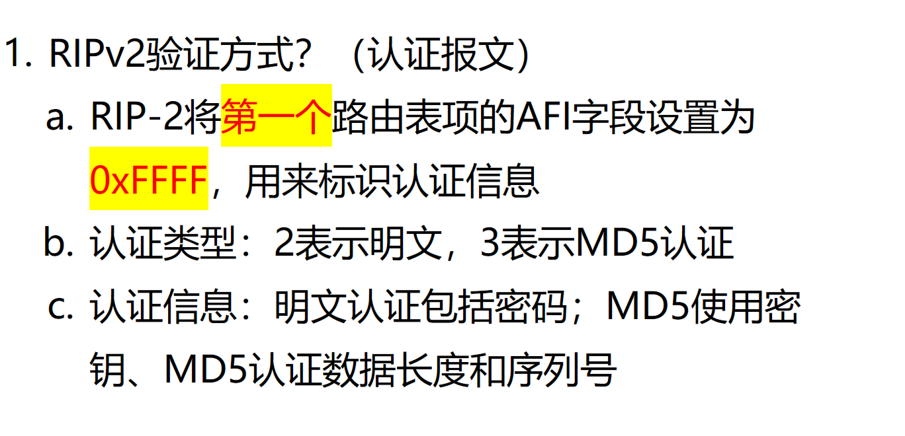
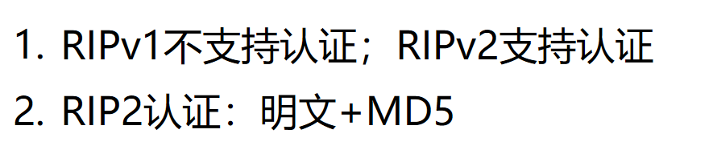

# 实验：https://github.com/lushiheng123/Networking/blob/Security/contents/%E8%B7%AF%E7%94%B1%E5%8D%8F%E8%AE%AE%E5%AE%89%E5%85%A8/RIPV2%E8%AE%A4%E8%AF%81.md

# 1. RIPv2 支持验证吗？怎么支持？

# 2. RIPV1 和 V2 在认证上的区别？

