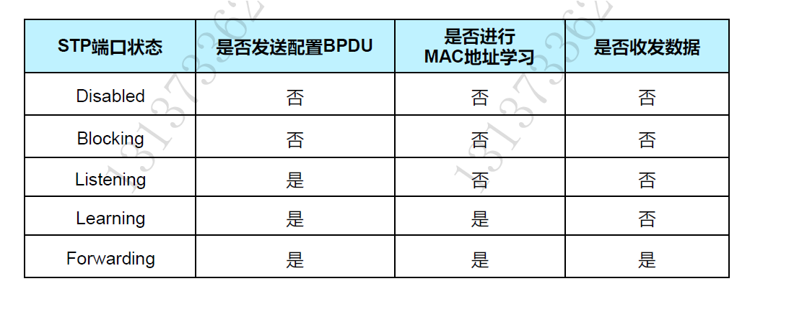
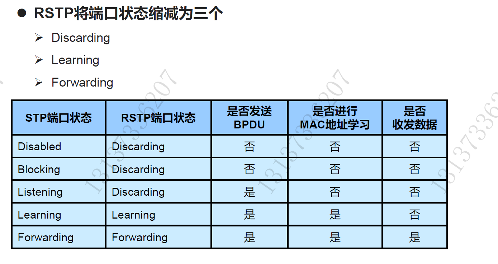
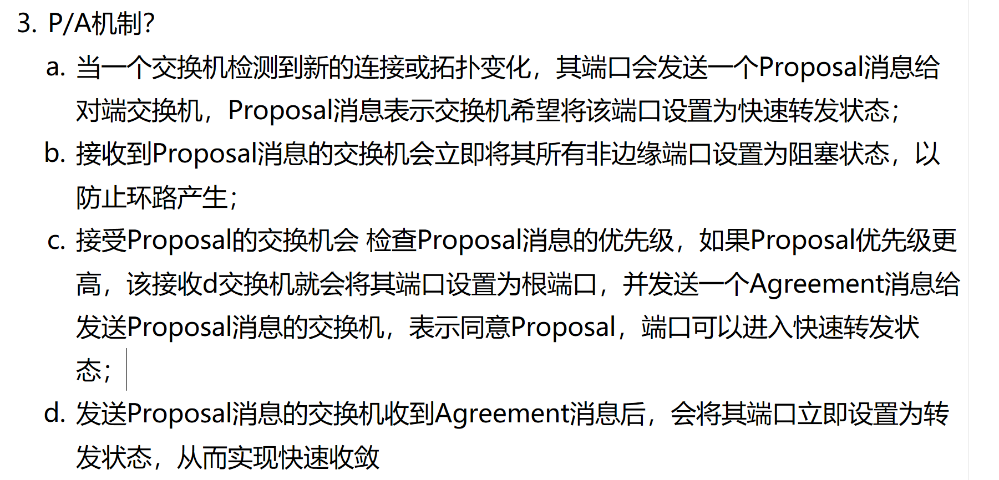
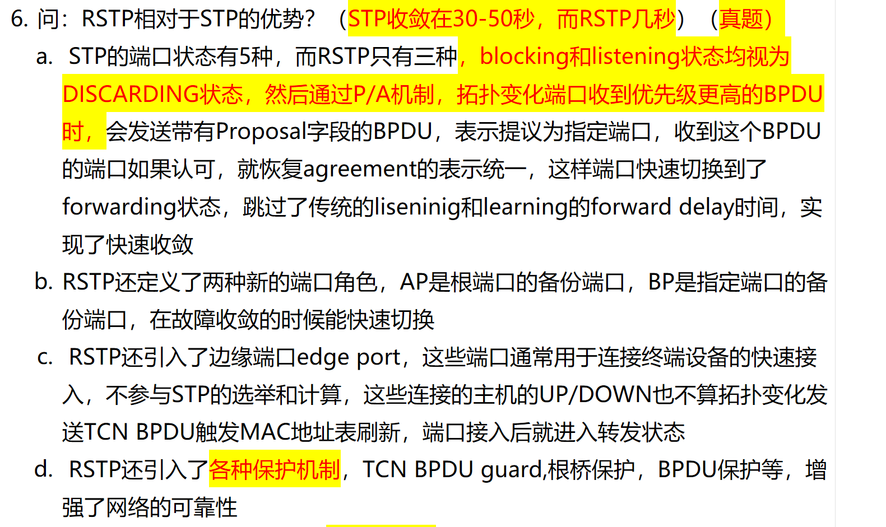
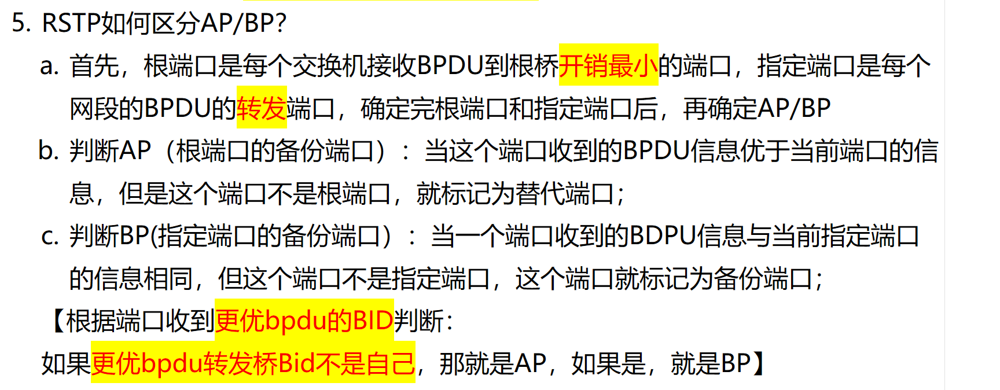
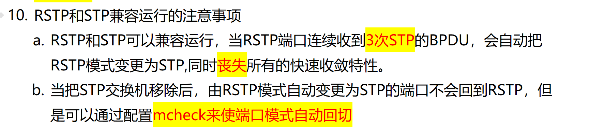
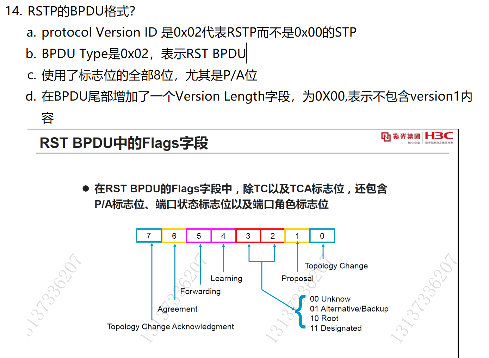
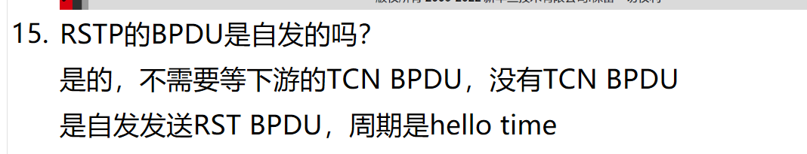
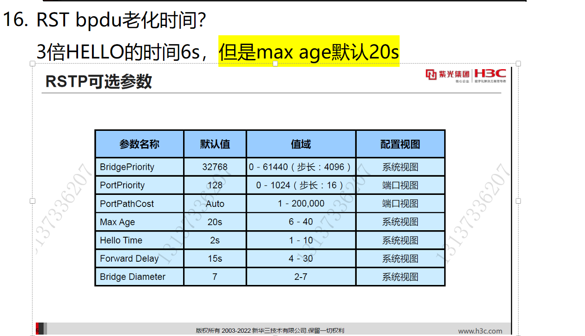

# 1. 端口种类？

<!-- en-interview -->
### English Interview

**Question:** What are the different port states in STP and RSTP, and how do they differ in terms of BPDU transmission, MAC address learning, and data forwarding?

**Answer:**

In STP, there are five port states: Disabled, Blocking, Listening, Learning, and Forwarding. Each state has specific behaviors—like whether it sends BPDUs, learns MAC addresses, or forwards data. For example, in Blocking state, the port doesn't send BPDUs, doesn't learn MAC addresses, and doesn't forward data. In Forwarding, all three are enabled. RSTP simplifies this to three states: Discarding, Learning, and Forwarding. Discarding combines STP’s Disabled, Blocking, and Listening states—no data forwarding or MAC learning, but it may send BPDUs. Learning state is similar to STP’s Learning, where MAC learning happens but no data forwarding. Forwarding remains the same. This reduction speeds up convergence because RSTP doesn’t wait for the listening and learning timers. So, RSTP improves efficiency by merging states and enabling faster topology changes.

# 2. RSTP 的 P/A 机制是什么？

<!-- en-interview -->
### English Interview

**Question:** What is the P/A mechanism in RSTP?

**Answer:**

The P/A mechanism in RSTP, or Proposal/Agreement mechanism, enables rapid convergence by allowing a switch to transition a port to forwarding state quickly when a topology change is detected. Instead of waiting for the full STP timer cycle, RSTP uses this mechanism to negotiate port states directly between switches. When a switch detects a new link or topology change, it sends a Proposal message to its neighbor, proposing that the port be placed in forwarding mode. The receiving switch then immediately blocks all non-edge ports to prevent loops, checks the Proposal’s priority, and if it’s higher, responds with an Agreement message, agreeing to the proposal. Upon receiving the Agreement, the proposing switch immediately puts its port into forwarding state. This significantly reduces convergence time compared to traditional STP. The P/A mechanism is especially effective in point-to-point links and helps avoid temporary loops during topology changes.

# 3. RSTP 相比于 STP 的优势？

<!-- en-interview -->
### English Interview

**Question:** What are the advantages of RSTP over STP?

**Answer:**

RSTP significantly improves convergence speed compared to STP, reducing convergence time from 30-50 seconds to just a few seconds. This is achieved through several key enhancements. First, RSTP simplifies port states—combining blocking and listening into a single DISCARDING state—and uses the Proposal/Agreement (P/A) mechanism. When a port receives a superior BPDU, it sends a Proposal BPDU; if acknowledged, the port transitions directly to forwarding, skipping the traditional listening and learning phases. Second, RSTP introduces new port roles: Alternate Port (AP) as a backup for root ports, and Backup Port (BP) for designated ports, enabling faster failover. Third, it adds Edge Ports for direct connections to end devices, which bypass STP calculations and immediately enter forwarding state, avoiding unnecessary delays. Finally, RSTP includes various protection mechanisms like TCN BPDU Guard, Root Protection, and BPDU Protection, enhancing network stability and security. These improvements make RSTP more efficient and reliable in dynamic network environments.

# 4.RSTP 如何区分 AP/BP？

<!-- en-interview -->
### English Interview

**Question:** How does RSTP distinguish between Alternate Port (AP) and Backup Port (BP)?

**Answer:**

In RSTP, Alternate Port and Backup Port are determined after root and designated ports are selected. The root port is the one with the lowest cost to reach the root bridge, and the designated port is the one forwarding BPDUs on each segment. Once those are set, we identify AP and BP based on BPDU information. An Alternate Port is a backup for the root port — it receives better BPDU information than its own, but it’s not the root port. A Backup Port is a backup for the designated port — it receives the same BPDU info as the designated port, but it’s not the designated port itself. A key rule: if the better BPDU’s Bridge ID (BID) is not the local switch’s own BID, it’s an AP; if it is the local switch’s BID, it’s a BP. This helps avoid loops while ensuring fast convergence. For example, if a switch receives a BPDU with a lower BID from a neighbor, and that neighbor isn’t itself, the port becomes an AP. If the BPDU comes from itself, it’s a BP, meaning there’s a redundant link to the same segment.

# 5. RSTP 和 STP 互联会怎样？

<!-- en-interview -->
### English Interview

**Question:** What happens when RSTP and STP are interconnected?

**Answer:**

When RSTP and STP are interconnected, they can coexist, but with some important behaviors. The key point is that an RSTP port will automatically downgrade to STP mode if it receives three consecutive STP BPDUs. Once in STP mode, the port loses all RSTP fast convergence features like rapid transition and edge ports. This is because RSTP needs to operate in a consistent environment, and detecting STP BPDUs indicates the presence of legacy STP devices. After removing the STP switch, the port won’t automatically revert to RSTP mode. However, you can enable the "mcheck" feature to allow the port to automatically re-enable RSTP mode once STP BPDUs are no longer detected. This ensures the network can return to faster convergence when possible. So, while interoperability is supported, it comes at the cost of performance, and manual intervention or configuration is needed to restore optimal RSTP behavior after STP devices are removed.

# 6. RSTP BPDU 报文的格式？

<!-- en-interview -->
### English Interview

**Question:** What is the format of an RSTP BPDU packet?

**Answer:**

RSTP BPDU has a different format compared to traditional STP BPDU. The key difference starts with the Protocol Version ID, which is 0x02 for RSTP, versus 0x00 for STP. The BPDU Type is also 0x02, indicating it's an RST BPDU. Unlike STP, RSTP uses all 8 bits in the Flags field, not just a few. Specifically, it introduces the Proposal/Agreement (P/A) mechanism, which enables faster convergence by allowing ports to transition directly to forwarding state. The Flags field includes bits for Topology Change (TC), Topology Change Acknowledgment (TCA), Learning, Forwarding, Agreement, and Proposal. Additionally, bits 1 and 0 are used for port role indication: 00 for unknown, 01 for Alternative/Backup, 10 for Root, and 11 for Designated. Finally, RSTP adds a Version Length field at the end, set to 0x00, indicating no version 1 content is included. This enhanced format supports faster topology convergence and more efficient communication between switches.

# 7. RST BPDU 是自发的吗？

<!-- en-interview -->
### English Interview

**Question:** Is RST BPDU sent spontaneously?

**Answer:**

Yes, RST BPDU is sent spontaneously. Unlike STP, which relies on topology changes triggered by TCN BPDUs from downstream switches, RSTP (Rapid Spanning Tree Protocol) proactively sends RST BPDUs without waiting for any external trigger. The root bridge and designated bridges send RST BPDUs at regular intervals, which is defined by the hello time—typically 2 seconds by default. This continuous, periodic transmission helps maintain up-to-date topology information across the network and allows for faster convergence when a link fails or a new switch is added. For example, if a port loses connectivity, the switch immediately starts the rapid transition process by sending RST BPDUs to notify neighbors, rather than waiting for a TCN BPDU to propagate upstream. This mechanism significantly reduces convergence time compared to traditional STP. So, in summary, the spontaneous nature of RST BPDU is a key feature that enables rapid network recovery and improved stability.

# 8. RSTP BPDU 的老化时间？

<!-- en-interview -->
### English Interview

**Question:** What is the aging time for RSTP BPDU?

**Answer:**

In RSTP, the BPDU aging time is determined by the Max Age parameter, which defaults to 20 seconds. This value is not directly 3 times the Hello Time, as some might assume—though Hello Time is typically 2 seconds, making 3 times that 6 seconds. However, the standard Max Age is 20 seconds, which is the time a switch waits before considering a BPDU as expired if no new BPDU is received from the upstream bridge. This aging mechanism is critical for detecting topology changes and triggering topology change procedures. For example, if a switch doesn’t receive a BPDU within 20 seconds, it assumes the upstream bridge is down and starts the process of reconfiguring the spanning tree. The Max Age can be adjusted between 6 and 40 seconds, depending on network size and convergence requirements, and it’s configured in system view. So, while 3x Hello Time (6s) might be a theoretical calculation in some contexts, the actual default BPDU aging time in RSTP is 20 seconds.
