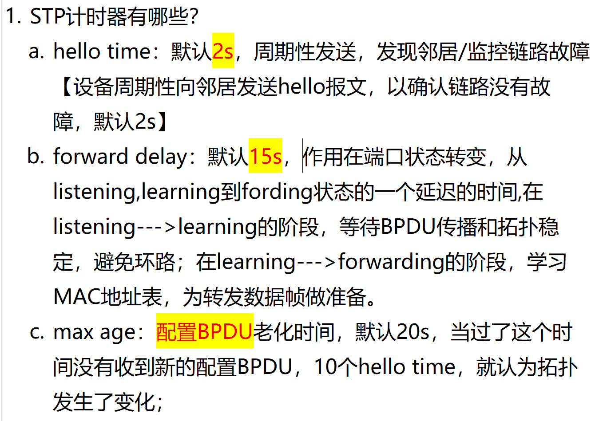
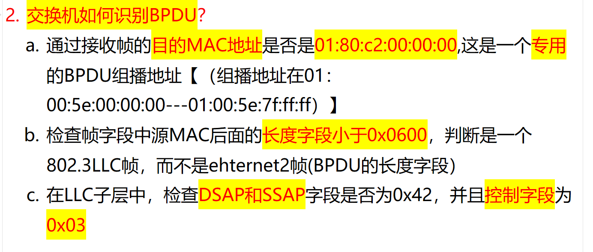
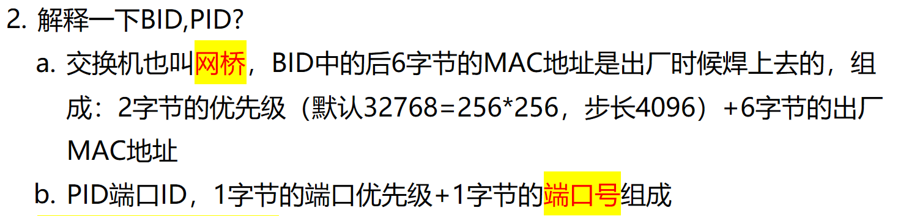
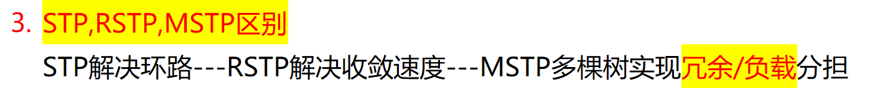
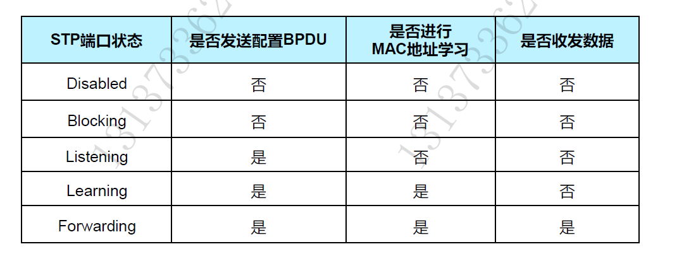
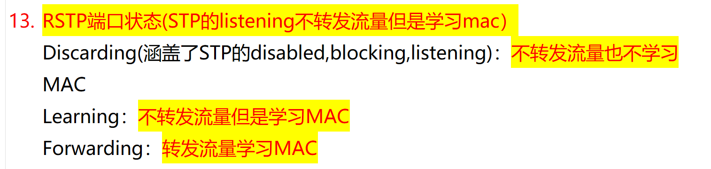
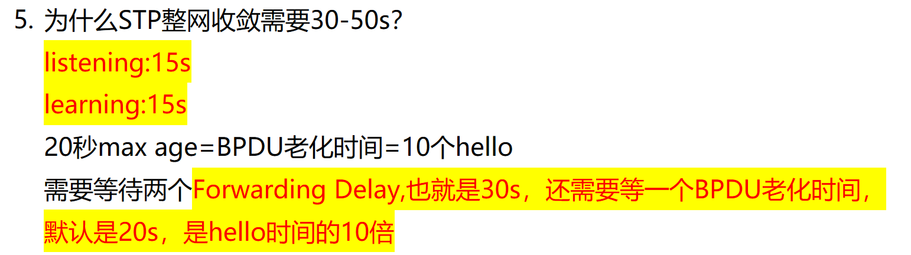
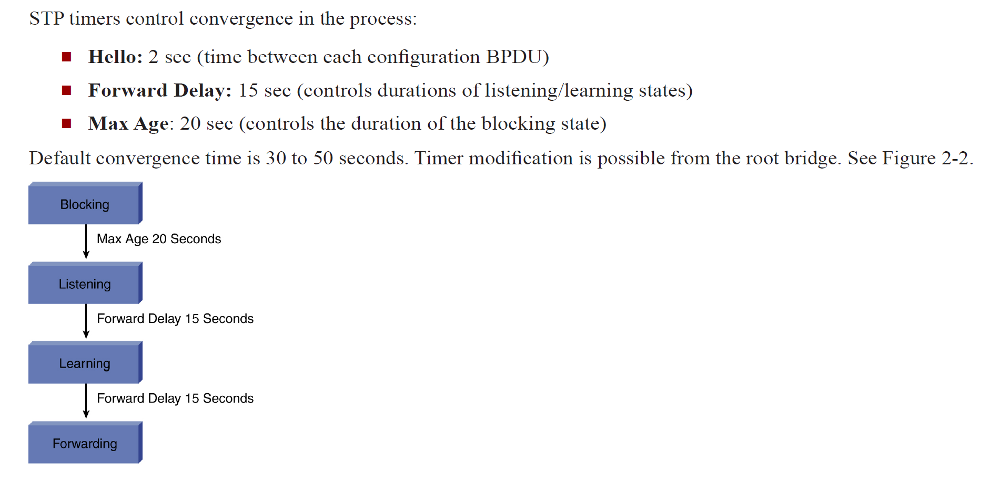

# 1. STP 有哪些计时器？

<!-- en-interview -->
### English Interview

**Question:** What are the timers used in STP (Spanning Tree Protocol)?

**Answer:**

In STP, there are three main timers: Hello Time, Forward Delay, and Max Age. These timers are crucial for maintaining a loop-free network topology. 

First, Hello Time is set to 2 seconds by default. It’s the interval at which switches periodically send BPDU messages to detect neighbors and monitor link status. If a switch doesn’t receive a Hello within this time, it may detect a link failure.

Second, Forward Delay is 15 seconds by default. It’s used during port state transitions — specifically from Listening to Learning, and then from Learning to Forwarding. This delay allows time for BPDUs to propagate and for the topology to stabilize, preventing temporary loops.

Third, Max Age is 20 seconds by default, which equals 10 Hello Times. It defines how long a switch will wait for a new Configuration BPDU. If no new BPDU is received within this period, the switch assumes the topology has changed and initiates a recalculation. These timers work together to ensure network stability and convergence.

# 2. 怎么识别是 STP/BPDU?

<!-- en-interview -->
### English Interview

**Question:** How does a switch identify a BPDU frame in STP?

**Answer:**

A switch identifies a BPDU by checking several key fields in the received frame. First, it looks at the destination MAC address—BPDU frames are sent to the reserved multicast address 01:80:C2:00:00:00, which falls within the range 01:00:5e:00:00:00 to 01:00:5e:7f:ff:ff. Second, the switch checks the length field right after the source MAC. If it’s less than 0x0600, it indicates an 802.3 LLC frame rather than an Ethernet II frame, which is typical for BPDU. Finally, within the LLC sublayer, the switch verifies that both DSAP and SSAP fields are 0x42 and the control field is 0x03. These values are standardized for STP BPDU encapsulation. This multi-step verification ensures the switch correctly identifies BPDU frames and processes them accordingly for spanning tree operations, avoiding misinterpretation of other control or data traffic.

# 3. BID 和 PID 是什么？

<!-- en-interview -->
### English Interview

**Question:** What are BID and PID in the context of network switching and Spanning Tree Protocol?

**Answer:**

BID stands for Bridge ID, and PID stands for Port ID. These are key components used in the Spanning Tree Protocol (STP) to determine the root bridge and elect designated ports. The BID is composed of a 2-byte priority field (default 32768, which is 256×256, with a step size of 4096) and a 6-byte MAC address, which is factory-assigned and unique to each switch. This combination helps identify each bridge uniquely in the network. The PID, or Port ID, is made up of a 1-byte port priority and a 1-byte port number. It’s used to break ties when multiple ports have the same cost to the root bridge. For example, if two ports on different switches have the same path cost, the switch with the lower BID becomes the root. If two ports on the same switch have the same cost, the one with the lower PID (based on priority and port number) is chosen as the designated port. This mechanism ensures loop-free topology in redundant networks.

# 4. STP/RSTP/MSTP 区别？

<!-- en-interview -->
### English Interview

**Question:** What are the key differences between STP, RSTP, and MSTP?

**Answer:**

The main evolution from STP to RSTP to MSTP addresses scalability, convergence speed, and traffic optimization. STP, or Spanning Tree Protocol, was designed to prevent Layer 2 loops in redundant topologies by blocking redundant paths. However, its convergence time could be up to 50 seconds, which is slow for modern networks. RSTP, Rapid Spanning Tree Protocol, improves this by using port roles like designated, root, and alternate, along with faster transition states—converging in under 1 second. It also introduces edge ports for direct device connections, skipping the listening/learning phases. MSTP, Multiple Spanning Tree Protocol, takes it further by allowing multiple spanning trees across VLANs. Each tree can handle different VLANs, enabling load balancing and redundancy. For example, you can assign VLANs 10 and 20 to one spanning tree, and VLANs 30 and 40 to another, so traffic is distributed across different links. This not only avoids loops but also optimizes bandwidth usage. So, STP prevents loops, RSTP speeds up convergence, and MSTP enables both redundancy and load sharing.

# 6. STP 端口状态？RSTP 端口状态？

<!-- en-interview -->
### English Interview

**Question:** What are the port states in STP and RSTP, and how do they differ?

**Answer:**

In STP, there are five port states: Disabled, Blocking, Listening, Learning, and Forwarding. Disabled ports don’t send BPDUs, learn MAC addresses, or forward traffic. Blocking ports also don’t forward or learn, but they do receive BPDUs. Listening ports send BPDUs but don’t learn MACs or forward data. Learning ports send BPDUs, learn MACs, but still don’t forward traffic. Only Forwarding ports do all three: send BPDUs, learn MACs, and forward data.

In RSTP, this is simplified to three states: Discarding, Learning, and Forwarding. Discarding combines STP’s Disabled, Blocking, and Listening — it doesn’t forward traffic or learn MACs. Learning state is similar to STP’s Learning: it learns MAC addresses but doesn’t forward traffic. Forwarding state is the same as in STP — it forwards traffic and learns MACs. The key improvement in RSTP is faster convergence by reducing the number of states and allowing faster transition to Forwarding.

# 7. STP 收敛为什么要 30-50s？

<!-- en-interview -->
### English Interview

**Question:** Why does STP convergence take 30 to 50 seconds?

**Answer:**

STP convergence typically takes 30 to 50 seconds due to its timer-based design, which ensures loop-free topology but introduces delay. The core reason lies in the state transition process: when a port transitions from blocking to forwarding, it must go through listening and learning states, each lasting 15 seconds by default — that’s 30 seconds for the two forwarding delays. Additionally, the Max Age timer, set to 20 seconds, is critical. If a switch doesn’t receive a BPDU from the root bridge within Max Age (20 seconds), it assumes the root is down and starts recalculating the topology. This 20-second wait is also why the total convergence can reach up to 50 seconds — especially in scenarios where a topology change is detected and the network needs to re-elect a root bridge or reassign roles. These timers are designed for stability and to prevent temporary loops, but they come at the cost of convergence speed. The Hello time (2 seconds) is used for detecting failures, but the actual convergence is governed by Forward Delay and Max Age.
