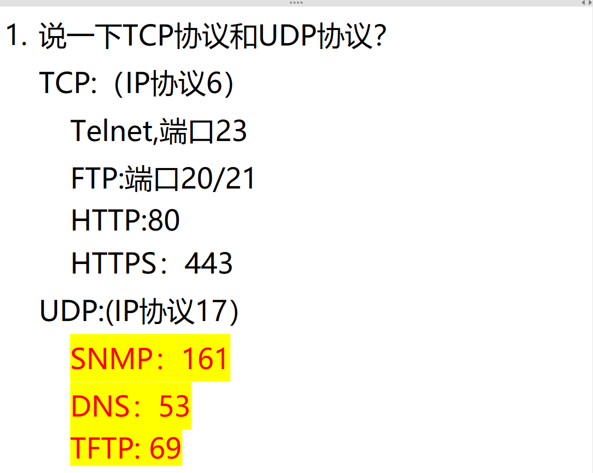
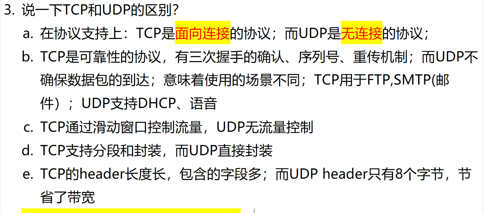

# 1. 支持的协议区别？

<!-- en-interview -->
### English Interview

**Question:** What are the key differences between TCP and UDP protocols?

**Answer:**

TCP and UDP are both transport layer protocols, but they differ significantly in reliability and use cases. TCP, which stands for Transmission Control Protocol and uses IP protocol number 6, is connection-oriented and ensures reliable, ordered, and error-checked delivery of data. It establishes a connection through a three-way handshake, uses acknowledgments and retransmissions, and supports flow control and congestion control. Common applications include Telnet on port 23, FTP using ports 20 and 21, HTTP on port 80, and HTTPS on port 443.

In contrast, UDP, or User Datagram Protocol, uses IP protocol number 17 and is connectionless, providing faster but unreliable communication. It doesn’t guarantee delivery, order, or error-checking, making it suitable for time-sensitive applications where speed matters more than accuracy. Examples include SNMP on port 161, DNS on port 53, and TFTP on port 69. So, TCP is ideal for applications requiring data integrity, while UDP is preferred for real-time services like streaming or VoIP.

# 2. TCP 和 UDP 的区别？

<!-- en-interview -->
### English Interview

**Question:** What are the key differences between TCP and UDP?

**Answer:**

The main difference is that TCP is connection-oriented and reliable, while UDP is connectionless and unreliable. TCP establishes a connection through a three-way handshake, ensuring data delivery with sequence numbers and retransmission mechanisms. It uses sliding window for flow control and supports segmentation and encapsulation. This makes TCP suitable for applications like FTP and SMTP where data integrity is critical. On the other hand, UDP doesn’t establish a connection, has no retransmission or flow control, and sends data directly. It’s faster and more efficient, with a smaller 8-byte header, saving bandwidth. UDP is ideal for real-time applications like VoIP or DHCP, where speed matters more than reliability. So, TCP is for guaranteed delivery, UDP for speed and low overhead.
