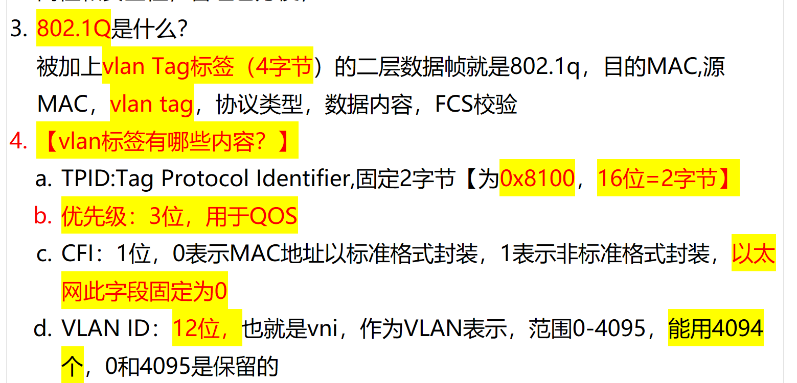
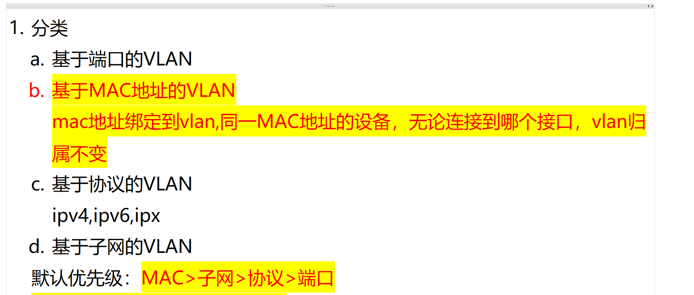
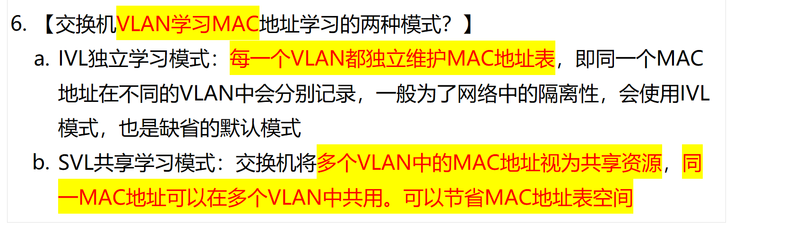

# 802.1q 是什么？vlan tag 的内容？

**Question:** What is 802.1Q, and what are the components of a VLAN tag?

**Answer:**

802.1Q is the IEEE standard for VLAN tagging in Ethernet networks, enabling multiple virtual LANs to coexist on the same physical infrastructure. It adds a 4-byte VLAN tag to the Ethernet frame, inserted between the source MAC address and the EtherType field. This tag allows switches to identify and forward frames to the correct VLAN. The VLAN tag consists of four key fields: first, the TPID (Tag Protocol Identifier), which is a fixed 2-byte value of 0x8100, indicating the frame is 802.1Q tagged. Second, the Priority field, which is 3 bits long and used for QoS to prioritize traffic. Third, the CFI (Canonical Format Indicator), a 1-bit field that’s set to 0 in Ethernet, indicating standard MAC address format. Finally, the VLAN ID, which is 12 bits long, ranging from 0 to 4095 — but 0 and 4095 are reserved, so only 4094 VLANs are usable. This structure allows efficient traffic segmentation and prioritization in enterprise networks.

# vlan 分类？

**Question:** What are the different types of VLANs and how do they work?

**Answer:**

There are primarily four types of VLANs: port-based, MAC-based, protocol-based, and subnet-based. The most common is port-based VLAN, where devices connected to a specific switch port belong to that VLAN. MAC-based VLAN assigns devices to a VLAN based on their MAC address, so even if a device moves to a different port, it remains in the same VLAN—this is useful for mobile devices. Protocol-based VLAN groups traffic by protocol type, like IPv4, IPv6, or IPX, which helps in segregating different network protocols. Subnet-based VLAN assigns VLAN membership based on the IP subnet, which is helpful for IP-based segmentation. The default priority order is MAC > subnet > protocol > port, meaning MAC-based takes precedence if multiple criteria apply. This hierarchy ensures consistent and predictable VLAN assignment, especially in complex environments where devices may move or use different protocols.

# 交换机 VLAN 学习 MAC 的方式？

<!-- en-interview -->
### English Interview

**Question:** What are the two modes for VLAN-based MAC address learning on a switch?

**Answer:**

There are two primary modes for MAC address learning in VLANs on a switch: IVL (Independent VLAN Learning) and SVL (Shared VLAN Learning). IVL is the default mode, where each VLAN maintains its own separate MAC address table. This means the same MAC address can appear in multiple VLANs independently, which enhances network isolation and security. For example, if a device is connected to multiple VLANs via trunk ports, its MAC address will be learned and stored separately in each VLAN’s table. On the other hand, SVL mode treats MAC addresses as shared resources across VLANs. In this mode, a single MAC address is learned once and shared among multiple VLANs, which helps conserve MAC address table space—especially useful in environments with limited hardware resources or high port density. While SVL saves memory, it reduces isolation, so IVL is typically preferred for security-sensitive networks. The choice depends on the network design goals: isolation vs. efficiency.
