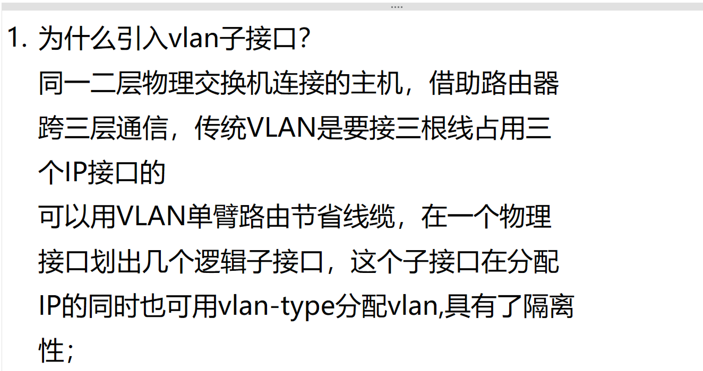
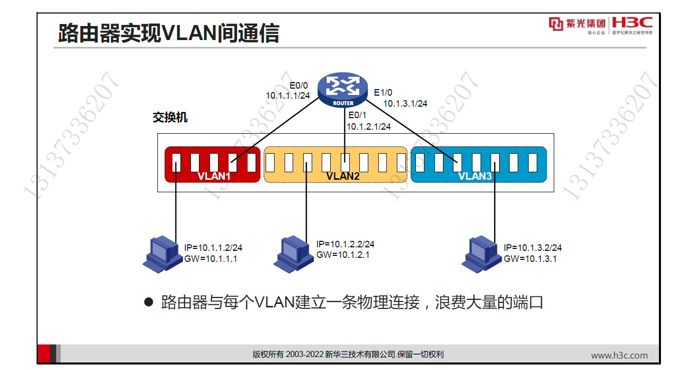
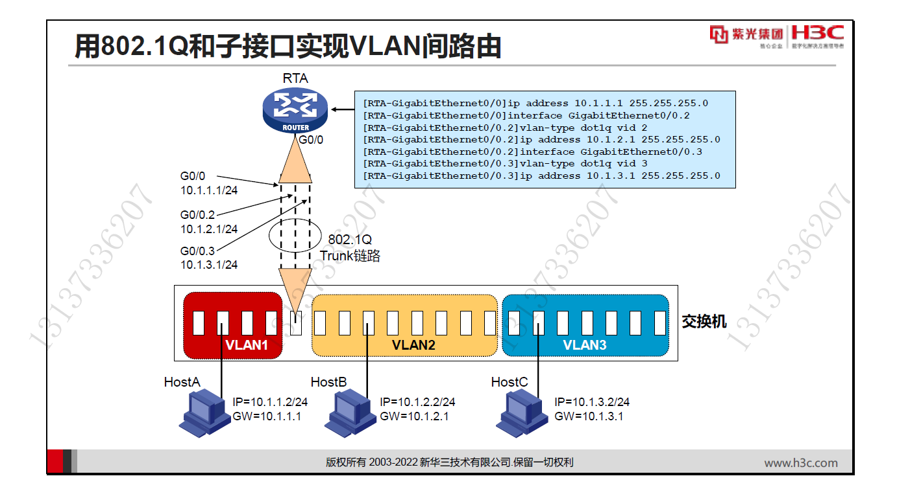

# 1. VLAN 子接口？

<!-- en-interview -->
### English Interview

**Question:** Why are VLAN sub-interfaces introduced in networking?

**Answer:**

VLAN sub-interfaces are introduced primarily to solve the inefficiency of traditional inter-VLAN routing, which requires a separate physical connection and IP address for each VLAN, consuming valuable router ports and cabling. The core idea is to enable inter-VLAN routing using a single physical interface by creating multiple logical sub-interfaces. Each sub-interface is configured with a unique IP address for a specific VLAN and uses the 802.1Q tagging mechanism to identify and forward traffic belonging to that VLAN. For example, on a router’s physical interface, you can create sub-interfaces like GigabitEthernet0/0.1, 0.2, and 0.3, each assigned to VLAN 1, 2, and 3 respectively. These sub-interfaces are connected to the switch via a trunk link, which carries traffic for all VLANs. This approach, known as "router-on-a-stick," dramatically reduces hardware requirements and cabling while maintaining VLAN isolation and enabling seamless communication between different VLANs. It’s a scalable and cost-effective solution widely used in enterprise networks.
