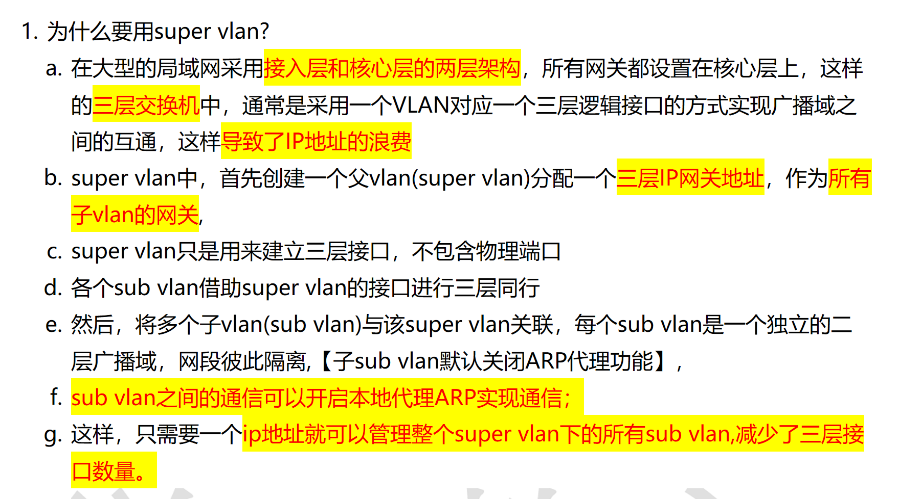
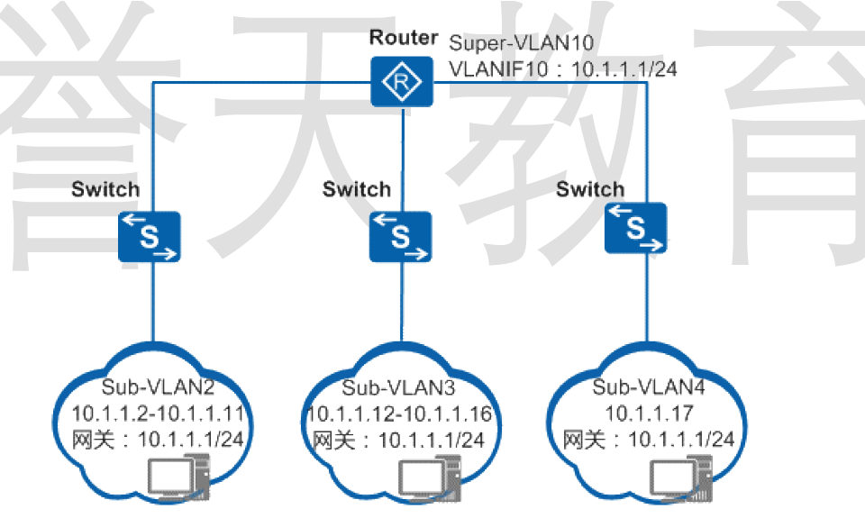
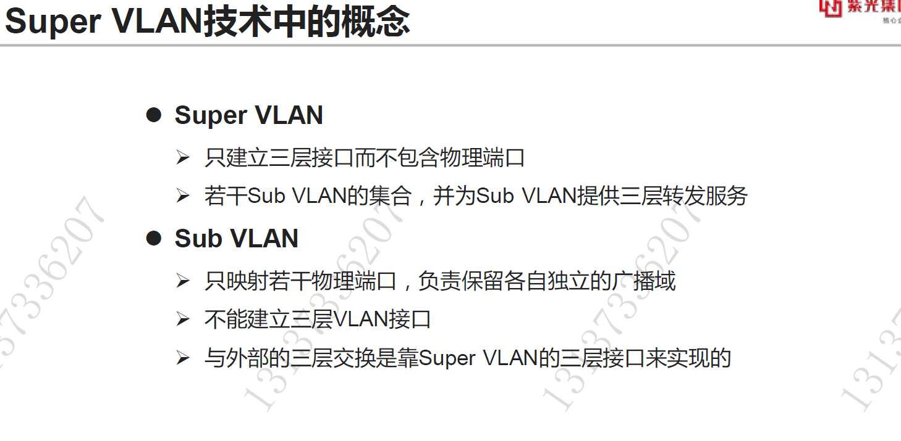
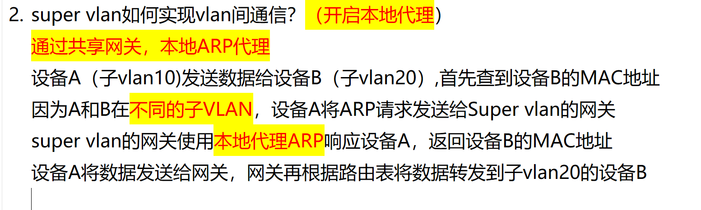

# 1. 为什么使用 vlan 聚合（super vlan)?

**Question:** Why is VLAN aggregation (Super VLAN) used in network design?

**Answer:**

Super VLAN is primarily used to optimize IP address utilization and reduce the number of三层 interfaces in large-scale networks. In traditional designs, each VLAN requires its own IP gateway, leading to IP address waste and increased configuration complexity. With Super VLAN, we create a single "parent" VLAN that doesn’t contain physical ports but serves as a logical三层 interface with one IP address. This single IP acts as the default gateway for multiple "sub-VLANs," which are independent broadcast domains and contain the actual physical ports. Each sub-VLAN maintains its own network segment, ensuring isolation, while relying on the Super VLAN’s interface for inter-VLAN routing. For example, in the diagram, Super-VLAN10 with IP 10.1.1.1/24 serves as the gateway for Sub-VLAN2, 3, and 4. Communication between sub-VLANs can be enabled via local ARP proxy if needed. This approach drastically reduces the number of required IP addresses and三层 interfaces, simplifying management and scaling in enterprise networks.

# 2. sub vlan 怎么通信？

<!-- en-interview -->
### English Interview

**Question:** How do sub-VLANs communicate with each other in a Super-VLAN architecture?

**Answer:**

In a Super-VLAN setup, sub-VLANs can communicate with each other through a shared gateway using local ARP proxy. The core idea is that each sub-VLAN has its own IP subnet, but they share a single gateway configured on the Super-VLAN. When a device in one sub-VLAN, say VLAN 10, wants to send data to a device in another sub-VLAN, like VLAN 20, it first needs to resolve the destination’s MAC address. Since they’re in different sub-VLANs, the source device sends an ARP request to the Super-VLAN gateway. The gateway, acting as a local ARP proxy, responds to the source device with the destination’s MAC address, even though it doesn’t know the actual MAC address yet. Then, the source sends the data to the gateway. The gateway, based on its routing table, forwards the packet to the correct sub-VLAN, in this case VLAN 20, where the destination device receives it. This mechanism avoids the need for separate gateways per sub-VLAN and enables inter-sub-VLAN communication efficiently.
