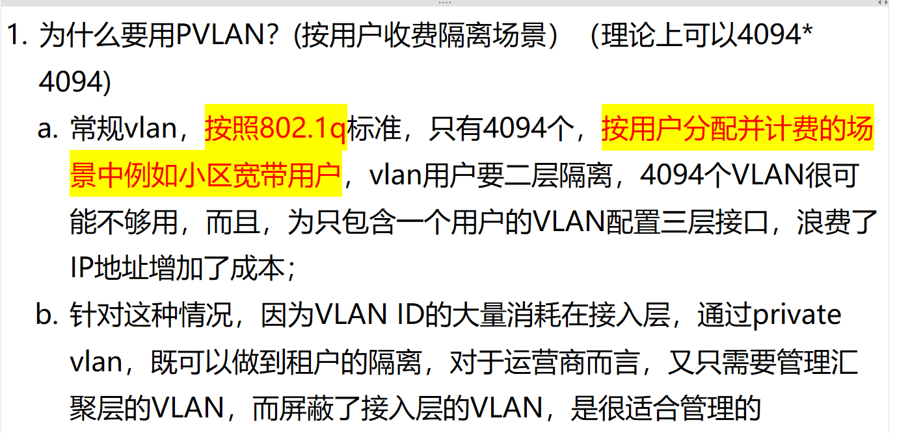
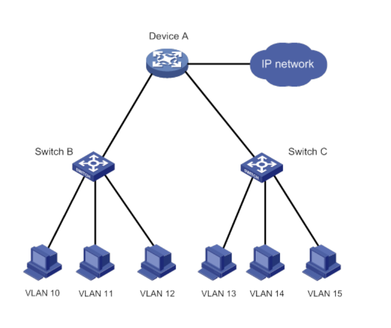
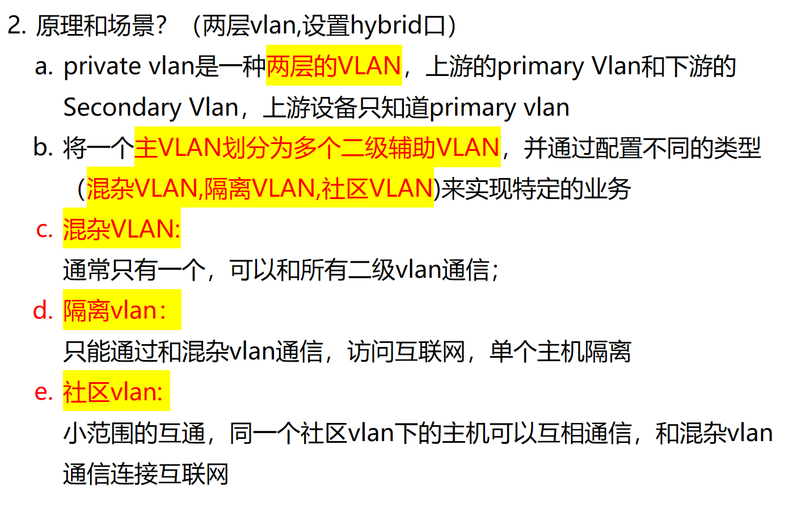
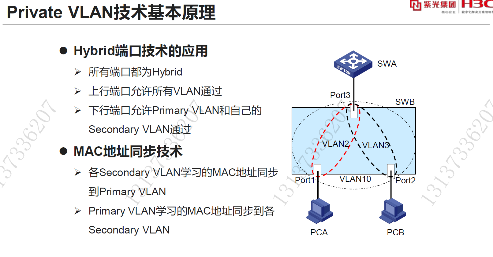

# 1. 为什么要引入私有 vlan(private vlan)?

**Question:** Why is Private VLAN (PVLAN) introduced in network design?

**Answer:**

Private VLAN is introduced primarily to address scalability and management challenges in large-scale access networks, such as residential broadband(住宅宽带) or enterprise multi-tenant environments. The core idea is to achieve user-level Layer 2 isolation while minimizing the consumption of VLAN IDs and IP address resources. Standard VLANs, limited to 4094 by the 802.1Q standard, become insufficient when each user requires a separate VLAN for billing and security.PVLAN solves this by using a hierarchical structure: one primary VLAN (often called the "primary VLAN") is managed at the aggregation layer, while multiple secondary VLANs (isolated or community) handle individual users at the access layer. These secondary VLANs are isolated from each other but can communicate with the primary VLAN. This way, the service provider only needs to manage a few primary VLANs, while still providing secure, isolated access for thousands of users—making it highly scalable and efficient for carrier-grade networks.

# 2. Secondary VLAN 有哪些？

<!-- en-interview -->
### English Interview

**Question:** What are the types of Secondary VLANs in Private VLAN technology?

**Answer:**

In Private VLAN technology, Secondary VLANs are categorized into three main types: Isolated VLAN, Community VLAN, and Mixed VLAN. These are designed to provide granular control over device communication within a network. The Mixed VLAN, typically only one per Primary VLAN, can communicate with all Secondary VLANs, acting as a gateway to external networks. The Isolated VLAN allows devices to communicate only with the Mixed VLAN, which is useful for isolating individual hosts while still providing internet access. The Community VLAN enables limited communication among devices within the same Community VLAN, while also allowing access to the Mixed VLAN for internet connectivity. This structure enhances security and network segmentation. For example, in a corporate environment, different departments can be placed in separate Community VLANs for internal communication, while all users can access the internet through the shared Mixed VLAN. The Hybrid port configuration supports this by allowing the upstream port to carry all VLANs and downstream ports to carry only the Primary VLAN and their associated Secondary VLANs. MAC address synchronization ensures proper forwarding across VLANs.
