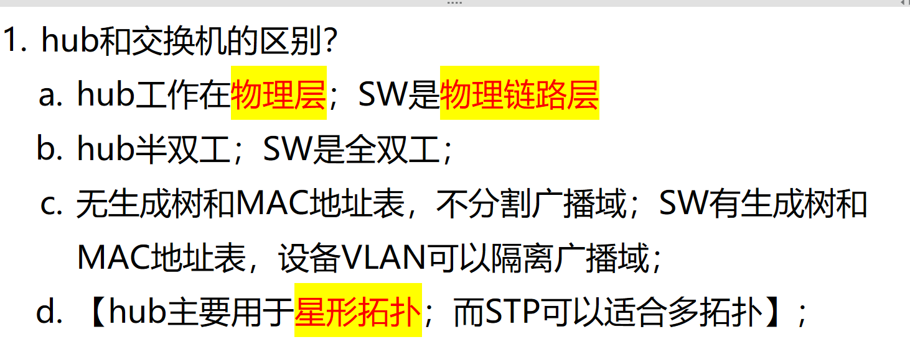
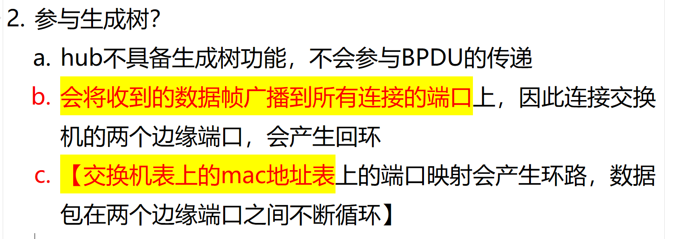

# 1. hub 集线器 和交换的区别？

<!-- en-interview -->
### English Interview

**Question:** What are the key differences between a hub and a switch?

**Answer:**

The main difference is that a hub operates at the physical layer, while a switch works at the data link layer. This means a hub simply forwards all incoming data to every port, creating a single collision domain and broadcast domain. In contrast, a switch uses MAC address learning and forwarding, which allows it to send data only to the intended recipient, reducing collisions and improving efficiency. Hubs are half-duplex, meaning they can't transmit and receive simultaneously, whereas switches support full-duplex communication. Additionally, switches maintain a MAC address table and implement Spanning Tree Protocol (STP) to prevent loops in redundant topologies, while hubs have no such features. Hubs are typically used in star topologies, but if you connect two switch ports directly without STP, it can cause loops. So, switches are more intelligent and scalable, making them the standard for modern networks.
