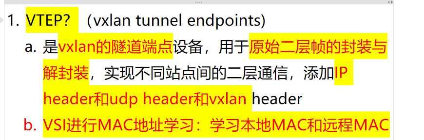
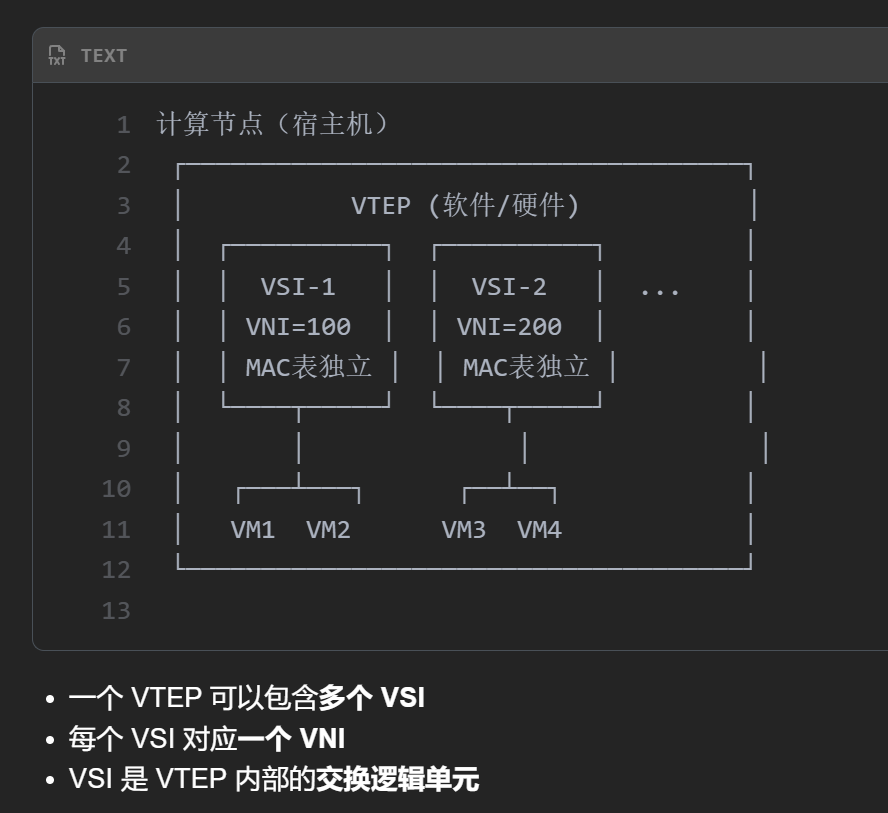
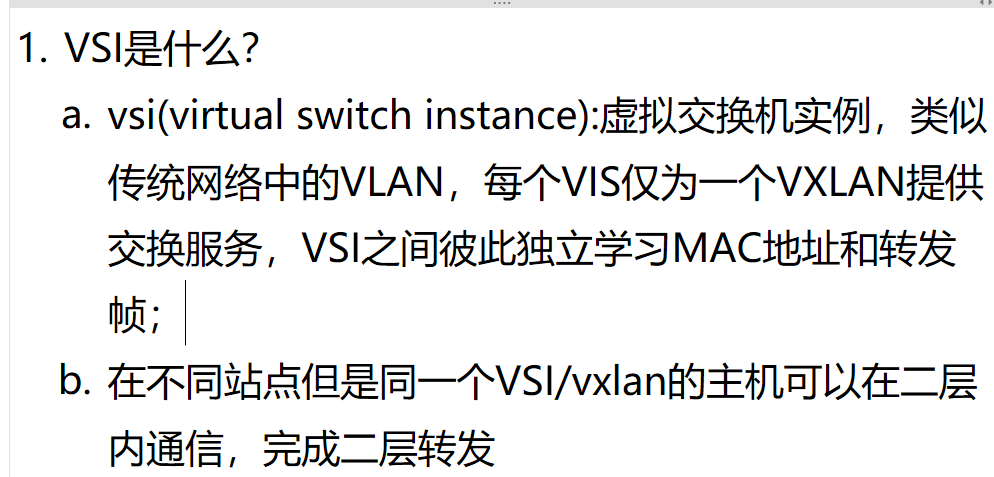
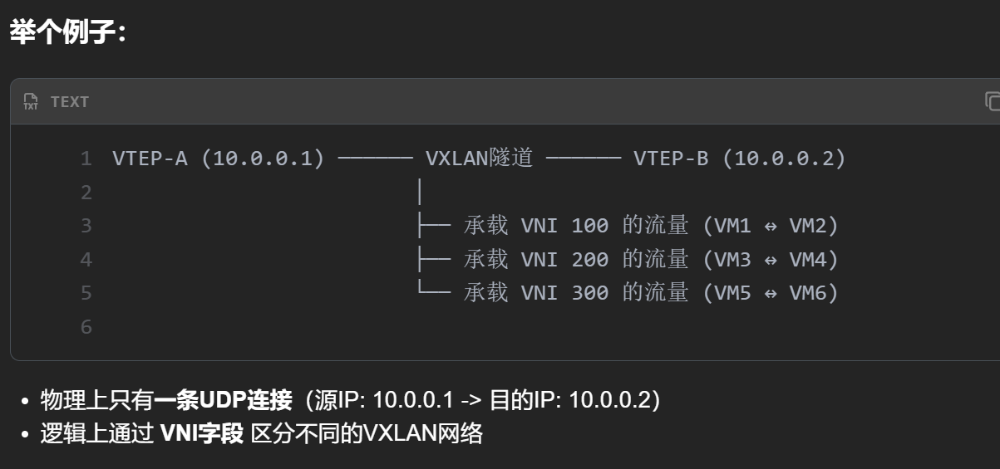
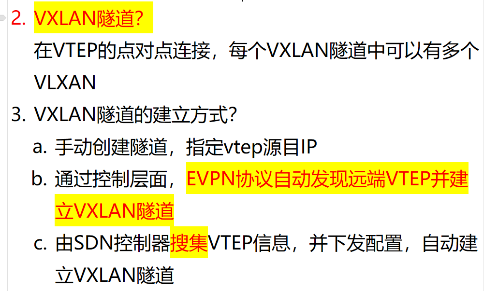

# 1. VTEP 作用？

<!-- en-interview -->
### English Interview

**Question:** What is the role of a VTEP in VXLAN?

**Answer:**

A VTEP, or VXLAN Tunnel Endpoint, is a key device in VXLAN networks that acts as the endpoint of the tunnel. Its main function is to encapsulate and decapsulate Layer 2 frames for communication across different sites. When a frame needs to be sent over the VXLAN network, the VTEP adds an IP header, a UDP header, and a VXLAN header to the original Layer 2 frame, transforming it into a Layer 3 packet that can traverse the underlay network. At the receiving end, the remote VTEP strips off these headers and forwards the original Layer 2 frame to the destination. This allows Layer 2 connectivity between geographically separated devices. Additionally, VTEPs perform MAC address learning through their associated VSI (VXLAN Switching Instance), learning both local and remote MAC addresses to build forwarding tables. This enables efficient frame switching and ensures the network can dynamically adapt to changes in topology. In short, VTEPs are essential for enabling scalable, flexible, and secure Layer 2 extension over Layer 3 infrastructure.

# 2. VSI 是什么？（VTEP相当于虚拟交换机，VSI相当于虚拟交换机上面一个逻辑单元）

# 3. VXLAN 隧道？

<!-- en-interview -->
### English Interview

**Question:** What is a VXLAN tunnel and how is it established?

**Answer:**

A VXLAN tunnel is a point-to-point connection between two VTEPs (VXLAN Tunnel End Points) that encapsulates Layer 2 traffic over a Layer 3 network using UDP. The key idea is to multiplex multiple virtual networks over a single physical UDP connection. For example, between VTEP-A (10.0.0.1) and VTEP-B (10.0.0.2), there’s only one UDP tunnel, but it can carry multiple VXLAN segments—identified by different VNI values like 100, 200, and 300—each representing a separate logical network (e.g., VM1-VM2, VM3-VM4, etc.). The VNI field in the VXLAN header acts as a tag to distinguish traffic belonging to different tenants or networks. As for tunnel establishment, there are three main methods: manually configuring the tunnel with source and destination VTEP IPs; using control-plane protocols like EVPN to automatically discover remote VTEPs and build tunnels; or leveraging an SDN controller to collect VTEP information and dynamically push configurations to establish tunnels automatically. This flexibility supports scalable and automated network deployments in cloud and data center environments.
