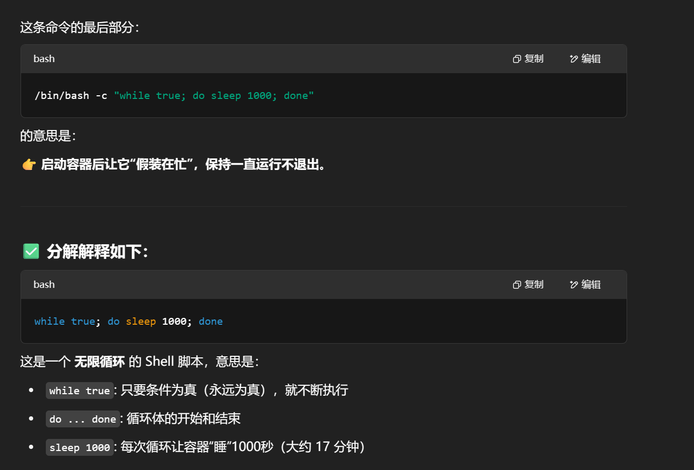
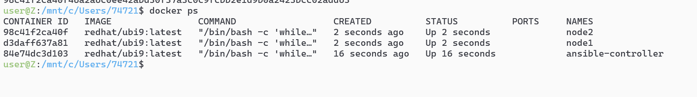
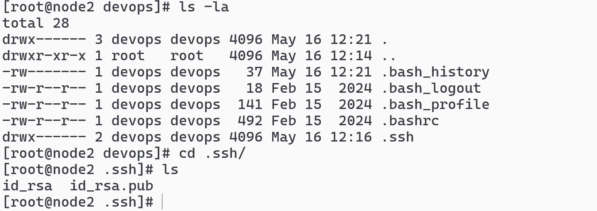
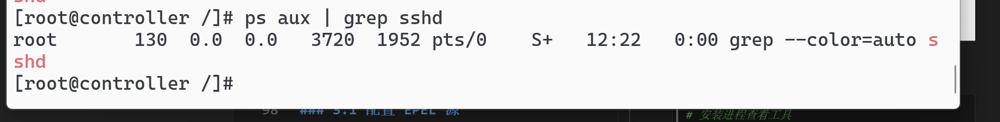
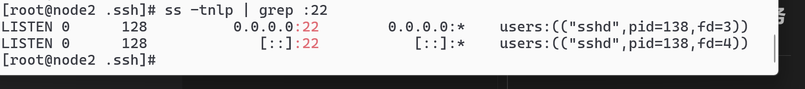
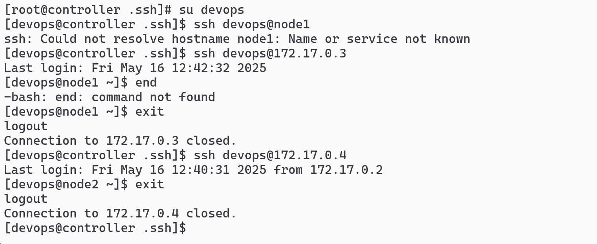

# 跟着官网走的教程

## 1. 环境准备

### 1.1 基础镜像获取

拉取 Red Hat Universal Base Image 9 作为基础环境：

```sh
docker pull redhat/ubi9:latest
```

### 1.2 容器环境初始化

创建一个控制节点和两个被管理节点：

```sh
docker run -d --name ansible-controller -h controller redhat/ubi9:latest /bin/bash -c "while true; do sleep 1000; done"
docker run -d --name node1 -h node1 redhat/ubi9:latest /bin/bash -c "while true; do sleep 1000; done"
docker run -d --name node2 -h node2 redhat/ubi9:latest /bin/bash -c "while true; do sleep 1000; done"
```



# docker ps 查看容器创建情况



## 2. SSH 服务配置

### 2.1 安装 SSH 服务

在所有节点上安装 SSH 服务：

```sh
# 在控制节点安装
docker exec -it ansible-controller /bin/bash
dnf install -y openssh-server
sshd

# 在node1安装
docker exec -it node1 /bin/bash
dnf install -y openssh-server

# 在node2安装
docker exec -it node2 /bin/bash
dnf install -y openssh-server
```

## 2. 用户配置

### 2.1 创建管理用户

在所有节点上创建用于 Ansible 管理的用户：

```sh
# 在每个节点上执行以下命令
useradd devops
passwd devops   # 设置密码：123456
```

配置用户的 sudo 权限：

```sh
mkdir -p /home/devops/.ssh
chmod 700 /home/devops/.ssh
chown devops:devops /home/devops/.ssh
```

### 2.3 配置 SSH 服务

安装 SSH 客户端：

```sh
dnf install -y openssh-clients
```

为 devops 用户配置 SSH：

```sh


# 生成 SSH 密钥
ssh-keygen -t rsa
# 生成主机密钥
ssh-keygen -A
```

# 检查路径



# dnf install -y procps-ng 安装进程工具

# ps aux | grep sshd 发现没有启动 sshd 服务，ss -tnlp | grep :22



# /usr/sbin/sshd 启动 ssh 服务了



# dnf install -y wget

# wget https://dl.fedoraproject.org/pub/epel/epel-release-latest-9.noarch.rpm

# dnf install -y ./epel-release-latest-9.noarch.rpm

# dnf clean all ，dnf makecache

### 3.2 安装基础工具

安装网络工具：

```sh
dnf install -y net-tools iproute
```

```sh
# 测试 SSH 连接
ssh devops@172.17.0.3
```

# su devops 然后 ssh-copy-id devops@172.17.0.3免密登录



### 5.1 Python 环境准备

安装 Python 和 pip：

```sh
dnf install -y python3 python3-pip
pip3 install --upgrade pip
```

# dnf install -y container-tools

```sh
# 安装 Ansible Navigator
pip3 install ansible-navigator
```

# mkdir ansible_quickstart && cd ansible_quickstart
