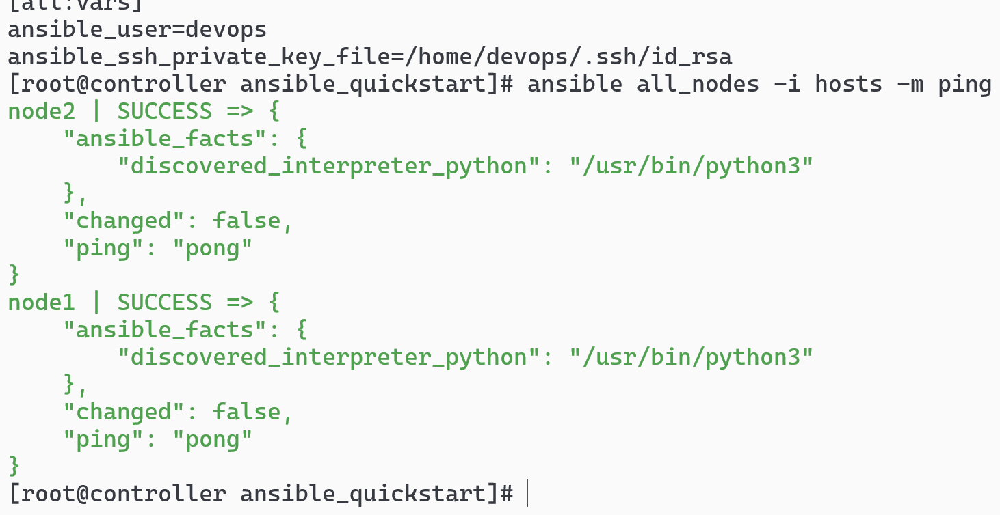
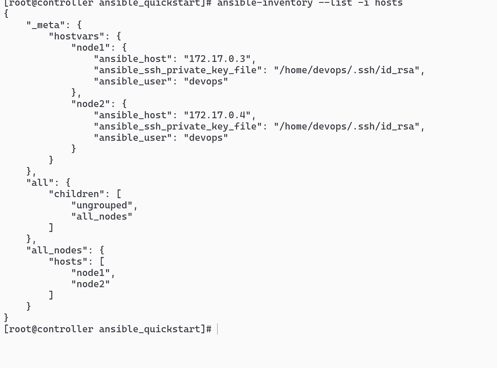

# vim hosts

```sh
[all_nodes]
node1 ansible_host=172.17.0.3
node2 ansible_host=172.17.0.4

[all:vars]
ansible_user=devops
ansible_ssh_private_key_file=/home/devops/.ssh/id_rsa
```

# ansible all_nodes -i hosts -m ping /ansible all -i hosts -m ping 测试连通性



# ansible-inventory --list -i hosts/ ansible-inventory -i hosts --list


