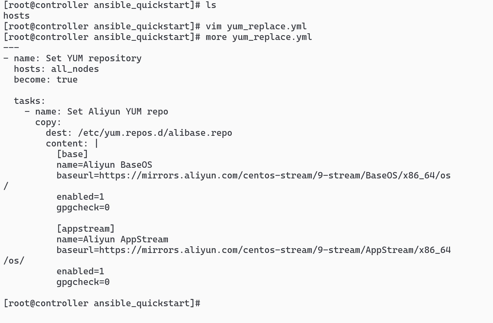
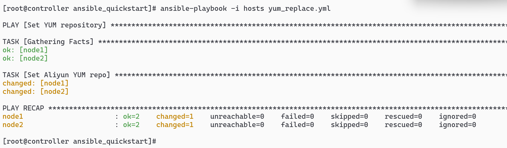
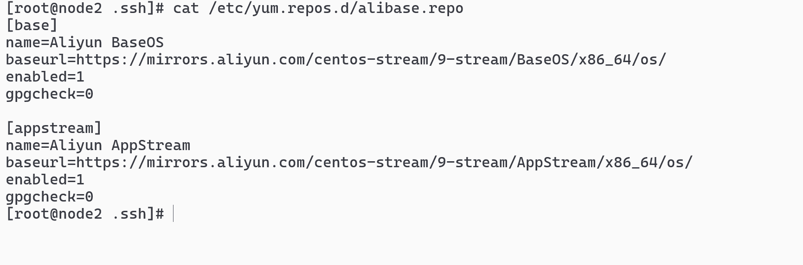

# 创建 yum_replace.yml 文件

```sh
---
- name: Set YUM repository
  hosts: all_nodes
  become: true

  tasks:
    - name: Set Aliyun YUM repo
      copy:
        dest: /etc/yum.repos.d/alibase.repo
        content: |
          [base]
          name=Aliyun BaseOS
          baseurl=https://mirrors.aliyun.com/centos-stream/9-stream/BaseOS/x86_64/os/
          enabled=1
          gpgcheck=0

          [appstream]
          name=Aliyun AppStream
          baseurl=https://mirrors.aliyun.com/centos-stream/9-stream/AppStream/x86_64/os/
          enabled=1
          gpgcheck=0
```



# ansible-playbook -i hosts yum_replace.yml 执行



# cat /etc/yum.repos.d/alibase.repo 检查节点是否 playbook 运行正确
