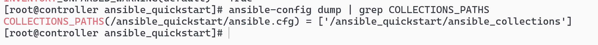
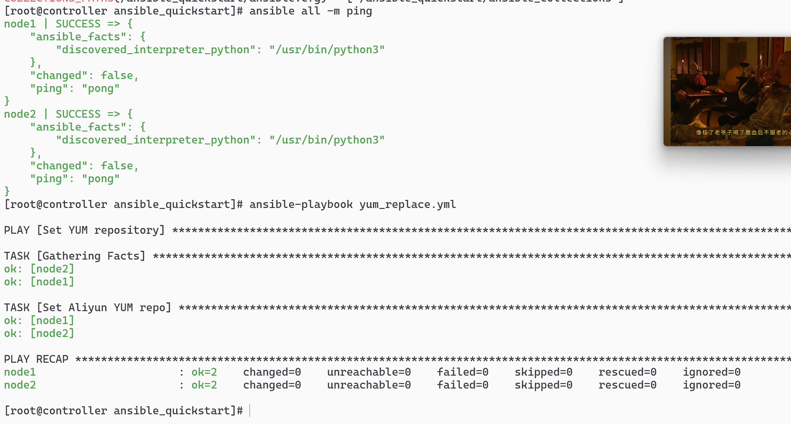

# vim ansible.cfg

```sh
[defaults]
inventory = ./hosts
roles_path = ./roles
collections_path = ./ansible_collections
```

# ansible-config dump | grep COLLECTIONS_PATHS 查询 path



# 这样的话每次都不用特殊指定 host

```sh
ansible all -m ping
ansible-playbook yum_replace.yml
```



# （如果需要）sudo dnf install -y container-tools fuse-libs 安装 fush 内核
