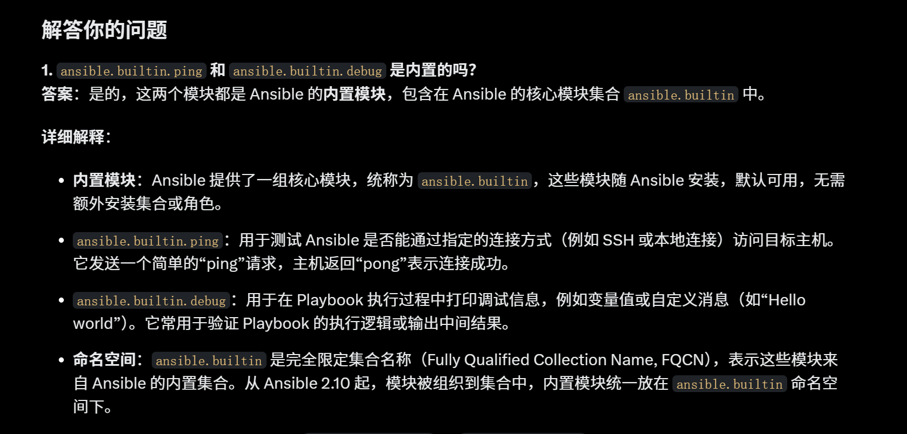
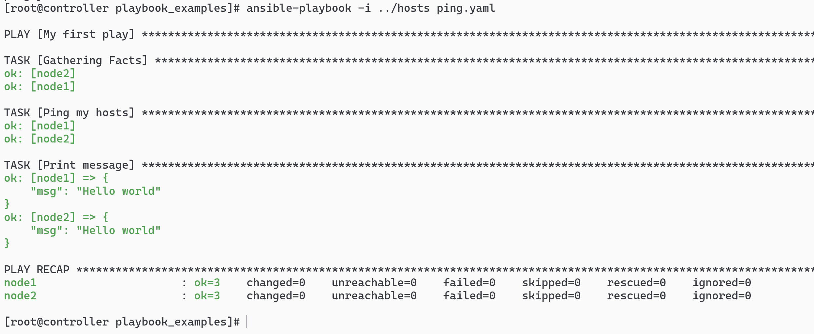
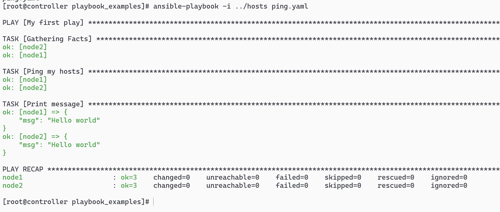

# ansible.builtin



## 写 ping_playbook.yaml

```sh
- name: My first play
  hosts: all_nodes
  tasks:
   - name: Ping my hosts
     ansible.builtin.ping:

   - name: Print message
     ansible.builtin.debug:
       msg: Hello world
```



# ping 的结果


