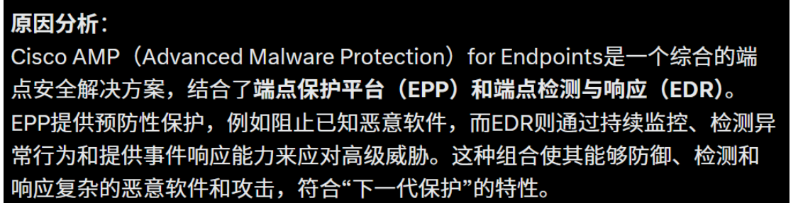

# AMP(Advanced Malware Protection) 是什么？

GPT回答

这段内容全面介绍了 **Cisco AMP（Advanced Malware Protection）**，是 Cisco 提供的**高级恶意软件防护解决方案**，主要应用于终端安全防护。下面是重点知识点的整理与总结：

---

## 📌 一、AMP 的核心作用

Cisco AMP 是一种集 **恶意软件检测、分析、响应和防御** 于一体的 **下一代终端安全解决方案**，可与 Cisco 的其他安全产品（如 NGIPS、Threat Grid 等）协同工作。

---

## 🧩 二、主要功能模块与技术

### 1. **实时阻断与持续监控**

- 对文件进行实时扫描、行为分析。
- 即使初始未识别为恶意，也会在行为可疑时后续报警（**追溯安全 Retrospective Security**）。

### 2. **文件声誉系统（File Reputation）**

- 根据全球威胁情报、文件历史行为、特征分析，判断文件“好”或“坏”。

### 3. **文件轨迹（File Trajectory）**

- 追踪恶意文件在网络中传播的路径与影响的终端，便于溯源与清除。

### 4. **行为沙箱（Sandboxing）**

- 利用 Threat Grid 技术对未知文件在安全环境中做静态和动态分析。
- 检查 700+ 个行为指标，准确率高、误报率低。

### 5. **持续监控与可视化**

- 即使文件已运行，仍持续记录其所有行为。
- 提供详细的事件时间线和攻击链追踪。

### 6. **流行度分析（Prevalence）**

- 分析文件在组织中出现频率，低频文件更有可能是定向攻击样本。

### 7. **爆发控制（Outbreak Control）**

- 管理员可直接隔离、删除或放行文件（黑/白名单）。
- 可设为自动响应。

---

## 🛡️ 三、与其他组件的集成

AMP 可以与以下 Cisco 安全工具无缝集成，提高检测效率：

- **Threat Grid**：提供强大的恶意代码行为分析与可视化。
- **Cisco Talos Intelligence**：全球威胁情报支持。
- **Threat Response**：事件关联、自动化响应。

---

## ⚙️ 四、终端连接器（Endpoint Connectors）

AMP 的代理程序部署在终端设备上（包括物理机、虚拟机、VDI），负责本地实时监控和威胁报告。也提供 **入侵检测（IDS）与入侵防御（IPS）** 功能。

---

## 🧠 五、静态与动态恶意代码分析

- **静态分析**：无需运行文件，分析其结构、指令、签名。
- **动态分析**：模拟运行环境，观察其行为变化。

---

## 💥 六、恶意软件阻断机制

多引擎配合，包括：

- 签名检测（Signature）
- 模糊指纹（Fuzzy Fingerprint）
- 机器学习（ML）
- AV 引擎（Tetra 和 ClamAV）

---

## ☁️ 七、云端管理优势

- 分析任务、情报对比等耗资源操作都在云端完成，终端性能负担小。
- 云管理平台提供统一的策略控制与报告中心。

---

## 🔎 八、指示性威胁（IOCs）

- 提供攻击线索与攻击行为的证据，帮助分析是否存在持续性威胁（APT）。

---

## 🧭 九、案例分析与细节可视化

- 可通过 AMP 界面查看威胁前后的整个过程。
- 分析哪个应用触发了恶意代码、恶意代码调用了哪些进程等，便于精准响应。

---

## ✅ 总结

Cisco AMP 是一套 **集检测、响应、可视化、追溯、安全情报、沙箱分析于一体的高级终端防护系统**，尤其适用于需要对高级持续性威胁（APT）进行 **深度检测与应对的企业网络**。

需要我用图表或流程图帮你整理 AMP 的工作机制吗？

